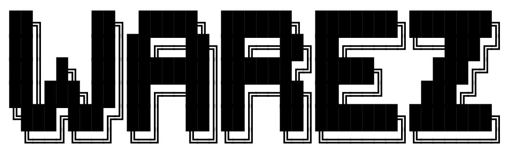
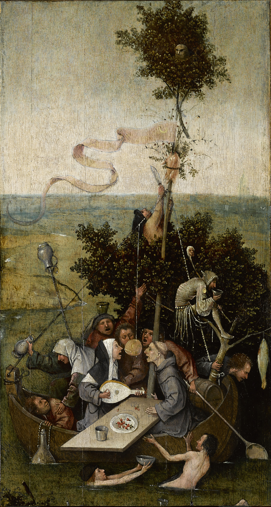

# Preface

Before you start to read this book, take this moment to think about making a [donation to punctum books](https://punctumbooks.com/support/), an independent non-profit press.

Any amount, no matter the size, is appreciated and will help us to keep our ship of fools afloat. Contributions from dedicated readers will also help us to keep our commons open and to cultivate new work that can’t find a welcoming port elsewhere. Our adventure is not possible without your support.

Vive la Open Access.

Fig. 0. Hieronymus Bosch, Ship of Fools (1490–1500).

([Image from Wikicommons](https://en.wikipedia.org/wiki/File:Jheronimus_Bosch_011.jpg) and is in the public domain)

## Copyright

*Warez: The Infrastructure and Aesthetics of Piracy*. Copyright © 2021 by Martin Paul Eve. This work carries a [Creative Commons BY-NC-SA 4.0 International license](https://creativecommons.org/licenses/by-nc-sa/4.0/), which means that you are free to copy and redistribute the material in any medium or format, and you may also remix, transform and build upon the material, as long as you clearly attribute the work to the authors (but not in a way that suggests the authors or punctum books endorses you and your work), you do not use this work for commercial gain in any form whatsoever, and that for any remixing and transformation, you distribute your rebuild under the same license.

First published in 2021 by dead letter office, BABEL Working Group, an imprint of [punctum books](https://punctumbooks.com), Earth, Milky Way.

The babel Working Group is a collective and desiring-assemblage of scholar– gypsies with no leaders or followers, no top and no bottom, and only a middle. babel roams and stalks the ruins of the post-historical university as a multiplicity, a pack, looking for other roaming packs with which to cohabit and build temporary shelters for intellectual vagabonds. We also take in strays.

* ISBN-13: 978-1-68571-036-1 (print)
* ISBN-13: 978-1-68571-037-8 (ePDF)
* doi: 10.53288/0339.1.00
* lccn: 2021951510. Library of Congress Cataloging Data is available from the Library of Congress

Work on this book was made possible through the award of a Philip Leverhulme Prize from the Leverhulme Trust.

Book design: Vincent W.J. van Gerven Oei

Cover image: Ahmed Adly via Unsplash

punctumbooks: spontaneous acts of scholarly combustion

## Contents

* Acknowledgements
* Dedication
* Terminological Notes
* Glossary

1. Original Pirate Material
2. Setting the Scene
3. Infrastructure
4. Organization
5. Aesthetics
6. Takedowns

* Conclusions
* Appendix (available in original PDF)
* Bibliography

## Acknowledgements

Many individuals have helped me in the writing of this book. My thanks at punctum to Eileen Joy, Vincent W.J. van Gerven Oei, and Lily Brewer. For her brilliantly helpful suggestions on the manuscript, my thanks to Virginia Crisp. Notably, thanks also to Jamie Harries, Ronald Snijder, Paul Tavner, Jake Bickford, James Baker, and John Fink for responding to my queries on degenerative DRM. I owe a debt to Ben Garrett for assembling the DeFacto2 archive that underpins this work. My thanks go also to Iñigo Quilez for permission to include images of his DemoScene productions. With thanks to my friends, in no particular order: Joe Brooker, John and Caroline Matthews, Caroline Edwards, Iain Robert Smith, James and Holly Crow, Helen and Duncan Stringer, Alyson Jakes, Duncan Gray, Richard Hall, Hazel and Michael Vanderhoeven, Siân Adiseshiah, Ernesto Priego, Ben Johnson, Lianne de Mello, Julian Cottee, Doireann Lalor, Mark Blacklock, Peter Christian, Roland Clare, Kay Mendlson, Warren Young, Andy Byers, Mauro Sanchez, Rose Harris-Birtill, Paula Clemente Vega, Tom Grady, Jon Fugler, Bryan Cheyette, Stephen Curry, Don Waters, Ross Mounce, Tobias Steiner, and Sam Moore. Everyone at A Love From Outer Space. Friendship has sustained me through the writing of this book under difficult global circumstances. I hope to see you all on the other side of the Coronavirus Pandemic. My final thanks, as ever, go to my family — Gill Hinks, Rich Gray, Alyce Magritte, Nova Gray, Mina Gray, Susan Eve, Juliet Eve, Lisa Holloway, Carin Eve, Anthony Eve, Julia Eve, Sam Jones, and Toby Eve — but especially, with all my love, to my wife, Helen.

## Dedication

For Nova and Mina, who will not know, for some time, what this book is about

and for James, who already does.

## Terminological Notes
Throughout this book, the terms “Warez Scene” and “the Scene” are capitalized in order to denote the underground movement. Other terms, such as NukeNets have some capitalisation where there are CamelCase formulations, while some roles do not. User nicknames are specified in the case used by the holder.

## Glossary

* **0day**. Refers to the most bleeding-edge access to pirate releases. Its derivation is that access comes “0 days” since its release.Addline. The command that will add a user to a topsite. This command contains the user’s Internet Protocol (IP) details, ident mask, and other security features.

* **Affiliate**. An arrangement whereby a release group is associated with a topsite and “pres” its releases on that site. It can also refer to the affiliation of courier groups with a site.

* **ASCII art**. An artistic mode in which graphics are constructed from textual characters using the American Standard Code for Information Interchange.

* **Autotrader**. A courier who uses software to transfer releases between topsites automatically without any human intervention. It is also used to refer to such software itself. It is generally frowned upon but is also a seemingly widespread practice.

* **Bittorrent**. A protocol for the distribution of content between peers. It is often but not exclusively used in the lower echelons of the piracy hierarchy.

* **Bouncer (BNC)**. A proxy to which users connect. These mechanisms hide or cloak a topsite’s actual IP address. Bouncers can handle either just the File Transfer Protocol (FTP) command channel or can also take the form of “traffic bouncer” that also masks the data stream. There are also IRC bouncers that keep users connected to an Internet Relay Chat server, which means that they do not have to reconnect to the server every time and that their connecting IP address remains hidden.

* **Bulletin Board System (BBS)**. A precursor to the internet that offered dial-in access to a single machine. The Scene originated in BBS cultures and moved to the internet in the 1990s.\

* **Courier**. An individual who moves releases between sites to build ratio credit for download and to participate in courier charts. The act of transferring a release, in competition with other couriers, is called “racing.” Previously, in earlier BBSs, a courier was also referred to as a “broker.”

* **Courier Charts**. Competitive scoring systems that rank couriers. Based on weektop scorecards.

* **Crack**. A modification to a piece of software that removes its copyright protection routines. Often bundled with releases.\

* **Daemon**. A piece of server software that runs as a background process, rather than interactively. Examples include web servers and FTP servers that serve remote users. Topsites use FTP daemons.

* **DRM)**. Digital Rights Management. Programming routines that aim to make it impossible, illegally, to copy an artefact. Cracks aim to circumvent DRM/TPM.

* **Dupecheck**. A database of previous scene releases, allowing a release group to ascertain whether a release is a duplicate of a previous work.

* **Eggdrop**. A piece of software for running IRC bots. It is frequently used to run topsite bots.

* **Exif**. Exchangeable image file format. An image file format that may contain metadata exposing the original source.

* **File eXchange Protocol (FXP)**. The use of FTP to transfer files between two remote servers rather than the more common client-server architecture.

* **File Transfer Protocol (FTP)**. A protocol for storing and retrieving files from a remote server.

* **FLAC**. The Free Lossless Audio Codec. A lossless music compression format.

* **FXP board**. A bulletin board or forum site where pirated releases are disseminated through hacked servers. It is a lower level of the Warez Scene that is strictly frowned upon by the topsite scene.

* **Ident**. A protocol specified in the specification document “RFC 1413” (Request for Comment) that identifies the user of a particular TCP (Transmission Control Protocol) connection. It is used in the Scene to determine whether a user connecting to the topsite is authorized.

* **Internal**. A release designed only for dissemination among members of the release group itself. Such releases are not beholden to the same standards (e.g., dupecheck) as public releases.

* **Internet Relay Chat (IRC)**. A distributed online chat system used by Sceners to communicate with one another. Site bots also post updates to the IRC channels of topsites.

* **Keygen**. A “key generator.” A piece of software that will produce a valid, but counterfeit, serial key or license for software that requires it. Often distributed with a release.

* **Leet-speak**. A contraction of “elite speak” — a form of slang communication that uses text and numbers. Often, the numbers “1337” or “31337” are used to mean “leet” of “eleet” for the digits’ resemblance to “e,” “l,” and “t.”

* **MP3**. The MPEG-2 Audio Layer III codec. A music compression format.

* **NFO Files**. Short for iNFOrmation file. A text file that contains information about a release. Usually also populated with ASCII art.

* **Nuke**. Both a noun and a verb. In its noun form, this refers to a “bad” release that has been marked as a rule violation at either the topsite-level (a violation of individual site rules) or Scene-level (a violation of release rule standards). Nuke as a verb refers to the act of marking a release as bad using the “site nuke” command.

* **NukeNet**. An inter-site system for nuking releases.

* **Nuker**. A person with the role of nuking releases.

* **Pre**. A noun and a verb. It is the moment at which a release is made available.

* **Pre-spam**. The act of posting pre-announcements in order to convey a message rather than to advertise the true availability of a release. They are also used to catch autotraders.

* **Race**. The competitive transfer of releases between topsites by couriers. The goal is to earn credits and to score highly enough to retain one’s account on the site. Statistics from this contribute to the weektop scorecard.

* **RAID**. A Redundant Array of Independent Disks. This is a storage schema that makes additional copies of data locally, spread across many different hard-disk drives (“striping”), in order to protect against the risk of catastrophic drive failure and data loss. Topsites use RAID to protect their archives.\

* **Release**. A pirate artifact, be it music, movies, software, games, etc.

* **Release Group**. A set of individuals working together to create releases.

* **SceneBan**. A lifetime ban instated on an individual for a serious infraction, such as being a law enforcement officer.

* **Site**. Short for topsite.

* **Siteop**. A site operator. The administrator who runs a topsite. These users may not be the site owner (i.e., the physical owner of the server).

* **Topsite**. An FTP server with a high-speed internet connection and vast amounts of storage space. It has affiliates, couriers, siteops, nukers, and other user categories. It is ranked according to various criteria for participation in courier charts.

* **TPM**. Technical Protection Measures (TPM). See DRM.\

* **Weektop Scorecard**. Also referred to as “wkup” or “wktop”. The weekly positional ranking of couriers and release groups by the volume uploaded to a particular topsite. Used to create a competitive ambiance and Scene-wide scoring systems such as courier charts.

* **Zipscript**. A software routine that executes on a topsite while a release is being uploaded. This provides integrity checking, release tagging, and other “race” features.