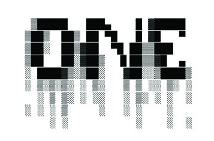

# Original Pirate Material

> Some men rise, some men fall
> 
> I hear ya call, stand tall now
> 
> Has it come to this?
> 
> Original pirate material
> 
—The Streets, “Original Pirate Material”

This is the first scholarly research book about the “Warez Scene.” The Warez Scene is a worldwide, underground, organized network of pirate groups specializing in obtaining and illegally freely releasing digital media before their official sale dates.[^1] This underground subculture, which began life in the pre-internet era Bulletin Board Systems (BBSs), moved to File Transfer Protocol (FTS) servers (also known as “topsites”) in the mid-to-late 1990s.[^2] The “Scene,” as it is known, is highly illegal in almost every aspect of its operation. The term “warez” itself refers to pirated media, a derivative of “software.” This Warez Scene is an underground culture with its own norms and rules of participation, its own forms of sociality, and its own artistic outputs. This book describes and analyses what we know about this underground culture, its operations, and its infrastructures.

Before I turn to this network, I want to talk about another criminal enterprise: the stock exchange. In early 2012, a company called Knight Capital developed a software system designed to make them millions of dollars. The software worked at timescales lower than those possible for humans with a sophisticated high-frequency trading algorithm. For instance, when the software detected that shares had begun to dip, it would sell its stock before price drops could do any financial damage. Likewise, searching for patterns in the data that people cannot perceive within an actionable timeframe, the software looked for shares that appeared to be on the up and made purchases at a tremendous rate. It was a clever piece of software engineering and part of a broader societal obsession with acceleration that recognizes how speed is among the defining characteristics of contemporary capital. It was also a startling example of what a computational approach could do to accelerate traditional, stock-market trading in the service of profit.[^3]

The only problem was that the trading software did not work as intended. In fact, Knight Capital’s software worked exceptionally badly. Losing value at approximately $10 million per minute, it took almost an hour for a supervisor to realize the damage and for the company to shut the system down. After losing $460 million in forty-five minutes, the software destroyed Knight Capital’s reputation and actual value. Yet, the damage went far beyond this. Reputational waves spread quickly through the stock exchange. The algorithm’s unusual trading activities caused a loss of confidence in the 150 or so companies affected by its operations. This disruption heralded the birth of the automated flash crash, the now periodic incursion of software system failure into social systems of corporate value and share circulation.[^4]

My story of high finance points to an obsession with speed and competition in contemporary computation, but it also gestures towards another structure: a competitive game. High-frequency traders situate their servers immediately adjacent to the stock exchange so that they can race against one another on millisecond timescales. Recent advances in high-frequency trading have sought speed advantages of less than a billionth of a second at substantial cost.[^5] These traders use sophisticated software algorithms to trade automatically and much more quickly than would be possible in a system overseen by human reactions. The top traders gain reputational supremacy for the success of their algorithms and the sophistication of their hardware. They put in many hours per week, usually excessively so, trading stocks and shares. They live a high-octane yet digitally mediated life. They also, of course, take home more wealth than they could ever hope to spend, hence my quip on the moral “illegality” of such undertakings.

This is not a book about the stock market. But this tale of high finance’s obsession with computational speed and automation, using light-speed hardware, deploying algorithmic transfers, and featuring reputational predominance, is an obsession that resonates strongly with the pirates of the Warez Scene. For, as ironic as it may sound for a covert, illegal network, the Scene thrives on fierce competition for cultural capital and prestige among its members. For instance, as far back as 1997, journalists recognized that the primary sphere in which this Warez Scene operated was prestige rather than money.[^6] In this way, the Scene appears strange to outsiders. Most people assume that pirates conduct their activities to gain access to pirate material. They may even believe that pirates work for financial gain. While this may be true of the lower-level, pirate spaces of public peer-to-peer (P2P) sharing sites, it is not the case of the Scene to which this book is devoted. The structures of the Scene and the motivations of its participants are very different from those widely studied paradigms of public file trading.[^7] The piracy on which this book trains its gaze is piracy for piracy’s sake rather than for the actual access to the material gains of that digital piracy.

What could link this Warez Scene with high-frequency trading on the stock market? Strangely, the two groups have converging histories and parallel mechanisms of action that sit symbiotically as frames for understanding the paradigms of their birth. This link is odd because they would seem divided across the political spectrum and the line of legality. Commentators usually consider digital piracy in anti-capitalist terms (whatever that might mean, given the complexities and polyvalences of the term “capitalism”). Indeed, it is an illegal activity in which supposed “free riders” seek to get “something for nothing” at the expense of artists and developers, an aspect continually decried by many cultural producers and their representatives.[^8] Conversely, stock trading is the epitome of capital; its high mass. Participants in this game seemingly invest their hard-earned cash into other businesses to see a commensurate return on investment, which supposedly benefits all parties: the company gains capital, the investor gains wealth, and society gains the services of the corporation in question, under the invisible-handed “supervision” of price-pressure and markets.[^9]

However, this caricature of two pugnacious spheres of activity squaring up against one another is little more than a stereotype and betrays a superficiality of understanding. In actuality, the motivations within each field are far more complex than this initial evaluation can countenance. Both sides actually share a common goal — the automation of their various practices in order competitively to outflank other players for a capital return based on speed within a game-like environment; that is, algorithmic stock traders and high-level pirates both engage in games with an economic character. In the financial arena, this takes the form of algorithmic, high-frequency trading, in which the software, situated on high-bandwidth, low-latency servers directly adjacent to the major stock exchanges, conducts trades with only minor human interaction. However, an identical phenomenon has developed at various levels of the Warez Scene, in which couriers, as they are known, use similar techniques to ensure that they beat their rivals in the near-instantaneous transmission of copyrighted material from server to server. Both spheres of activity use the same term to refer to this rise of algorithmically controlled transaction — autotrading.

Most important for the central argument that I will advance in this book is that the Warez Scene has economic competition and aesthetic styling at its heart, just like high-frequency trading. This parallel is none so evident in that there was even at one time a topsite called “The World Trade Center.”[^10] While the political motivations of stock-market traders, as opposed to pirate groups, will vary in line with the type of capital with which they deal, that is, the symbolic versus the actual respectively, there is an economic logic that underwrites the cultural and aesthetic practices of the Warez Scene.[^11]

How can we understand the culture of this Warez Scene as economic, and why should we? Certainly, Alf Rehn has already taken one approach to this in his unpublished PhD thesis, detailing the Scene as a fractional economy.[^12] Yet as we will see, most of the announcements put out by members of this subculture are keen to stress the importance of the non-pecuniary nature of their activities. Under such circumstances, it doesn’t seem very easy to imagine how this space, which is devoid of money, might be considered economic. To understand this characterization, it is necessary to turn briefly to the ideas of economics and capital that make such a statement possible. The sociologist Pierre Bourdieu devoted a substantial part of his career to studying how various forms of capital — cultural, social, symbolic, and material — can become interchangeable. For instance, the possession of multiple forms of social and cultural capital (whom and what one knows, respectively) can translate into symbolic capital (prestige). Based on this prestige, one may, for example, be employed and thereby generate material capital (money).[^13] As a parallel example, consider that most academic publishing works on this basis of capital exchange. Academics are rarely paid directly for the journal articles that they publish. Instead, they accumulate reputations based on the quality of their published work. In turn, such reputation translates into being hired or being promoted. We can then perceive a system where a symbolic or reputational capital (prestige) transmutes into actual, material capital (money and wealth, albeit not as extensively as some may imagine).

We can perceive such fungibility of capital in the two spheres of activity with which I opened this book. It is, of course, utterly uncontentious to argue that the accumulation of material capital and wealth is the primary aim of stock exchange autotrading. However, it is not the only form of capital at play here, and this activity relies on the exchange of and negotiations for other types of capital. A trader’s reputation for speed and good algorithms will breed opportunities to tap into information networks that will likely influence future success, a kind of “Matthew Effect” in which the rich become richer.[^14] By contrast, but also somehow in parallel, in the Warez Scene on which this book focuses, material capital is distinctly not the most critical form. Instead, that honor falls on the forms of prestige and social capital accumulated at significant personal and legal risk. In turn, however, these reputational capitals bring material advantages to pirates as they will need never to purchase the media to which they have access.

Why should we think of this high-level piracy Scene in these terms of economics and capital? My fundamental argument is that we need to reconceptualize the Warez Scene to understand the psychology of those who participate within it. Douglas Thomas offers the traditional, and, as I argue, insufficient, account of the Warez Scene and its grounding in BBS cultures. He notes the emergence of a new “logic of reproduction” in which we erase the distinction between the original and the copy in the digital world. “Unlike aesthetic representation,” writes Thomas, “the logic of code does not exalt the original over the copy.”[^15] 

That is, in the digital space, we usually presume that once we have crafted the original, its reproduction can occur ad infinitum without any detrimental loss. This reasoning leads to various open-source software logics and the open-access movement in academic publishing. As I have argued, it can also lead to a type of digital commodity fetishism, where people mistake the near-zero cost of reproduction with a near-zero cost of producing the first copy.[^16] In the piracy space, it has led to the canonical formulation that pirates are merely taking advantage of the infinite reproducibility of the internet to copy things “in the way the internet intended.” Information wants, commentators tell us, to be free. In the conventional understanding, pirates simply use the internet to get things free of charge.

My argument is different. I argue that the Warez Scene is an aesthetic subculture and an alternative reality game, fixated on originality.[^17] Members engage for enjoyment and the accumulation of reputational capital rather than for the outcome of material wealth. I draw on several evidential bases to make this case. As one example of this alternative lineage, consider the aesthetic cultures of skill in pirates’ cracking systems for software. The 1980s cracking Scene was born alongside the legal, computer-art subculture known as the DemoScene, which continues today. In fact, software cracking was not illegal when it began, as my later history of the group Fairlight shows; it was a legal hobby.[^18] It is, in fact, the DemoScene with which the Warez Scene shares its name. The DemoScene is a subculture where computer programmers, artists, and musicians build short but increasingly complex, procedural animations called “demos” to showcase their technological mastery. Often, crackers would distribute these aesthetic showcases alongside their pirate works to demonstrate their “cool” credentials and technical ability. At the same time, the Warez Scene also disseminates information about releases. Such information consists most often of credits for the cracking and dissemination, inside NFO (pronounced “info”) files. These files usually contain ASCII art alongside their information that provides a decorative context and shows off the artistic skills of the creator. In other words, core to the Warez Scene is a set of aesthetic artifacts that allow participants to showcase their “cred” and cool — forms of social capital.

In this book, I argue that to understand the mentality of those who participate in the Warez Scene, it is first necessary to grasp the textual-artistic histories and cultures from which they emerged. To do so, I turn to the background contexts of the DemoScene and chart a history of ASCII Art that pays attention to computational colonialism hidden within its walls, alongside a lineage of concrete poetry and information aesthetics. One of the most curious aspects of the contemporary Scene is that aesthetic practices have always been core to its makeup, particularly among the class of users known as “crackers.” To understand the Scene in its most recent iterations, we must look back to previous eras of home computer hobbyist culture beginning in the late 1980s.

While the ethos that Thomas suggests of personal accumulation and greed may be true for the development of widespread P2P networks, such as the famed history of Napster, the second part of my fundamental argument is that such a view is incorrect for the Warez Scene.[^19] This is because many philosophies of piracy focus on the primacy of the copy, that is, the notion that it is the copy in which pirates are interested. I argue that this is not true in the Scene. It is, in fact, ideas of originality and craft that participants in this space value. As Rehn puts it, the Scene “is a meritocracy based on primacy, and the game of proving primacy is never-ending.”[^20] Ironically, coming first must happen again and again and again. As I will show, the rules and strictures of the Scene centrally reinscribe such notions of originality and the importance of being the first to release the liberated copy. There is a fundamental valorization of the speed to a “new original.” A pirate release exalts the craft of the crack or the quality of media encoding. A pirate release showcases the business logic of swiftness and scarcity in a group’s supply chain. Hence, be it in the programming skill of cracking software, the care in ensuring the quality of a film release, or in the business acumen of a supplier who can obtain music before its release date, the Warez Scene values specific types of originality and skill, a far cry from most descriptions of pirate activity.

If one is to comprehend this ethos of software piracy as a skilled aesthetic form, in which credit and authorship attribution is sought — as pirate material and with originality — we must think of the Warez Scene more broadly than a culture in which individuals are merely “ripping others off.”[^21] Certainly, there are adverse, economic effects from the Scene upon those who create art forms and software. But the artifacts created by the Scene are probably best considered as remix productions, an aspect to which I will later return in more detail. In the case of software, for instance, these are code-based modifications that exhibit skill and technicality in a surface reproduction that is identical to a commercially available artifact but that behave differently under the hood. In many ways, this is similar to the traditional reading of other subcultures that appropriate mainstream objects and give them a fresh spin. The famed punk aesthetic is a canonical example of how commercially produced objects were taken and repurposed.[^22]

The challenge for this parallel with the punk scene is that the appropriated artifacts of the Warez Scene do not exhibit any external semiotic difference from the originals. Crackers have modified the underlying code so that the software behaves in the same way as the original. They are fabrications that act as perfect copies, “posing,” Hillel Schwartz tells us, as good copies do, “au naturel.”[^23] By way of an analogy: sophisticated cracking outfits in the software space seek to reverse engineer, for instance, the oil painting, the Mona Lisa, only to recreate its exact form except with acrylic paints. Of course, in one sense, the originality of pirate artifacts nonetheless remains “parasitic” on the “host” object and particularly the labor structures that enable original artistic production.[^24] At the same time, this yields the paradoxical formulation that I call the “warez aesthetic.” Appropriating a line from the British hip-hop group The Streets, the warez aesthetic is a sense of original, pirate material. The warez aesthetic gives precise surface mimesis of an original, an “exact copy,” while valuing a new original construction behind the scenes — a construction that differs from the original; hence, original pirate material.

Reputations in the Scene are made or broken by the artistic successes of crackers, the business fluency of covert suppliers, and the skill and connectedness of their couriers. Those who debate the originality of these works have had their day in court and won. There is no disputing the Scene’s illegality. But one has only to look at the development of various sampling music cultures to see how the appropriation of existing work, remade into a new artifact, can have significant artistic merit and demonstrate skill despite the courts’ injunctions. The problem for the Scene with this argument, and the unfairness to those musical cultures, is that the Scene remakes artifacts that already exist, resituating them outside the sphere of monetary exchange. The fundamental question then becomes: where is the line of originality inscribed? To what extent does the situation play a key role here? The readymade artifacts of the Modernist period, such as Marcel Duchamp’s famous urinal Fountain (1917), asked this question long before the digital era. Is art artistic merely because it is in a museum? The Scene prompts similar meta-critical reflections. Can originality be derived from the resituation of an artifact within a new distribution context and, especially, an illegal context?

At the same time, the Scene nonetheless has its own cultures of exchange, that is, a currency that attempts to situate itself outside of monetary transactions but that functions economically. It does not matter, as Thomas notes, that the Warez Scene deems itself beyond money and refuses to operate on any paysite basis. The basic fact of the matter is that Sceners compete for prestige, which translates into site access, which translates into access to warez — about which they care relatively little — but also into reputation, esteem, and prestige — about which they care a great deal. This misunderstanding of the Scene’s psychological profile and behavioral characteristics has rendered most law enforcement efforts ineffectual.[^25] Tracing the Scene’s roots to aesthetic practices that value scarcity, primacy, originality, skill, craft, elitism, organization, rankings, prestige, reputation, and even trustworthiness, honor, and loyalty, allows us much better to get inside the mind of the high-level pirate.

It is also the case that the Scene is composed of many discrete sub-Scenes that carry different levels of prestige. Being able to access retail music at the same time as the general public will hardly confer the same degree of reputation as someone who can obtain PlayStation games five months before launch. As I will go on to discuss, each of these sub-Scenes has its own set of rules, norms, cultures, procedures, and senses of humor, among other elements. Given this, why do I focus on the Scene as a whole as though it were a total, coherent entity? First, because there is overlap. Sections for MP3, for example, exist on the same topsites as those specializing in games and films. Sites wish to offer their users a range of pirate media forms. So the MP3 Scene touches on the movie Scene and the console Scene. (That said, because those working in the ISO Games Scene may look down on MP3 suppliers, it is sometimes the case that music sections are isolated from other areas.) Second, because the evidential bases for each sub-Scene are themselves relatively small. We know about the Scene only through leaks and pirate archives. If we subdivided down and saw no commonality between different sub-Scenes working in different media forms, there would be barely sufficient documentation to understand its working as a whole. So treating the Scene as a whole means that I can study several cultures under one bracket and use more evidence, albeit with some loss of resolution and specificity.

This framing of a prestige-accumulation operation, which spans all of these sub-Scenes, leads to the other novel lens through which I analyze the Warez Scene in this book: As an alternative (or alternate) reality game. Alternative reality games (ARGs), as set out by Antero Garcia and Greg Niemeyer, are challenging to define. Still, they have the broad characteristics of being world-making exercises that feature competitive/play-like or gamified activities in which the essence of the world “only exists when [the games] are played, and there really is very little to hold on to at the end of the game, save for the transformative experiences of the players.”[^26] ARGs, therefore, can be “broadly understood as digitally-mediated games that transpire within the ‘real,’ physical world.”[^27] ARGs consist of three components: They are alternative; they are realities; and they are, in some senses, games. The Scene has all of these characteristics.

An essential component of the last of these fronts — that ARGs are, in some ways, games — is that they have rules. ARGs contain a structured mediation between a set of rule-like principles and players pushing against those boundaries. “In ARGs,” write Garcia and Niemeyer, “the rules of the game superimpose a novel, subversive order on the grid of a city.”[^28] In the case of the Warez Scene, this city is the internet and its legitimate channels of sale and distribution. As Chapter Four shows, the Warez Scene overlays a set of subversive but binding rules and quality standards as a quasi-judicial principle over the everyday norms of the net. “Every ARG,” continue Garcia and Niemeyer, “enacts that fundamental political power of bringing many individuals into an articulated organized community.”[^29] These are core activities of the rule-making elements of the Scene. Their function is to create a bound virtual communitarian space.

At the same time, though, there is a temptation to see transgressive potential in this rule-enforced aspect of ARGs. It is easy to imagine that whenever users test the bounds of the rules to modify their reality, this is evidence that the “game is a meaningful, vox populi alternative to corporate order.”[^30] This is not the case in the Scene, as it is not in many ARGs. Instead, “[c]orporate order is often camouflaged,” and that which seemed “diverse, approachable, and horizontal, is in fact often highly centralized.”[^31] Bearing more than a passing resemblance to the formulation of a “community of dissensus” that Bill Readings once used to characterize the contemporary university, the systems of rule formation in the Scene are nonetheless often hierarchically determined.[^32] This is a continual refrain of this book: the Warez Scene is not genuinely transgressive. Piracy at this level does not, as Michael Strangelove has claimed, undermine the very definitional aspects of capitalism.[^33] It is, in reality, a system that reproduces the logics of contemporary capital and exchange within its own competitive frameworks. For this very reason, I opened by comparing the Scene to the world of high finance trading systems. The game part of ARGs is evident in the Scene because it sets up a playing space with ultra-competitive rules. And the specific game is an exchange of different forms of capital.

The gamified nature of the Scene may not always be evident to its participants. Indeed, many ARGs deliberately seek to obscure their game-like basis and the sense of playing that goes with it. As Montola and Stenros document, an early ARG called The Beast — a tie-in with Steven Spielberg’s film A.I. (2001) — went under the slogan “TINAG,” This Is Not A Game. As they note for The Beast, “[t]he total denial of the gameness was the design principle. Everything had to look and feel as much as possible like it was real and believable.”[^34] That said, it is not universally the case that ARGs deny their game-like natures. Reality Ends Here and Ingress both operate on the premise of being other spaces, while Virtual Reality (VR) games such as Superhot feature interlude cut-scenes where the user dons a VR headset in the VR space. Yet, the denial that one is playing a game has been central to these modes from the start.[^35]

It is in the denial of game-like-ness that ARGs begin to become realities. As Rehn notes, “[w]hat goes on in the [S]cene can be and obviously feel like ‘just’ a computer game, but the involved are at least to some extent aware of how seriously outsiders take their activities.”[^36] Players of ARGs often take their alternative worlds somewhat too seriously and end up blurring the boundaries between their game space and the real world, either mistaking the game for reality or reality for the game. There is, writes Jane McGonigal, “a tendency to continue seeing games where games don’t exist.”[^37] That said, as Stephen Kline, Nick Dyer-Witheford, and Greig De Peuter put it, pirating material is a kind of fun game. “We may,” they write, “even get a charge out of cracking the various technological systems while Microsoft or Sony try to keep us out: hell, it’s just another level to the game.” Even while corporate organizations attempt to gamify work, a model in which “work-as-fun” becomes a dominant business principle, I contend that the Scene’s organization of “piracy-asplay” is the logical counterpoint to this.[^38]

It is also hard to find one’s way into the Scene. This hiddenness is characteristic of ARGs, which often have obscure entry points and are conventionally referred to as “rabbit holes” — points of ingress that lure in new users searching for clues.[^39] For Garcia and Niemeyer, “a ‘good’ rabbit hole is one that, for those not looking for clues, blends into the background and noise of the world.”[^40] Much of the Scene’s structure focuses on ensuring that points of entry, its rabbit holes, are obscure. The question with which the Scene must wrestle, of course, is: How does one recruit new talent to one’s illegal underground group without making it obvious to law enforcement how to get in touch? The usual solution is advertorial NFOs with tantalizing mentions of “you know where to find us” and similar breadcrumbs. Even the Scene’s esoteric naming conventions appear to present an intriguing rabbit hole where a user may question why the piece of music they have illegally downloaded carries such an overloaded folder structure (e.g., “Aeon_Zen-InveritasWEB-2019-ENTiTLED,” which is the naming structure of a Scene music release). Of course, a genuinely enterprising user would begin to read, trying to learn where to find the Scene. But the entrances to such rabbit holes are few and far between, deliberately made obscure both for operational safety and to retain the mystique and exclusivity of the Scene.

The type of game rubric under which we can categorize the Warez Scene has been provided most succinctly by Ian Bogost.[^41] Bogost refers to and delineates a subset of ARGs that “create their unique open social-code-driven play experiences” through “means of very small system designs, using just enough multimedia materials to glue the whole thing together.” These are games that “are neither multimedia games nor are they games without system design.” But they do have a minimal aesthetic and they do also have design principles. However, “[w]e might,” writes Bogost, “call such works games of social experimentation, for their primary aesthetic force arises from social behavior inspired by a specific system.” That is to say that, for Bogost, there is a whole set of ARGs “in which players can devise their own activities within the confines of the simulation.” This is very much how the Warez Scene works. There are codified norms of behavior (e.g., system design) in which users interact socially in different ways from the world at large. A low-grade aesthetic (e.g., ASCII art and DemoScene executables) provides an alternative context of retro multimedia “cool,” even while this does not appear central. And players operate in a reality where their own aesthetic stylings and systems of respect are of the utmost import. The Warez Scene sets up a gaming environment and asks users to compete within that structure. Perhaps the difference in this space to other ARGs is that the penalties for failing at the game are severe: Jail time. At this point, the real world intersects with the alternative reality of the Scene.

Yet, we should also not neglect the “alternative reality” portion of ARGs. The curious thing about this book is that I have to talk about an entire online world or community of practice that does not exist for most readers. “To play an ARG,” write Garcia and Niemeyer, “is to dive into a counter-narrative in medias res, and to co-generate story, strategy, and collaboration in real time, in real place.”[^42] The reality of this alternative world, though, is unassailable for those who exist within it. This extra-geographic yet territorial nature of the Scene leads Rehn to refer to it as though it were somehow a separate country of “Warezonia.”[^43] Yet the Scene does exist in our reality. Topsites, dupe databases, and the releases themselves are very much real.

However, the world I describe will seem alien and foreign to most readers. For instance, the rules of this subculture seem incomprehensibly hypocritical: a release group may not steal the work of a rival release group, even as the goal is to steal the original artifact from the creator. A release group may not duplicate the releases of another group, even while the very goal is duplication of the original. Sites specializing in giving material away for free, seemingly in an egalitarian spirit, have hierarchical structures of exclusion. “Lamers” will not be tolerated. The 

Scene will scorn “newbies.” Authority will accrue to those who have been longest in the Scene. That is, authority will stick to those who have spent the most extended period defying the authority of the law. Consistency is not the motto of the Scene. Yet, these hypocritical norms have been internalized and are just a way of life for those on the inside. They are unassailable bounds of daily operations, the Scene’s business as usual.

There are other characteristics of the Scene that look like an ARG. For instance, Markus Montola, Jaakko Stenros, and Annika Wærn describe a system of “onion”-layered participation in such games, where there are those on the fringes and those at the core.[^44] Participants interact with one another and work as a whole to structure the world. However, in the Scene, some participants are disposable compared to others. For instance, traders and couriers are easily replaced, even though they participate heavily, often for hours and hours per week. On the other hand, software crackers, who are highly skilled, are indispensable and irreplaceable. Their skillsets are in demand and not easy to replicate. Just as “[d]ifferent players have unequal levels of participation within an ARG,” the Scene is hardly a flat hierarchy.[^45]

Paul Virilio’s formulation of a split, stereoscopic or stereophonic reality is a helpful framework for understanding the Scene’s existence as an alternative reality within an alternative reality game.[^46] In a culture of digital globalization, Virilio suggests, it becomes necessary “to split the reality of the world in two.”[^47] “As,” he writes, “with stereoscopy and stereophony, which distinguish left from right, bass from treble, to make it easier to perceive audiovisual relief, it is essential today to effect a split in primary reality by developing a stereo-reality, made up on the one hand of the actual reality of immediate appearances and, on the other, of the virtual reality of media trans-appearances.”[^48] 

The Scene is of this nature, existing in two spaces at once, producing the requirement to “read two different worlds at the same time.”[^49] A world within a world, separate from ours, with different rules and codes of conduct, the Scene is like a game but nonetheless a reality, albeit an alternative one.

```
                      #   # 
                       # # 
                     #######
                       # # 
                      #   # 
```

The high-level Warez Scene has existed for several decades now and has taken various guises, although research into it is oft en said to be relatively scarce. It has been called “one of the least researched” fields of cybercrime.[^50] As Sigi Goode puts it, “[t]here has been comparatively little research into the behaviour and makeup of piracy groups.”[^51] That said, having completed work on this book, I now think this oft -repeated assertion to be untrue. The belief that the Scene is unresearched stems from the fact that there is relatively scant, popular knowledge of its activities. However, this is not the same as a fi eld being unresearched. In reality, as my bibliography attests, there is a substantial volume of research material on the Warez Scene. The work of Bodó Balázs, Virginia Crisp, David Décary-Hétu, Nick Dyer-Witheford, Eric Goldman, Maria Eriksson, Alf Rehn, Andrew Sockanathan, and others, all point to a disaggregated community of scholarship that has investigated this subculture. The approaches have been diverse and range from legal analyses to socio-technical studies via economic appraisals. This work remains, nonetheless, the first book solely about the Scene.

The knowledge of the Warez Scene that I describe in this book arises from the study of pirate archives, garnered from the open web, but in general terms, it handles material from around the turn of the millennium. Certainly, others such as David Tetzlaff have worked to chart different epochs of the Scene’s development, such as an era of Hotline chats and so forth.[^52] The period and practices that I map cover the time when the topsite Scene came of age — a point of significant capacity scaling and strange formalization despite the distributed and somewhat anarchic nature of the Scene. In other senses though, the historicization of this book is not rigorous and precise. The artifacts to which I had access cover a relatively broad duration of several decades. In particular, topsite NFOs tend to come from an earlier period and may now be grossly outdated, while contemporary release NFOs are still available and reflect current Scene practice. These are analyzed herein as though they were a single historical unit, produced from the same time period. This may be too much of a simplification, but it is the only way to handle such breadth of material while presenting a coherent narrative.

It is also worth noting upfront that there are challenges of legality in reporting on the Warez Scene, which is obviously a space in which the participants are conducting illegal activities. The Internet Relay Chat (IRC) channels within which most discussions have taken place have a strict honor code that entails a “no logging” principle. Only through the violation of these codes is the material on which I report brought to light. Further, there is no way the participants in this environment, none of whose true identities were ever known to me, would consent to be studied. While I handle this question of ethics more thoroughly below, this book avoids most ethical problems by focusing on the structures of the Scene in total, read out of the documents that have surfaced into the public realm, rather than examining individuals. In this respect, this book differs greatly from other anthropological studies of hacker cultures, such as those charted in the recent digital ethnographic work of Gabriella Coleman.[^53] I do not interview Sceners, and I have not tracked down their channels online, although I have received the occasional email from purported members of this culture interested in this book. Instead I work within a framework for the ethnographic study of the documentary emergence of institutions and practices.digital archives and ethics

How do we know, then, what we know about the Warez Scene? If this space is so secret and closely guarded, how can I write a book about it? What kind of documentary evidence could serve to back up readings and understandings of practice?

Although the Scene is highly private, participants leak information, and there are now specific archives dedicated to its documentation. One of the core features that makes this possible is that the Scene thrives on word of mouth and bragging documents. Participants balance the secrecy of topsites against a need to show off and to declare how powerful a site is. Given the nostalgic investment that many Scene users have — after all, it is frequently, although not always, an activity conducted in participants’ teenage years — it is not surprising that archives have emerged that chart the workings of the Scene.

An excellent example of this documentation is how sites have zipscripts that generate NFOs. While these are covered in more detail later, the point is that when release groups upload pirate releases to sites, these servers add a file that documents their existence. Usually, this file states that the release was at the site before a user had it. For instance, the NFO of “Distorted Illusions” adds, as a note, “remember we had it first!”[^54] These site NFO files sometimes boast of the hardware, speed of internet connection (“Powered by 155Mbits”), and affiliated release groups.[^55] These documents also often reveal the location of the sites. For example, the file may specify that, for a particular release group, the site is the “European HQ” or “Polish HQ.” The Appendix in this book details the sites known to us via the so-called “shrooms.ms site.nfos” pack from the DeFacto2 archive. Of course, such NFO files are a serious security risk. A true, security-conscious environment would not risk disseminating a site’s name, location, siteops’ names, and other information. It would, instead, lie low. As we shall see, the problem is that the fun of the Scene, the reason most of its participants invest in this alternative reality game, comes from competition and bragging. These files, a risk, are how Sceners earn street cred.

Every release also has an NFO that specifies details of the release group, information about the release itself, and other assorted snippets of information. These documents can help us garner a picture of the interlocking relationship between groups. They also demonstrate their practices (e.g., the types of affiliation that release groups request reflects an evolution of software and hardware setups in the topsite network).

Furthermore, “Scene magazines” report on activities in this underground network. Articles in these magazines cover “courier reports” (i.e., ranking courier groups), reviews of pirated software and films, and various interviews and pieces of “Scene history.”[^56] These documents, somewhat hard to come by, chart a selective but informative path to understanding the practices of the Warez Scene. In a knowing wink to future historians, many of these magazines specifically refer to their reports as “biased” (e.g., “Lester’s biased courier report”).

Various documentation projects have sought to build centralized archives of these files. Among the most prominent of these at the time of writing is the DeFacto2 archive, which aims to host “FTP session captures and user logs,” “[o]ld daemons from the 1990s and 2000s,” “[c]racktros, crack-tros, intros,” and “[m]agazines and publications.”[^57] This archive hosts many of these file types and offers insight into the practices — pragmatic, cultural, and aesthetic — of the Scene. However, it is unclear to what extent the archive operators have filtered the records. Most of the material in DeFacto2 comes from around the turn of the millennium. In soliciting material, the operators write, “[d]on’t worry if you feel the files are too new or irrelevant, send them up anyway.”[^58] They also note though that they “will filter through what [they] can use.”[^59] While this does not provide us with any information about why they would filter through records, we can surmise that it is concerned with legality. The archive does not host any copyright-infringing material, except for the NFO files, which themselves are under copyright, albeit a copyright that the authors will never enforce. It must also have something to do with non-incrimination. By detailing the Scene’s history from twenty years ago, the chance of an indictment resulting from the files is meager. After all, the statute of limitations period will have passed in many cases, although this will vary by international jurisdiction. Conversely, it is essential to note that the DeFacto2 archive does refer pseudonymously to siteops, nukers, couriers, and other individuals who, at one time, operated an illegal network of topsites.

I should broach one final question at this point: how reliable are the DeFacto2 archive and other Scene archival sources? Most of the sources I draw upon in this book are of an in-world, or even in-game, nature. They describe an online reality that is unfamiliar to outsiders, from the inside. Authors, as in any context, modify their statements to portray themselves in the best light possible. Therefore, I take all Scene documentary sources with a pinch of salt. While Sceners do not have any reason to hide the illegality of their actions, they frequently engage in internecine conflicts and other factional activities that may shape their writing.

Tying in with my earlier observations on the alternative reality structure of the Scene, it is also notable that Sceners tend to write as though the world in which they operate is the world as a total. They are usually so inside the system that they take for granted its norms, rules, regulations, procedures, processes, and rhythms. But in many ways the Scene is a fantasy land. It is an artificial construct that members have made. This does not mean that it is less real, but it lends a slightly strange character to these documents.

The nearest analogy to this situation is the work chronicling the virtual space of the computer game Minecraft and, especially, the oldest-running “anarchy server,” 2builders2tools (2b2t). This server is essentially a multiplayer Minecraft environment where there are no rules. This anarchy has led to a whole swathe of media coverage and the assertion from at least one participant that “[e]xploring 2b2t is like archaeology. […] There’s so much that it says about the nature of Minecraft itself and about the design of the game. 2b2t deserves a book.”[^60] It seems that 2b2t serves as a crucible for studying unchecked, anonymous, human behavior. The server has seen Nazi propaganda and cultures of destruction, and it is generally highly nihilistic. While Minecraft was designed for children, 2b2t is an R-rated experience. As one write-up put it, it is “a place of hostile users who drop the N- and F-words in chat, and build landscape-dominating swastikas.”[^61] 

Most notably, while Minecraft is supposed to be a game about cooperative building, in the 2b2t landscape, so-called “griefers” travel the landscape destroying the work of others. Rival factions gather to build and protect their landscape against enemies. The server is the computer-Lego equivalent of Cormac McCarthy’s dystopian, post-apocalyptic environment in The Road (2006).

Yet what is perhaps most useful about the world of 2b2t for the analysis in this book is how users themselves chronicle an in-game history. The 2b2t Wiki offers a history of the server over its decade of existence, charting an “Age of Unrest,” followed by “The Great Decay Period,” an “Age of Resurgence,” the “Pre-Hype Period,” an “Age of Hype,” followed by the current “Automation Period.” Users chart the constructions and usually destructions of various monuments in the game within a historical framework.[^62] The feature I wish to draw attention to is how they cover in-game events. Consider, for instance, the article on “Imperator’s Base.” The Wiki states that “Imperator’s Base, usually shortened to Imp’s Base and also known as Viking Base and the Ungriefable Base, is one of the largest bases in 2b2t, built by Imperator’s group in 2012. It was home to the most well-known build on 2b2t, the Jesus Statue, and was griefed by jared2013 in 2015.”[^63] Other articles give biographies and histories of players that refer to the in-game universe as though it were a totality: “[o]n a supply run through the nether, Judge met up with Offtopia to recruit willyroof and marksman77, both friends of elecdrof, from Shitpit City. They returned to Old Town finding jdw and Elecdrof adding builds to Old Town. One of the new recruits wanted to build outside of the base and Judge said fine.”[^64]Much of the reporting on the Warez Scene in this book is similar; a huge alternative reality game that spins a social web within which people can almost wholly exist. Most of the accounts given in NFO documents from the archives that I here consult talk about the in-world mechanics of the Scene as though “the Scene is all that is the case,” with apologies to Wittgenstein. They relate histories of sites, FTPDs, individuals, nukewars, and other esoteric phenomena in ways that will engender little external understanding or empathy. Studying documents from the Scene is like coming across a new world with a different history to the external one and trying to make sense of what it says. There are entire unexplained vocabularies, histories, jokes, codes of conduct, and principles. Reading accounts of the Scene is like exploring a language without referents. I will never see most of the artifacts and practices detailed in this book — only the leaked traces. It is a little like trying to understand the Battle of Hastings without knowing what “France” and “England” are (although proponents of the imagined communities theories of nationhood might argue that we do not have solid and shared conceptions of what these nations actually are).

What does this mean for the comprehensiveness of this book? It seems to me beyond doubt that Sceners who read this book will find elements with which they disagree, that are incorrect, that have mislabelled a practice, and that mischaracterize some of the ethos of their world. I will, certainly, be labeled a “lamer,” in Scene parlance.[^65] By contrast, I am also relatively confident that most of the high-level outline that I here piece together is correct. The surfaced archive is too extensive, with enough already written to give some confidence in much of the history. It is also the case that chroniclers can never resist writing about these subcultural spaces, even though it poses a security risk. Creating an alternative reality is not enough. One must, it seems, cement it with magazines, documentation, and other persistent artifacts that perpetuate the game.

Studies such as this fall under the rubric of “netnographies,” or works that attempt to examine the principles and characteristics of various online cultures ethnographically. A fundamental challenge of working in this space is ethics. Most of the documents and conversations in the DeFacto2 archive, in Scene magazines, and in site wktop charts (weekly rankings of user upload volumes) were thought, by the conversation participants and authors, to have been held or published privately.

Indeed, the study of underground pirate cultures presents a set of ethical issues that have been best covered, in recent days, by Robert V. Kozinets. The first question is: does studying the Warez Scene constitute the study of human subjects? In this book, I do not conduct interviews with participants nor do I intervene. The primary research model is textual and archival. I have read many documents from the Scene and used this to reconstruct its operating procedures. This methodology places the research in this book in the category of “archival research” that involves the downloading “of existing posts,” which “does not strictly qualify as human subjects research. It is only where interaction or intervention occurs that consent is required.”[^66]

Because their doings are illegal, a separate but related question pertains to the risk of harming those whose activities I document in this book. Kozinets notes that “studying illicit […] communities” constitutes studying a vulnerable group, a group who are vulnerable to law enforcement action.[^67] This appraisal of harm applies to interventions and interactions, of which there are none here. Under their pseudonyms in these documents, the individuals about whom I am writing have bragged openly of their illegal activities. As well, law enforcement agencies already have access to the records that I study in this volume.

A further question surrounds the ethics of harm. When the harm that may result from research that reveals illegal practices is the bringing to justice of criminals, is this a harm that should stop research? There may be borderline cases. The example that Kozinets gives is drug users, who should undoubtedly not be exposed to prosecution through research interviews if we wish to study the phenomena of drug addiction. Exposing drug users would lead, in the end, to a situation where no user of illicit drugs would ever speak to a researcher. Though does the same apply in cases where freely available, online material reveals criminal activities? Taken to the extreme, if my reading of these open, online documents revealed a murder, should I not publish the research because it might bring a murderer to justice? (Probably I should go to the police first.) Such reasoning generates only further questions about the severity of the crime and the need to protect sources from the harm of being prosecuted. Is it, and should it be, a matter for the individual researcher to decide who should be prosecuted and who should be protected?In this light, I needed a policy about using pseudonyms and real names and whether the material should be attributed. Indeed, the politics of citation and online pseudonymity is a tricky subject. As Amy Bruckman notes, “[n]orms for presentation vary for different sites.”[^68] In the Warez Scene, participants go by IRC usernames and site nicknames, which do not necessarily correspond to one another. That is, it is possible to use a different alias on topsites than on IRC. The two are linked only by a site invite script. Participants who have been arrested, tried, and convicted are “decloaked” in official legal documents, which are publications of record (e.g., the site operator of “The Ratz Hole”). While in other online cultures participants “may also routinely disclose information linking their pseudonym and real name,” this is not commonly the case in the Warez Scene where such disclosures would carry genuine risks of law enforcement penalties.[^69]

The secondary literature’s advice on handling pseudonyms is challenging to navigate. In works such as Kozinet’s, it is said that “online pseudonyms function exactly like real names and should be treated as real names.”[^70] Yet, in the case of the DeFacto2 archive, the pseudonyms are up to two decades old, and many or most are no longer in use. In fact, some may now be used by different, entirely innocent individuals. Further, were this book to treat Warez pseudonyms as real names that contain confidential data, it would also be impossible to cite material directly from the archive. This is due to “the fact that a direct quote can be accessed through a full-text search in a public search engine.”[^71] Hence, the dilemma for this volume is: should I present pseudonyms and quotations that are in the public sphere online verbatim? There is minimal risk of linking these pseudonyms to a real-world identity, unless the user has already been convicted in a court of law.

Finally, this citation situation is complicated even further by the fact that many of the documents that I cite are so-called Warez “magazines.” With titles such as the NetMonkey Weekly Report, The Marshall Mussolini Show, and many others, these documents contain articles written by Scene members and are signed as such. In other words, these are magazine sources like any other, even though the authors are people who have likely conspired to violate copyright law. These are instances where “culture members or culture leaders would like credit for their work.”[^72] The authors of these magazine documents put their names at the end and wished to be viewed as the authors of these sentiments, though they perhaps did not realize where the documents would appear on the open web. In any case, we can draw a parallel with the writings of the Mexican insurgent, Subcomandante Marcos. A prolific writer of anti-neoliberalist literature and military leader of the Zapatista Army of National Liberation, Marcos is still cited using his pseudonym; because he wanted the credit.

As this book argues, the Warez Scene is, at its core, about seeking credit. Groups vie for status and reputation in their releases. Other groups jostle to recruit defecting reputed rippers and crackers. Couriers want to be the best, to make it to the top of the weekly upload charts, and to be known to outpace all of their rivals. The Scene is made and broken on individual reputation and notoriety. At the same time, this fame is deliberately limited. It is an internal system of prestige, and many Warez documents decry the spreading of information about the Scene beyond the inner sanctum.

I have had, then, to take a stance on whether to reveal or not pseudonyms and sometimes real names. I am guided in this decision by one of Kozinets’s core principles: “should we not consider some message posters, gatekeepers, and community members to be ‘public figures,’ and accord them less power to control information about themselves (and more direct credit for their work) than so-called ‘private people’ who are not seeking power, influence, or attention in the same way?”[^73] I cite the authors of Warez magazines using the pseudonyms that they have signed on their work. I take them to have indicated a desire for credit for their writing by signing their work. In this way, I see Warez magazines as no different from any other form of electronic publication channel in that it is a medium that requires attribution. Group names, which are public signoffs, I likewise use without redaction. In other cases, when analyzing courier charts and site wkup/wktop figures leaked outside of their original intended venues, I nonetheless retain pseudonyms as these figures wished to receive credit within their culture for their efforts. Similarly, in the instances where site NFO files list the names of siteops, I retain these, as these were advertorial documents. These all appear to be requests for credit. I note that it is also possible, with some ease, to view these original documents, thanks to archives such as DeFacto2; redaction would also have been inefficacious. I also name those convicted or charged in a court of law as their names are matters of public record.

These principles allow me to take a relatively neutral stance. They are unlikely to give any additional assistance to law enforcement officers, who already possess these documents. At the same time, they facilitate the validation of the truth claims in this subcultural ethnography. For, as Anthony Grafton has put it, “the culturally contingent and eminently fallible footnote offers the only guarantee we have that statements about the past derive from identifiable sources. And that is the only ground we have to trust them.”[^74]

In an earlier draft of this book, I had intended to provide a pack of the NFO files and other documents on which I draw. The purpose of distributing these files in a companion archive would have been to make it easy to ascertain the sources from which I have derived information. My footnotes to Scene documents, for instance, contain filenames that would allow lookup in such an archive. As in the Appendix, they would provide a list of extant sites at one point in the Scene’s history. They could show the competitive history of courier racing through wktop charts. They might demonstrate the rules and meta-rules of various sub-Scenes and the overarching Nuke Council. They are the artifacts that prove the existence of the sub-surface, alternative reality of the Warez Scene.

However, I have opted not to distribute this archive with the work in light of the above discussion of ethics and redaction. The work is slightly impoverished because the archive on which it draws will inevitably decay and fall out of sight. The verification of my claims will become much more demanding over time as this archive fades. However, this is the ethical choice for this study, that is, to maintain the only-ever partial anonymity of attributional pseudonymity in the Scene.structure

By way of orientation, I will close this introduction with some notes on the structure of this book. This introductory first chapter has opened by setting the stage and the arguments of this book. It has given high-level background and has described the archives that document the Warez Scene and the ethics of using them for academic research.

The rest of this book features five other chapters. The second chapter covers theoretical conceptions of piracy and details the forms of piracy that are not the Scene. It also considers the crafts and skills of the pirates who make up this Scene. Chapter Three then introduces the technical infrastructures of the Scene. This chapter opens with a methodological analysis via Susan Leigh Star’s well-known article, “The Ethnography of Infrastructure,” which outlines the “tricks of the trade” used in this book. Among these tricks of the trade are examinations of the Scene’s “embeddedness,” for instance: how it is sunk inside university structures for high-speed server links; that the membership of the Scene takes for granted its infrastructural provisions but that these appear opaque and unclear to outsiders; that the embodiment of standards are shown in Scene rules and other types of procedural rule documents; that the Scene becomes visible on breakdown, especially when law enforcement operations are put into place; and that there are vast quantities of hidden labor used to support the infrastructure of the Warez Scene. This chapter then moves to examine the architectures of topsites — the high-capacity, high-bandwidth FTP servers that underlie the Scene — in both hardware and software terms. Finally, this chapter turns to the communication channels, bots, IRC networks, and other quasi-social spaces surrounding the Scene.

The fourth chapter of this book looks at structures of organization and rule-following. An essential characteristic of the Scene is that it is a highly regulated space, governed by interacting systems of rules that sit in perpetual tension with its distributed and anarchic decentralization. It is this rule system that allows me to frame the Scene as an alternative reality game. This chapter opens by examining the principles and histories of the term “organized crime,” which oscillates between the designation of activities as criminal, as opposed to the branding of individuals and gangs as organized criminals. From here, the rest of this chapter examines how the Scene’s guiding documents resemble quasi-judicial frameworks. For instance, through an extensive analysis of the FLAC Scene Rules v3, and the dissenting counter-document, I show how these rulesets mirror legal contracts, with recitals, binding natures, and free entry.

At the same time, however, Chapter Four also examines quality control systems on the ground. In particular, by analyzing dupechecking I aim to show one of the core contradictions of the Scene — that a culture dedicated to stealing other people’s work would have a strict set of rules and principles that determine the right of groups to release their pirate material. This chapter ends by studying the systems of nuking in the Scene, that is, the processes by which releases are marked invalid or bad. By looking at the Nuke Council’s guiding documents, I unearth the tensions between local implementations of rules on topsites themselves, which remain autonomous entities, against Scene-wide decisions on the permissibility, or otherwise, of a release.

Chapter Five turns to the aesthetics of the Warez Scene. A fundamental argument of this book is that we should consider the alternative reality game of the Scene as an aesthetic subculture. That is to say that the stylings of “cool” that attract members who can build a reputation in this space are crucial but, too, that much of the Scene has an aesthetic character in which artforms play a role. This chapter examines two related computer-art phenomena that converge in the Warez Scene, the DemoScene and ASCII Art communities. Tracing back the origins of the Scene to the early computer-art DemoScene, and the commensurate levels of skill involved in creating cracks and demos, this section is among the most important for those who wish to understand the motivations of Warez Sceners. This chapter also examines how the Scene’s cracking practices have influenced mainstream cultural production, noting the feedback loops of innovative Digital Rights Management (DRM) mechanisms that, for example, alter gameplay within cracked videogames.

The sixth and final chapter examines the Scene’s interactions with law enforcement over a two-decade period. Covering the early busts of Operation Cyber Strike in 1997 right through to the 2020 SPARKS raid, this chapter details the different operational strategies that law enforcement has used to clamp down on the Scene. The chapter closes with an appraisal of the success of law enforcement agencies and notes the whack-a-mole style of operations in which takedowns appear only shortlived before the many-headed hydra resumes its operations.

```
                      #   # 
                       # # 
                     #######
                       # # 
                      #   # 
```

This book asks the fundamental question: what is the Warez Scene? The answer is complicated and multi-faceted, but I have arrived at a different definition from other scholars. From all my work on this book, I conclude that the Warez Scene is an illegal, online, alternative reality game with aesthetic subcultural stylings that operates on a quasi-economic basis. It is an anarchically governed free-for-all that has nonetheless developed its own codes of behavior, ethics, activities, and, most importantly, hierarchies of prestige.[^75]

Why should we ask this question? Aside from the intrinsic interest in studying a fascinating subcultural space, there are arguments that a failure to understand these cultures results in a legal inability to regulate them. In his study of historical pirate networks, Adrian Johns posits, there is a clear moral of the story, that publishers and legal mechanisms in the past have only succeeded by understanding that which they faced. “The best way,” writes Johns, “to counter piracy is to appreciate the culture of the pirates themselves — and to understand it better than they do.”[^76] We should also ask these questions to answer Alexander Sebastian Dent’s “plea for more anthropology of piracy.”[^77] It is clear that Dent is right to note that “the precise nature and consequences of the upcoming implosion of draconian anti-piracy measures will be best understood through localized treatments that the ethnographically aware are in the best position to provide.”[^78] Before we can delve into the localized instantiations of pirate cultures and their demonizations, we must understand the operations of the global distribution network, the Scene, that undergirds these.

A penultimate note on typography and sourcing is worth propounding here. Throughout this book I cite works created by an underground subculture with its own standards of writing and speech. It is fair to say that correct English is not high on the agenda of these writers. Throughout this book I have opted to retain the original spelling and grammar of the sources, rather than to correct this or to add pedantic “sic” markings after every technically incorrect usage. From this, readers will also glean a sense of the communication style of the Scene and come to greater familiarity with its discourses and language registers.

What, then, of the financial “scene” with which I opened? I contend that finance and stock-trading are the best analogies to how the Warez Scene operates. A highly technical infrastructure that thrives on speed and reputation, with material reward possible, but by no means guaranteed, or even valued beyond reputation, it is the cut-throat, competitive nature that defines the Warez Scene. Yet, in contradictory fashion, the Scene is also a space of sociality and friendship, amid this competition. The Scene is an alternative reality game, and its players are addicted. Until we recognize that members of the Scene are not, at heart, really interested in pirate media but in the process of the competition itself, it is unlikely that law enforcement will be able to control this anarchic darknet.


## Footnotes

[^1]: This definition is derived from Virginia Crisp, Film Distribution in the Digital Age: Pirates and Professionals (Basingstoke: Palgrave Macmillan, 2017), 186. Alf Rehn, “Electronic Potlatch: A Study on New Technologies and Primitive Economic Behaviors” (PhD diss., Royal Institute of Technology, 2001), 57–58, refuses to use the term “pirate” to refer to Scene groups. I dispute this decision, though, and use the formulation here throughout.
[^2]: Patryk Wasiak, “‘Illegal Guys’: A History of Digital Subcultures in Europe during the 1980s,” Zeithistorische Forschungen/Studies in Contemporary History 9 (2012): 267.
[^3]: For more on speed, see also Rehn, “Electronic Potlatch,” 141.
[^4]: Tim Harford, “High-Frequency Trading and the $440m Computer Glitch,” BBC News, August 11, 2012, https://www.bbc.co.uk/news/magazine-19214294.
[^5]: Alexander Osipovich, “High-Frequency Traders Push Closer to Light Speed with Cutting-Edge Cables,” Wall Street Journal, December 15, 2020, https://www.wsj.com/articles/high-frequency-traders-push-closer-tolight-speed-with-cutting-edge-cables-11608028200.
[^6]: David Pogue, “Some Warez over the Rainbow,” MacWorld, October 1997, https://cdn.preterhuman.net/texts/computing/macintosh/Macintosh.txt.
[^7]: Clyde W. Holsapple et al., “Parameters for Software Piracy Research,” The Information Society 24, no. 4 (2008): 199–218; Andrew Sockanathan, “Digital Desire and Recorded Music: OiNK, Mnemotechnics and the Private BitTorrent Architecture” (PhD diss., Goldsmiths, University of London, 2011), 187.
[^8]: For instance, see Nico van Eijk, Joost Poort, and Paul Rutten, “Legal, Economic and Cultural Aspects of File Sharing,” Communications & Strategies 77, no. 1 (2010): 35–54.
[^9]: Although, see William Davies, The Limits of Neoliberalism: Authority, Sovereignty and the Logic of Competition (Thousand Oaks: Sage Publications, 2014) for a history of this supervisory terminology with respect to markets. Wendy Brown, Undoing the Demos: Neoliberalism’s Stealth Revolution (New York: Zone Books, 2015) also provides a worthwhile critique of such cultures.
[^10]: WTC, “World Trade Center Topsite (WTC-world.trade.center.1998.07.07.nfo),” July 7, 1998, DeFacto2, warez.scene.nfo.collection.v1.0.24351.shroo.ms.zip.
[^11]: The economic character of the Warez Scene, on which this book expands, has already been addressed by Alf Rehn, “The Politics of Contraband: The Honor Economies of the Warez Scene,” The Journal of Socio-Economics 33, no. 3 (July 2004): 359–74. I do not radically depart from the analysis in this paper but instead broaden and deepen our understanding by more explicitly setting out the activities undertaken in this subculture.
[^12]: Rehn, “Electronic Potlatch,” 24.
[^13]: See, for example, Pierre Bourdieu, Outline of a Theory of Practice, trans. Richard Nice (Cambridge: Cambridge University Press, 1977), 180.
[^14]: I have written previously about the Matthew Effect in Samuel Moore et al., “‘Excellence R Us’: University Research and the Fetishisation of Excellence,” Palgrave Communications 3 (2017): 6, https://www.nature.com/articles/palcomms2016105.
[^15]: Douglas Thomas, “Innovation, Piracy and the Ethos of New Media,” in The New Media Book, ed. Dan Harries (London: British Film Institute, 2004), 84.
[^16]: Martin Paul Eve, “The Great Automatic Grammatizator: Writing, Labour, Computers,” Critical Quarterly 59, no. 3 (October 2017): 39–54.
[^17]: I use the term “alternative reality game” rather than “alternate reality game,” the preferred formulation in some of the secondary literature, purely out of a British English preference.
[^18]: See Bryan Clough and Paul Mungo, Approaching Zero: Data Crime and the Computer Underworld (London: Faber & Faber, 1992), 61–84.
[^19]: For just a couple of sources on the role of Napster and the growth of P2P sharing, see Raymond Shih Ray Ku, “The Creative Destruction of Copyright: Napster and the New Economics of Digital Technology,” The University of Chicago Law Review 69, no. 1 (2002): 263–324, and Peter J. Alexander, “Peer-to-Peer File Sharing: The Case of the Music Recording Industry,” Review of Industrial Organization 20, no. 2 (2002): 151–61.
[^20]: Rehn, “Electronic Potlatch,” 152.
[^21]: This is akin to the pirate function that Kavita Philip outlines in her “What Is a Technological Author? The Pirate Function and Intellectual Property,” Postcolonial Studies 8, no. 2 (2005): 199–218.
[^22]: Johan Kugelberg and Jon Savage, Punk: An Aesthetic (New York: Rizzoli, 2012).
[^23]: Hillel Schwartz, Culture of the Copy: Striking Likenesses, Unreasonable Facsimiles (New York: Zone Books, 2014), 268. A parallel is also made by Maria Eriksson, “A Different Kind of Story: Tracing the Histories and Cultural Marks of Pirate Copied Film,” Tecnoscienza: Italian Journal of Science & Technology Studies 7, no. 1 (2016): 100.
[^24]: Alexander Sebastian Dent, “Introduction: Understanding the War on Piracy, Or Why We Need More Anthropology of Pirates,” Anthropological Quarterly 85, no. 3 (2012): 667.
[^25]: Eric Goldman, “A Road to No Warez: The No Electronic Theft Act and Criminal Copyright Infringement,” Oregon Law Review 82 (2003): 371.
[^26]: Antero Garcia and Greg Niemeyer, “Introduction,” in Alternate Reality Games and the Cusp of Digital Gameplay, eds. Antero Garcia and Greg Niemeyer (New York: Bloomsbury Academic, 2017), 1.
[^27]: Ibid., 10.
[^28]: Ibid., 4.
[^29]: Ibid.
[^30]: Ibid.
[^31]: Ibid.
[^32]: Bill Readings, The University in Ruins (Cambridge: Harvard University Press, 1996), 19–20.
[^33]: Michael Strangelove, The Empire of Mind: Digital Piracy and the AntiCapitalist Movement (Toronto: University of Toronto Press, 2005).
[^34]: Markus Montola and Jaakko Stenros, “Case B: The Beast,” in Markus Montola, Jaakko Stenros, and Annika Wærn, Pervasive Games: Theory and Design (Boston: Morgan Kaufmann Publishers, 2009), 27.
[^35]: On Reality Ends Here, see Jeff Watson, “Games Beyond the ARG,” in Alternate Reality Games and the Cusp of Digital Gameplay, eds. Antero Garcia and Greg Niemeyer (New York: Bloomsbury Academic, 2017), 187–210. On Ingress, see Thaiane Moreira de Oliveira, “‘Ingress’: A Restructuring of the ARG or a New Genre? An Ethnography of Enlightened and Resistance Factions in Brazil,” in Alternate Reality Games and the Cusp of Digital Gameplay, eds. Garcia and Niemeyer, 288–310. For more on computer games that have computers in them, see Ian Bogost, “Persuasive Games: Process Intensity and Social Experimentation,” Gamasutra, May 23, 2012, https://www.gamasutra.com/view/feature/170806/persuasive_games_process_.php.
[^36]: Rehn, “Electronic Potlatch,” 235.
[^37]: Jane McGonigal, “‘This Is Not a Game’: Immersive Aesthetics and Collective Play,” in Melbourne DAC 2003 Streamingworlds Conference Proceedings (Melbourne: Royal Melbourne Institute of Technology University, 2003), 5.
[^38]: Stephen Kline, Nick Dyer-Witheford, and Greig De Peuter, “Workers and Warez: Labour and Piracy in the Global Game Market,” in Digital Play: The Interaction of Technology, Culture, and Marketing, eds. Stephen Kline, Nick Dyer-Witheford, and Greig De Peuter (Montreal: McGill-Queen’s University Press, 2003), 198.
[^39]: Dave Szulborski, This Is Not a Game: A Guide to Alternate Reality Gaming (Macungie: New-Fiction Publishing, 2005), 49.
[^40]: Garcia and Niemeyer, “Introduction,” 15.
[^41]: The quotes in this paragraph are attributed to Bogost, “Persuasive Games.”
[^42]: Garcia and Niemeyer, “Introduction,” 5.
[^43]: Rehn, “Electronic Potlatch,” 32.
[^44]: Montola, Stenros, and Wærn, Pervasive Games, 120–21.
[^45]: Garcia and Niemeyer, “Introduction,” 6.
[^46]: This is gestured to by McGonigal, “‘This Is Not a Game’.”
[^47]: Paul Virilio, The Information Bomb, trans. Chris Turner (London: Verso, 2005), 15.
[^48]: Ibid.
[^49]: Garcia and Niemeyer, “Introduction,” 9.
[^50]: David Décary-Hétu, Carlo Morselli, and Stéphane Leman-Langlois, “Welcome to the Scene: A Study of Social Organization and Recognition among Warez Hackers,” Journal of Research in Crime and Delinquency 49, no. 3 (2012): 361.
[^51]: Sigi Goode, “Exploring the Supply of Pirate Soft ware for Mobile Devices: An Analysis of Soft ware Types and Piracy Groups,” Information Management & Computer Security 18, no. 4 (2010): 220.
[^52]: David Tetzlaff, “Yo-Ho-Ho and a Server of Warez,” in The World Wide Web and Contemporary Cultural Theory: Magic, Metaphor, Power, eds. Andrew Herman and Thomas Swiss (New York: Routledge, 2000), 99–126.
[^53]: Gabriella Coleman, Coding Freedom: The Ethics and Aesthetics of Hacking (Princeton: Princeton University Press, 2012).
[^54]: DI, “Distorted Illusions Topsite (DI-distorted.illusions.XXXX.XX.01.nfo),” n.d., DeFacto2, warez.scene.nfo.collection.v1.0.24351.shroo.ms.zip.
[^55]: VDR, “Virtual Dimension Research Lake Topsite (VDR-vdr.lake.1998.02.09.nfo),” February 9, 1998, DeFacto2, warez.scene.nfo.collection.v1.0.24351.shroo.ms.zip.
[^56]: See, for instance: lester, “Which Ftpd Is Right for You?” Netmonkey Weekly Report (Nwr36.Txt), February 22, 1999.
[^57]: DeFacto2, “Wanted Uploads,” GitHub, March 25, 2019, https://github.com/Defacto2/defacto2.net.
[^58]: Ibid.
[^59]: Ibid.
[^60]: Roisin Kiberd, “The Minecraft Server That Will Kill You 1,000 Times,” Newsweek, September 15, 2016, https://www.newsweek.com/2016/09/23/minecraft-anarchy-server-2b2t-will-kill-you-498946.html.
[^61]: “2b2t Photodiary: Inside Minecraft’s Most Offensive Server,” PCGamesN, October 17, 2016, https://www.pcgamesn.com/minecraft/2b2t-photodiary-inside-minecrafts-most-offensive-server.
[^62]: “Timeline,” 2b2t Wiki, 2020, https://2b2t.miraheze.org/wiki/Timeline.
[^63]: “Imperator’s Base,” 2b2t Wiki, 2020, https://2b2t.miraheze.org/wiki/Imperator%27s_Base.
[^64]: “THEJudgeHolden,” 2b2t Wiki, 2020, https://2b2t.miraheze.org/wiki/THEJudgeHolden.
[^65]: See also a similar disclaimer in Rehn, “Electronic Potlatch,” 91.
[^66]: Robert V. Kozinets, Netnography: Ethnographic Research in the Age of the Internet (Thousand Oaks: Sage Publications, 2010), 151.
[^67]: Ibid., 153.
[^68]: Amy Bruckman, “Teaching Students to Study Online Communities Ethically,” Journal of Information Ethics 15, no. 2 (2006): 89.
[^69]: Kozinets, Netnography, 145.
[^70]: Ibid., 144.
[^71]: Ibid., 145.
[^72]: Ibid.
[^73]: Ibid.
[^74]: Anthony Grafton, The Footnote: A Curious History (Cambridge: Harvard University Press, 1999), 233.
[^75]: For more on Scene ethics, see Alf Rehn, Ordered Misbehavior: The Structuring of an Illegal Endeavor (Stockholm: Royal Institute of Technology, 2003).
[^76]: Adrian Johns, “Pop Music Pirate Hunters,” Daedalus 131, no. 2 (2002): 77.
[^77]: Dent, “Introduction.”
[^78]: Ibid, 669.
