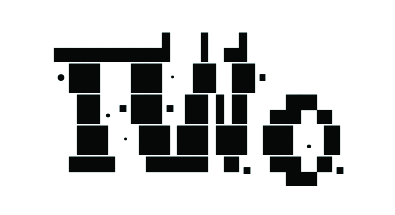
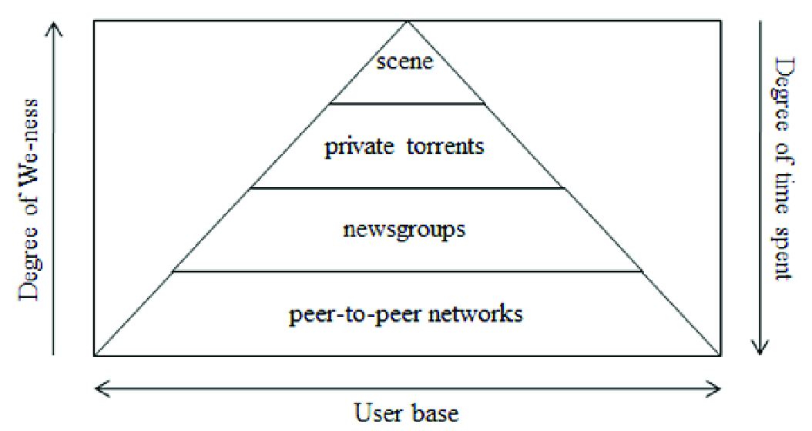
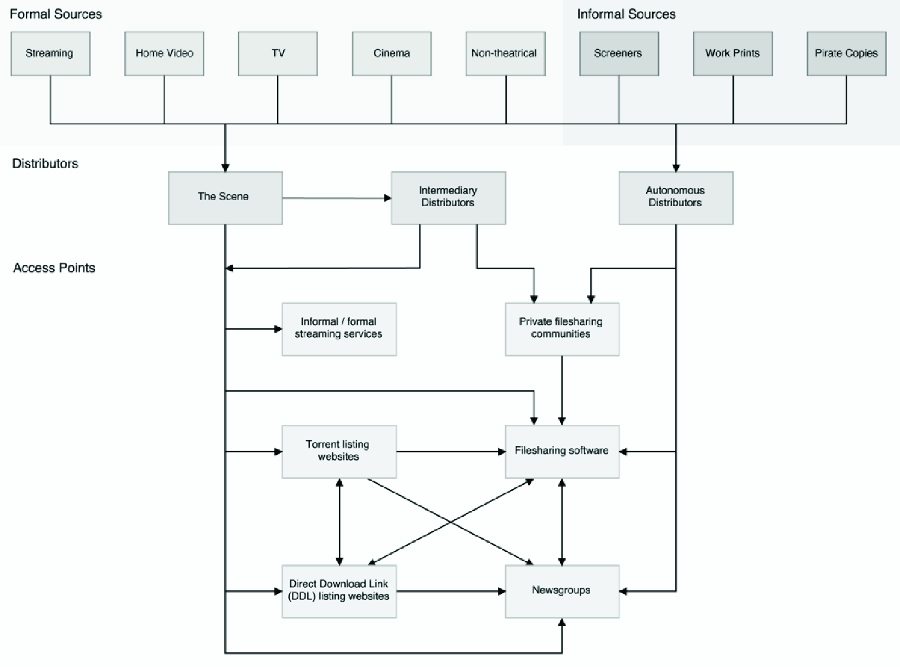

# Setting the Scene

## Pirate philosophy and imagery

What is digital piracy? Is it freedom fighters campaigning for the open liberation of digital material? Or is it simply the high-seas equivalent of buccaneers, extorting victims economically while hiding, coward-like, behind their screens? Of course, the very term “piracy” implies that there is a cut-throat nature to the act in its metaphor. It also implies that there must be personal gain at the illicit expense of another. However, piracy’s terminology places this activity within various imaginaries and optics that condition how we understand its motivational frames.[^1]

The domineering propaganda campaigns of the Motion Picture Association of America are, by now, familiar to most home-video audiences in the twenty-first century. The advertisement begins, “you wouldn’t steal a car.” The comparison they make is that one should not download pirated material because such an action would be analogous to theft . Ironically, given its deceptively simple logic, it is on such framing that one of the core philosophical debates around piracy rests: is digital piracy a form of theft? Can intellectual property be stolen? Further, it turns out that these questions have answers that are not addressable in simple terms of property relations but that sit within debates about labor in the digital world.

The terms of piracy and theft require upfront debate because there are significant differences. Theft is the act of deceptively appropriating someone else’s property and thereby depriving the legitimate owner of access to it. UK law, for example, is explicit in stating that to steal something means that the original owner must lose access: “[a] person is guilty of theft if he dishonestly appropriates property belonging to another with the intention of permanently depriving the other of it.”[^2] US law varies by state, but all larceny-theft provisions contain at least two components: 1.) dishonest appropriation of property; 2.) with the intent to deprive the original owner of it.[^3] Digital piracy does not deprive the original owner of the item in question because the act of copying has no impact on the original artifact. While a campaign by the Federation Against Software Theft (FAST) in the UK used the slogan “piracy is theft,” the legal reality is very different.[^4]

In the digital world, what we are discussing when we speak of piracy as theft is the unauthorized reproduction of an infinitely re-copyable artifact — not a “theft” in the traditionally understood sense. The transmission of a digital artifact from one party to another does not, in most cases, result in a loss of access for the original owner; although the recent craze for non-fungible tokens (NFTs) is an attempt to introduce such rivalry in the digital world. However, this ability to copy without deprivation is why various thinkers have branded digital artifacts as “non-rivalrous.” There is no rivalry for their ownership, and it is possible to share these objects without losing the original.[^5] What is instead eroded in the realm of piracy is the coercive, scarcity relationship between ownership and purchase inherent in physical objects. In short, the supposition is that if an identical copy of an artifact is available for free, the underlying labor that created the first copy will go unremunerated. People will not pay for something they can get for free.

Digital rights management technologies, intellectual property laws, blockchain ledgers, and the comeback of physical media (e.g., vinyl records) are all attempts to reintroduce rivalry and scarcity into the world of digital objects and to stem the tide of piracy.[^6] While the former three approaches use software systems, including cryptographic proof of work/space/stake, to reinscribe scarcity into the digital realm, the latter links a digital purchase to real-world ownership — albeit at significant ecological cost in the case of vinyl and blockchain — and conspicuous consumption.[^7]

There is an irony in these attempts to halt piracy. In one sense, the entire purpose of anti-piracy initiatives is to ensure that the creators of digital artifacts are remunerated for their labor, thus ensuring, under capital, the continued production of such objects. There is often a focus in such initiatives on the image of the “starving” musician or artist. This figure is swindled of a livelihood by the copying power of the digital realm, even as it is more likely to be the intermediary large corporate record labels that stand to lose the most. In another sense, though, these attempts to halt piracy deflect attention away from this labor through what Marx called commodity fetishism.[^8] Commodity fetishism is the principle that people believe that, when they buy something, they are paying for the object rather than paying for the labor that created the object. By emphasizing the relationship in a commercial transaction as purchasing an object rather than underwriting the labor that produced the object, anti-piracy initiatives devalue labor. “You wouldn’t steal a car” is the framing rather than “you wouldn’t steal the work time that produced a car.” In their imagery of the starving artist, such efforts at once glorify labor and its remuneration but do so by erasing labor from any visibility within an economic transaction.

Piracy is also potentially a highly offensive term for unauthorized, digital reproduction. Why? The ICC International Maritime Bureau reported in its annual piracy report for 2004 that seaborne pirates murdered thirty crew members that year.[^9] Every year, real sailors are kidnapped, threatened, and murdered by real, seafaring pirates. However, the typical imagery of the pirate has been subject to a romanticization that downplays violence and habilitates piracy. The Disney-fied images of pirates that have become routinized viewing for infants the world over, for instance, do not usually include AK47s and other contemporary weapons systems. Captain Hook may be the baddie, but the maiming and murder of his victims remain offscreen. As C.R. Pennell puts it, “[t]here was,” and still is, “in reality, nothing attractive about pirate violence, except for sadists and voyeurs, and those who held pirates to be heroes skated quickly over this thin ice.”[^10]

The widespread romanticization of piracy is, at least in part, linked to an idea of resistance to capitalism. More often than not, commentators tie this view to the idea of the commons. As Peter Linebaugh and Marcus Rediker highlight, the history of maritime piracy intertwines with various understandings and practices of the commons and “commoning.”[^11] But the idea of the commons has also played a vital role in the study of digital technologies. It even shares an etymological root with “communication.”[^12] Indeed, perhaps the most distinct feature of the digital landscape is the possibility of sharing all digital artifacts in common; the cost-per-perfect copy is nearly zero. It seems it should be possible to share all digital files in common. In such a light, digital piracy appears to resist capitalistic flows, a type of digital communism.

Given this well-known romanticization, it is surprising that Virginia Crisp writes that “[w]ithin popular and much academic discourse it is hard to escape the understanding that pirates are nothing more than deviant thieves.”[^13] Certainly, this is the discourse that operates within industry-sponsored, anti-piracy, advertisement campaigns. However, as Crisp goes on to note, “another construction of the ‘pirate’ is as a ‘subversive radical’ engaged in a power struggle with the cultural industries.”[^14] Indeed, the worldwide emergence of political “Pirate Parties” and various ambivalent pirate philosophies is evidence of the docility of pirate imagery.[^15] We can feel at home with the idea of pirates as friendly renegades, fighting against the global corporate hegemony, liberating material from those who had wrongly seized it from the hands of the people. We link piracy as resistance in such contexts to ideas of helping people in common, an almost-communism, a lineage perhaps best explored in Eric Hobsbawm’s relatively well-known analysis of social banditry and noble robbers.[^16] This is a far cry from murder on the high seas.

This metaphor of the commons, though, has featured heavily in digital spaces. On a superficial level, it seems to be a helpful analogy for what is happening in the digital world when resources are shared, and copies are co-owned. However, figures such as Sam Moore and Stuart Lawson have recently pointed out that the commons is a somewhat vague and imprecise analogy that buries historical detail in favor of an idealized, and generalized, notion of the commons.[^17] The commons, in other words, becomes a floating signifier onto which every participant projects their own take.

At its heart, much of the digital landscape looks more like the thirteenth-century period of enclosure in England when there was mass consolidation of previously common land into larger farms. As Nick Dyer-Witheford notes, enclosure was a multisided mass societal upheaval, one that required:

> a new regime of social discipline, surveillance, and criminalization including the witch-hunting of commons dwellings and using women, poor laws, antivagrancy legislation, workhouses, and the first steps in the formation of an internal state apparatus of thief-taking and policing to monitor, confine, and punish the potentially unruly population evicted from the land.[^18]

Certainly, the produce of these newly enclosed spaces can remain available to consume without paying. However, the practices of common-ing, in which common-pool resources are shared, worked over together, and communally governed, are rarely present in these new digitally enclosed cultures that large multinational corporations often own. Again, piracy can present itself as though it is a resistance to such practices of enclosure.

However, the history of the internet is much more complex than a simplistic, historical analogy to England’s enclosure can show. For instance, it is naïve to believe that the origins of the internet lie in common spaces where users disseminated everything for free for the good of everyone, as if it were some form of utopian commons that was later enclosed. Instead, it is worth remembering that the US military’s Advanced Research Projects Agency originally developed the internet, known as ARPANet. As Janet Abbate writes, “[i]n the years since the Internet was transferred to civilian control, its military roots have been downplayed [… but] [t]he Internet was not built in response to popular demand […]. Rather, the project reflected the command economy of military procurement.”[^19] The academic side of the early internet was secondary to its military history. As Leonard Kleinrock, an early internet engineer specified, “[e]very time I wrote a proposal I had to show the relevance to the military’s applications.”[^20] Hence, there is no precise movement from open, digital commons to enclosed, network platforms, with piracy as an intervening resistance movement.

That said, there are histories of enclosure in the digital world at a very material level, to which Dyer-Witheford directs us. For instance, the 1993 introduction of domain name sales was a clear incursion of commerce into the inter-networked world rather than the first-come, first-served system that had preceded this. The analogies to physical space and sale here were prominent, including the idea that those who sit on domains with no intention of using them are so-called “cyber-squatters.” Also, from 1991 to 1995 the architecture of the internet backbone was transferred from the National Science Foundation, a US government agency, to a group of telecommunications companies. The US government billed this as a democratic move, purportedly to ensure that they did not have permanent and final governance of a vital, trans-national infrastructure. However, it was also an enclosure of sorts where previously public-owned technology was transferred into private ownership.[^21]

It is against this mode of enclosure that some narratives romantically situate “hackers, pirates, free-software creators, universal and open access movements, cyberactivists, and hacktivists.”[^22] As is clear from the diverse figures in this list, there are many spaces where one can see resistance to capital in the digital arena. This resistance has also spanned many different media types over history. As has been bolstered by the recent historical work of John Willinsky and Adrian Johns, piracy, as a form of resistance to commercial practices, is not unique to digital media.[^23] However, digital piracy is far more widespread now than the unauthorized duplication of books in the early years of print. If digital piracy is a form of resistance, then it is omnipresent. The (admittedly, extremely partisan) Software & Information Industry Association and Business Software Alliance at one point estimated that 38 percent of software worldwide was pirated.[^24]

The responses to these enclosures have been categorized differently, depending on the perspective of the classifier. As Sarah Coleman and Dyer-Witheford point out, “[d]istinguishing between political and criminal responses to enclosure is not always easy.”[^25] On the one hand, it is difficult to conceptualize digital piracy as a radical, economic proposition when its analogous material metaphor is essentially one that involves murder for personal gain. On the other hand, decrying digital pirates as equivalent to seafaring killers is likewise obviously problematic and renders piracy’s definition nebulous. For example, “pirate” covers a broad swathe of copyright infringement activities, to which the next section of this chapter will turn. However, it also extends to a swath of ongoing illicit, naval activity. As Dawdy and Bonni put it: “[a]lthough many definitions of piracy have been offered, no authors we came across were willing to venture an explanatory model that would link diverse types of so-called piracy.”[^26] Pirates have, at various times, been “predators, parasites, criminals, outlaws, rebels, heroes, heroines, evildoers, buffoons, opportunists, armed robbers, raiders, plunderers, bandits, brigands, liberators, rogues, robin hoods, rapscallions, and bloodthirsty killers.”[^27]

Truly, piracy is diffusely defined. Piracy is “a substitute for declared war,” a form of “violent maritime predation in that it is not part of a declared or widely recognized war.”[^28] It has also been seen in economic terms as the taking of “tributes,” as “unrequited, systematic exactions effected by force or threat of force,” and as the activity of “commerce raiders.”[^29] Importantly, though, it is a mode of illicit violence in which — at least in the Graeco-Roman era — the idea of a “base” was key. As Philip de Souza notes, the maritime nature of piracy and the hefty equipment toll that this brought meant that pirates required an anchor point, a lair, or a hideout. As de Souza puts it, “[s]hips also need harbours or anchorages, so that the pirates’ bases become an important factor in their success, and the suppression of piracy requires the control of such bases.”[^30]

These definitions all go some way towards understanding the concept of piracy. However, Dawdy and Bonni point to perhaps the most salient feature of piracy as it applies in the digital and seafaring worlds when they propose a definition of “a form of morally ambiguous property seizure committed by an organized group.”[^31] While I have already covered how the notion of “property seizure” does not hold water for digital piracy, Dawdy and Bonni’s definition contains an even more critical element: a pirate needs a crew. For, as they note, “[o]ne thing that many of the [extant] definitions lack is an emphasis on the social quality of piracy […]. No pirate works alone. This is an important fact that has not been sufficiently appreciated in the literature on piracy due to a leap to legally classify piracy with individually motivated criminality.”[^32]

It is impossible to underemphasize the importance of a group, or as we might call it a Scene, for piracy. It is no coincidence that P2P networks that connect individuals, forming ad hoc temporary groups, have thrived at the lower end of the piracy food chain. Nevertheless, as we will go on to see, the tension between individualism and collectivity runs through the heart of the Warez Scene. The environment prizes elitism and individual skill above all else. Exclusivity of access — to computer hardware, computational skill, a supply chain for various media forms — is rewarded with even further exclusivity and admission to elite grounds far from the public view.

Conversely, Sceners are almost all part of groups. For instance, Sceners dub couriers in the iND (individual) group “lamers.” A pirate without a team is scarcely a pirate at all. Nevertheless, the groups are fractious. They bicker, argue, attack one another, compete, and generally take a no-holds-barred approach. Hence, we have the contradiction at the heart of piracy: individualism and elitism run to its core, but at the same time no person is an island. A community spirit, of sorts, is crucial.

At various levels, online pirates have also been conceptualized in terms of publishing and distribution modalities, as an informal distribution mode.[^33] That is, some have taken piracy to be a form of publishing, a distribution channel like any other with a dissemination role. As Balázs Bodó and Zoltán Lakatos note of Hungarian P2P sites, for example, administrators and uploaders fulfill “the same function in P2P piracy as publishing does in the book industry.”[^34] As Virginia Crisp also shows, these shadow, publishing cultures mirror the practices of mainstream distribution, with the highest value placed upon pirating the most famous works in licit channels.[^35] While it may be true to state that piracy is a form of distribution and that it does constitute part of the contemporary ecology of media distribution, the ways in which it can act to filter, frame, and amplify material — the functions that Michael Bhaskar ascribes to the activity of “publishing” — are conditioned by mainstream, legal methods.[^36] That is to say that if we conceive of piracy as a publishing and dissemination activity, it is one that is closely linked to mainstream cultures of licit dissemination.

It is relatively easy to see how piracy fulfills some of these functions of publishing. Certainly, pirate cultures amplify the material that passes through their halls, although this may not operate in the ways that audiences, producers, or even pirates anticipate.[^37] In providing another route to obtaining the material, albeit in a way that undercuts the legal market with a free offering, piracy amplifies. However, the functions of filtering and framing are somewhat different here than in conventional, permitted distribution channels (such as sales through Amazon).

In terms of filtering, as Crisp notes, the material that sails through pirate channels is conditioned by the material produced in legal streams. To return to my original formulation of “original pirate material,” this is a model in which the Scene emphasizes uniqueness and originality, despite it being a copy culture. There are sets of rules, covered extensively in Chapter Four, that determine what is allowed to be “published” in the Scene. Although these rules are a type of filtering, allowing both local (i.e., topsite-level) and Scene-wide prescriptions and proscriptions, they are conditioned by the material put out by Hollywood studios. The Scene rules are secondary filtering systems for a series of pre-produced artifacts that have, already once before, been through various filtering mechanisms.

In terms of framing, the Scene certainly takes on this publishing activity. The framing of the pirate artifact as being subject to quality control and rigorous scrutiny mechanisms is clear. This manifests, for instance, in the obscure, directory naming conventions that mark out a Scene “release” (the term used for a pirate artifact, be it a movie, TV show, computer game, or music recording). The Scene designation is meant to frame pirate publication as high-standard and high-speed.

Understanding pirate practices through the lens of publishing is also apt as there are parallels between contemporary digital piracy and earlier phases of book publishing history. As Bodó Balázs puts it:

> a longer historical lens suggests that the current crisis of copyright, piracy, and enforcement has much in common with earlier periods of change and conflict among cultural producers. From the early days of the book trade in the fifteenth century, cultural markets were shaped by deals within the publishing trade and with political authorities over who could reproduce works and on what terms. Broadly speaking, pirate publishers then played two roles in this early history. In the first mode, “they printed censored texts” and in the second “they introduced cheap reprints that reached new reading publics.”[^38]

As we shall see, these pirate cultures are not brilliantly placed to circumvent censorship. However, they certainly reach new audiences who would not have paid for the original works. In the digital space, the mass publics who wish to download material without paying make an audience for this material. Ironically, members of the Scene decry the mass circulation of their work. While we can understand the high-level, piracy Scene in relation to histories and practices of publishing, it also sits in an uneasy and ambivalent tension with such modes.

Nevertheless, if we consider piracy as a form of publication or dissemination, then it is vital to consider the role and mythologies of the original author or artist. Let us return to the starving artist figure, who plays a role in the appropriation and habilitation of piracy as a metaphor for digital copying outside the circuit of capital.[^39] The parallel here is that non-participation in consumer monetary exchange equates to starving someone. The logic is made causative, and the starving takes on the active voice. It is claimed in this case that it is from the artist that you are stealing the car.

The romanticized mythology of the starving artist is problematically deployed within discourses on digital piracy. It is true that, in some senses, copyright law places extreme restrictions on artistic freedom. For example, proponents of remix culture, in some ways central to the argument in this book, note how contemporary copyright law impedes the interplay between tradition and the individual talent, forbidding the reuse of in-copyright works within radically new spaces, even for artistic purposes.[^40] At the same time, as Matthew Barblan points out, “[a]s popular as the ‘starving artist’ cliché may be, real artists need food. Meeting artists’ basic needs goes a long way towards empowering them to create their art. Copyright’s role in giving artists the economic freedom to meet their basic needs — by generating income from their art — is an important part of the relationship between copyright and creative freedom.”[^41] In turn, this is linked to the tricky intersections between commerce and art. As Tyler Cowen controversially put it, “[e]conomic circumstances influence the ability of artists to express their aesthetic aspirations. Specifically, artistic independence requires financial independence”; a sentiment that echoes Virginia Woolf ’s earlier feminist pronouncements on the need for a room of one’s own.[^42]The problem with the myth of the starving artist as a target of anti-piracy campaigns is that one is not supposed to challenge this stereotype. Instead, regardless of its truth, the myth is that the artist’s starvation is the factor that allows him or her to produce “great art” — a troubling assertion, to say the least. That is, anti-piracy campaigns summon the assertion that, in some ways, great artists should be starving. Although industry proponents may say that they are working to alleviate this situation, anti-piracy campaigns that invoke the figure of the starving artist present at once a character that is to be pitied from their impoverishment while, simultaneously, painting a persona that relies on impecunity for artistic creation. Great art, this myth seems to say, can only come from those who are starving.

Such a stance draws attention to precisely which figures we make out to be victims in anti-piracy campaigns. In some cases, the call to “support the artists” clarifies that it is creators whom digital pirates economically damage. This feeds and is fed by the myth of the starving artist. In other senses, more systemic, capitalistic damage is posited to the consumer. The logic goes that if people refuse to pay for games, music, and movies, eventually these artifacts will not be manufactured, thereby damaging the consumer. As James Newman puts it: “[c]oncerted anti-piracy campaigns from the 1980s onwards, such as the “Don’t copy that floppy” television campaign, have consistently sought to discursively construct the legally-paying consumer as the real victim.”[^43] This context switching between harm to the creator and harm to the consumer calls into question the tricky interrelationship between art and commerce, between autonomy and utility. For even as the myth of the starving artist posed the use of commerce as a way of supporting artistic genius, such niche, arthouse productions are often not those upon which digital piracy trains its sights. The popular artforms that pirates most frequently target are those with mass appeal — the products of what first-generation Frankfurt School thinkers such as Theodor W. Adorno and Max Horkheimer would call “the culture industry.”[^44] While, as Maria A. Slowinska has pointed out, there are ways in which many “contemporary art and contemporary commercial strategies” converge to form a new hybrid figure of art and commerce, the fact that there is a populism in the targets of digital piracy should make us question the role of the starving artist within such discourses.[^45] It should also lead us to question how revolutionary piracy is if it just serves up the same culture industry products. Is it the same figure hiding behind the moniker of “creator” when one summons Vincent van Gogh and the Disney corporation? Both are “starving” artists under some anti-piracy rhetorics.

Then, piracy is at once both an attack on and a replicative function within capital. Like theft, piracy is an attack on capital accumulation within circuits of commerce. It is a disruptive mechanism that blocks the intended flow of finance. This is why there are laws against it. At the same time, piracy has an often neglected function of replicating popular media forms, with personal accumulation at the lowest possible price point — zero. Digital piracy accrues personal gain to the perpetrators and practitioners, even if it does not entail loss in the same sense as theft for the original owner. In this book, I demonstrate that this gain need not even be the item that is pirated but a form of cultural cachet within the subcultural Warez Scene. In short, there are economic logics within the alternative reality game of the Scene that replicate the macro-economics of contemporary capital. Thus, while piracy may wreck certain economic systems, it does so by reimplementing its own micro-logics of capital and redistributing the culture industry’s homogenized outputs.

The fact that piracy operates on its own logic of capital was recognized in the 1997 “No Electronic Theft Act” (NET) in the US. As Eric Goldman notes, “[t]he NET Act modified criminal copyright law […] in two principal ways: first, it expanded the definition of ‘financial gain’ to cover bartering implicit in warez trading, and second, it created a new basis of criminal infringement based only on a minimum quantum of infringement (irrespective of motive).”[^46] The former is essential since criminal copyright infringement is “the willful infringement of a copyright (a) for purposes of commercial advantage or private financial gain […] or (b) by the reproduction or distribution (including by electronic means), during any 180 day period, of copyrighted works with a total retail value of more than $1,000.”[^47] Of course, one could argue that legal frameworks such as the NET Act are merely bringing piracy to be understood within an economic frame of reference, rather than the piratical activities themselves possessing an economic character. Certainly the NET Act has the obvious benefit of making warez trading a form of criminal activity that can be successfully prosecuted, as had happened in over eighty cases by 2004.[^48]

But digital piracy is also not one, single thing. As Goldman puts it, “[t]he generic term warez trading imprecisely lumps together disparate activities.”[^49] In this book, I deal with the subset of piracy that takes place in elite circles behind closed doors rather than the mass systems of P2P sharing that may cause large-scale, economic damage through their broad accessibility. That said, these two spheres are not entirely separable; releases from the Scene leak into the public sphere and are usable by anyone who stumbles across them.[^50] For this reason, the next section of the book deals with the forms of piracy that are not the Scene. This tension between the desire to share and the desire to remain hidden runs through the analyses of this book and reveals the curious and conflicting motivations that drive people to participate within these subcultures.

Finally, if piracy is often romanticized, as much of this section has suggested, then we should pay close attention to whose piracy is romanticized. In the West or Global North,[^51] piracy is often romanticized through an exoticization, or orientalization, of racial mythology. Historically, as Kavita Philip notes, “[t]he pirate figure has commonly functioned as a raced, gendered subaltern who effects the inversion of hegemonic power relations.”[^52] This seafaring imaginary of deviant, racial servitude runs from St. Augustine through Bertolt Brecht, but it has also evolved to match the contemporary digital world. In the digital space, the fear of pirate Others, particularly bootleggers in “Eastern” nations, has arisen as a specter to haunt Hollywood studios and record labels. The ways in which this can be understood lie in the “world-shaping,” “ideological work” that involves “naming the original as ‘real’ and the copy as ‘fake’”; a way for corporations to re-mark damaging piracy as the efforts of foreign agents, as dominant forces have done through history.[^53] Consider that “good piracy,” which is romanticized as political freedom fighting, often takes the form, of, for instance, free-culture pioneers such as Lawrence Lessig arguing before the US Supreme Court for the right of consumers to copy their own media and to transform it. By contrast, as Philip goes on to argue, “[b]ad piracy is Asian piracy”; the cheap resale of “counterfeit” DVDs on the street corner.[^54]

This is to say that while certain forms of piracy are romanticized, racial or ethnic biases drive these choices. Ironically, as we will go on to see, the Scene actually reproduces some of these (post-)colonial logics itself. The geo-segmentation of Warez networks into the US, European, and Asian sites, with poor intercontinental routing speeds, led to a hierarchy of topsites in which different racing charts were produced for different regions.[^55] In turn, this drove a valorization of specific geographic site locations, mostly centered in the US and Europe. It is also notable that, as the Scene deals with almost every digital media format available, pornography is also prominent within this space. Given that pornography has well-known racial characteristics and that pornographic works have titles that denote genre through racial labels, the Scene is a space that is flooded with a stream of textual, racial epithets. Even if it has been argued, then, that “pornography often promises difference, but actually culminates in a universalizing sex act which overcomes difference,” the Scene is a world where announcement bots daily sexualize and objectify Black and Asian people.[^56]

The geographic and linguistic centers of the Scene that I cover seem to have an Anglo-European bias. As English remains the dominant language of intercultural exchange in most spaces, this is hardly surprising. As we will see, many Scene rules specify that only the Latin character set (i.e., a–z) are valid in release filenames, thereby requiring the transliteration of nonanglophone releases. That said, there are groups that specialize in releasing material from non-English cultures. For instance, many release names reflect the Japanese pop music genre (JPOP) (e.g., “4TE-More_Ippo_Zutsu-JPOP-WEB-2015-POWDER”). While this shows that the Scene does work internationally, it is also the case that such releases must set themselves aside, using the JPOP or KPOP (Korean pop) tags. Given that this text appears in the release name, many topsites also likely ban such releases. The marker of distinction and diversity here also serves as a marker by which releases may be excluded. The majority of this book is concerned with the functions of the Anglophone Scene. This is due to a combination of factors, including but not limited to the composition of the archives to which I had access and my ability to read only European languages. It is possible that other more geographically specific Scenes would merit further attention and research.

## Piracy Outside of the Scene

If we are not to conceive of digital piracy in romanticizing anticapitalist terms, yet we are also to value or, at least, to understand the craft and novelty of original pirate material that constitute my claimed warez aesthetic, then we need to consider the different levels of the piracy ecosystem and the differing motivations of actors within that web.[^57] Often constructed as a hierarchical “piracy pyramid,” online copyright violation can be broken down into a hierarchy as follows, from top to bottom:

1. Topsites, or the Scene
2. File eXchange Protocol (FXP) boards
3. Private torrent trackers
4. Public torrent trackers, or XDCC and other P2P mechanisms
5. Bootleggers.[^58]

The remaining chapters of this book primarily focus on the top level of this environment — the topsites and release groups that constitute the network known as the Warez Scene. But it is worth unpacking the lower hierarchies to understand each level’s motivations and conceptualize piracy within these spaces. As Jonas Andersson and Stefan Larsson note, motivations and justifications for participation vary hugely between different types of actors within these areas.[^59] But the Warez Scene can only really be understood by its distinction from other types of piracy, by its differentiation from other forms.



Figure 1. Huizing and van der Wal’s pyramid. Reproduced under a Creative Commons License. 

Different scholars have painted the pyramid differently at different times and with diverse structuring motivations for the hierarchy. Ard Huizing and Jan A. van der Wal, for instance, compare the Scene to private torrents, newsgroups, and public P2P networks (shown in Figure 1).[^60] The structuring logic that Huizing and van der Wal employ is across the axes of “community” or “We-ness,” as they term it. They also use the level of time investment made by members of each tier with a fi nal dimension indicating the relative proportion of users within each segment. That is, for Huizing and van der Wal, the Scene can be characterized as a space of a small userbase, where participants spend a lot of their time as part of a tight-knit community. By contrast, public P2P networks represent the precise opposite on every single one of these traits. The descending area coverage of each tier of the pyramid makes it an excellent metaphorical form for this representation.

As Virginia Crisp has aptly shown, this diagram and all such pyramids are reductive. Her own schema of the formal and informal movie distribution ecology aptly shows the bottlenecks and entry points when filtering through these systems.[^61] It is clear that, in reality, a simple pyramid is reductive of the flows between official and non-official distribution. Despite this, for reasons of concision in this explanatory portion of the book, I stick to a simplified pyramid and hierarchical structure, albeit one that also encompasses non-digital piracy (e.g., bootleggers selling material on street corners). Such an approach confounds, to some extent, Huizing and van der Wal’s setup. Bootleggers likely spend a significant amount of time in their pirate activities, and they profit from it, even if they are not a closely bonded group and even if they are a broader userbase. Starting at the bottom of my structure, it is perhaps easiest to understand the motivations of these bootleggers.[^62]

“Bootleggers” are people who sell pirated material, be it on the streets or online. We should take note that there is sometimes a racialized demonization of the idea of bootlegging, as it often takes place within less economically developed nations.[^63] Nonetheless, such individuals will have a variety of supply chains for their material, which will range from full Scene releases — with the Scene sometimes billed as the key distribution route — right down to home-made copies of media that they legally own but have illegally duplicated.[^64] The motivation of these individuals is crystal clear: they are into piracy in order to make money.[^65] Bootleggers are often confused, as Lee Marshall notes, with “tape traders,” who have, for example, recorded a live gig of jambands such as Phish, the Dave Matthews Band, and the Grateful Dead, who all encourage this practice. Indeed, tape trading is a licit activity in which such bands “permit their audiences to record their live concerts and then let fans trade these recordings amongst themselves on the condition that no money is involved.”[^66] Tape trading is legitimate, as long as it is noncommercial. Bootleggers, by contrast, reintroduce commercial motive into piracy and, as a result, are hated in common both by anti-piracy outfits and, as we shall see, the Scene itself.



Figure 2. Virginia Crisp’s more thorough diagram of distribution sources. Copyright Virginia Crisp, reproduced by kind permission of the author. 

Importantly, as I note in several contexts throughout this book, most Scene releases come with strict prohibitions against selling their pirated warez. To be caught bootlegging or selling warez outputs will, in most cases, merit a lifetime “SceneBan.” This has caused a great deal of confusion in the secondary literature. Some work, such as S.M. Furnell’s taxonomy of cybercrime, has totally misread the motivations of Sceners. For while he correctly ascribes “challenge,” “ego,” and “ideology” to Sceners, he also writes erroneously that they operate for “money.”[^67] This goes directly against the vast body of evidence in, say, Scene notices and announcements that decry those who sell warez or access.[^68]While this spurning of commercial motive could lead us back to romantic ideals of piracy, it is not truly linked to any deep-seated ethical principle. It is rather because selling pirate material is likely to attract unwanted legal attention. However, anti-piracy campaigns, such as the aforementioned notorious “You Wouldn’t Steal a Car” campaign, have often targeted this bootlegging level of pirates, accusing the practice of funding terrorism.[^69] For instance, a report commissioned by the RAND Corporation accuses the Warez Scene of supplying material that is used by “many more people further downstream” (e.g., the bootleggers) to fund terrorism. These accusations are even made while, “as far as can be determined,” Warez Scene groups themselves “do not engage in other forms of organized crime, such as drug or human trafficking” and “are driven by the challenge, by wanting access to free goods, and by the thrill of ‘living on the edge,’ not to mention ‘street cred[it]’ among the groups.”[^70] Crisp’s distribution diagram seems to confirm that the Scene is one of the few routes by which, for example, films enter lower pirate markets. Even when it is claimed that “the true warez culture is a non-profit venture,” an aspect to which I will return, this is problematic given that the Scene does likely feed bootlegging markets.[^71] As a result, even though the Scene has a strict ethos of prohibiting the distribution of their releases on public P2P media[^72] and membership bases who “strongly object to commercial piracy,” commerce springs from their activities, downstream in bootlegging.[^73]

Bootleggers pose a genuine threat to the economics of various media industries. As I have already noted, there is a geospecificity to this. As Kline et al. point out, “the major breeding-grounds for contraband games are probably in the black markets of the world, China, the Russian Federation, Southeast Asia, and other emerging, or declining, markets.”[^74] While Hong Kong is lined with markets selling the latest contraband Play-

Station titles, by some estimates 98 percent of titles are pirated in Russia and Ukraine. However, it is a mistake to see this as entirely localized. The Interactive Digital Software Association “accuses more than fifty countries of either aiding counterfeiters or failing to establish or seriously enforce adequate protections against theft of intellectual property.” Despite Sceners trying to keep releases in the family, their work finds its way down to bootleggers who are spread worldwide. “If the interactive game industry is now globalized,” write Kline et al., then “so too is the shadow world of pirate enterprise that haunts it.”[^75]

In my hierarchy, the level above bootleggers is the set of public torrent trackers that have been a thorn in the side of criminal enforcement agencies for almost two decades. The most notorious of these in the West, The Pirate Bay, has proved virtually impossible to close, despite massive ongoing legal efforts, police raids, and state interventions.[^76] These sites are public, open depositories of pirated material in which end users use protocols such as Bittorrent, a fast P2P distribution algorithm, to disseminate the material among themselves. The actual torrent files, hosted by sites such as The Pirate Bay, do not contain the pirated material itself. Instead, the torrent files are pointers that coordinate peers to communicate and to share the files. The initial seeder is the person who has infringed, not the intermediate hosting site. Therefore, when these sites are raided there is no actual pirate material on their servers, despite their clear, ongoing intent to violate copyright law. Instead, the central servers themselves merely have the indexing files. Such a torrent system is akin to having the table of contents to a book that points to where you can get the chapter but not the chapter itself. This referential characteristic of torrenting has made it difficult, in legal terms, to shut down sites like The Pirate Bay.

While this type of torrent site is open to the public, a tier of activity above this works on an invitation-only basis — private Bittorrent trackers. These sites require users to be active in uploading and participating. They usually have strict rules and quality assurance processes. These, in turn, lead to well-seeded torrents and high-quality material, shared between a limited but still relatively large userbase.

To date, the most notorious, private Bittorrent trackers have been Oink’s Pink Palace and its successor, What.CD. These websites were private music trackers funded by donations from the userbase, which provided a clear legal route to their prosecution. Specializing in lossless distribution formats where the sound quality of the music is identical to the original on the recording (i.e., is not compressed in a way that loses any quality), Oink’s Pink Palace was eventually raided and shut down in 2007 having run for three years. The founder of the site, Alan Ellis (the eponymous “Oink”), was prosecuted for copyright fraud but was not found guilty even though he did not deny running the site, demonstrating the difficulty of legally pursuing torrent website operators (siteops).[^77]

Oink’s Pink Palace was succeeded by What.CD, which ran from 2007 until 2016, when it preemptively shut down to avoid a raid.[^78] Perhaps the most notable feature of this site was the introduction of its own custom server software and its highly slick tracker website, Ocelot and Gazelle, respectively. The professionalism of these software developments, which could handle up to five million connected peers with just three gigabytes of RAM, has many similarities to the custom FTP daemons of the Scene, covered below.[^79] Although undeniably and totally illegal, such was the extent and organizational prowess of What.CD that it was hailed, even in professional journalism circles, as “[t]he greatest music collection in the world,” ever.[^80] Just as Library Genesis is painted as the illegal equivalent of the Library of Alexandra in the digital-book, piracy space, so What.CD was for music.[^81] Clearly, requiring that users remain active, upload material at a ratio to their download, and have strong cataloguing and metadata principles led to the creation of what can only be described as a professional piracy outfit, despite the fact that the site administrators did not profit financially from their dealings. It is clear that the Scene is a much more tightly knit group, and that private Bittorrent trackers are much more spread out than this; however, there are distinct parallels between the “best” outfits at this level, and the work of the top-level Scene.

The motivations of those who participate in Bittorrent “communities” are varied.[^82] Most people who use public trackers, it can be assumed, are primarily interested in acquiring the end content free of charge. As there are no motivational structures, such as a requirement to upload, the focus is on the material itself on these sites. Furthermore, there is often less of a “cult of the uploader” around releases, compared to, for instance, private torrent sites, where user classes and hierarchies reward those who upload quality releases, which I cover in Chapter Four..

On occasion, proponents have nonetheless argued that such pirate sites act as cultural depositories, preserve media for the longer term, and motivate broad participation — “shadow libraries” as “dark archives.” This is an extension of my earlier argument that piracy is a type of publishing activity. Certainly, there was a direct campaign to preserve the illegal archive in the case of the Library Genesis torrent collection.[^83] However, there is a problem with this argument: the robustness of these illegal sites as a preservation system is dubious at best. Hence, those who believe that such activities constitute “a grand subaltern repository for access and preservation” are overlooking the fact that recent studies show preservation robustness of not more than 40 percent.[^84] Certainly, this may be better than nothing, and we cannot ignore these so-called “shadow economies” of illicit distribution, but it is hardly a solid infrastructural basis on which to found the perpetuation of our cultures.[^85]

One of the challenges in understanding the motivations of various actors in these spaces is that different media types may come with different motivations. Suppose we assume that participation in public, torrenting communities occurs primarily in order to obtain illegally copied objects. In that case, there are many reasons why an agent may do so. However, the reasons vary with the artifact in question. For instance, it is plausible that some software piracy takes place within a business context. Pirate copies of, for instance, Microsoft’s Office suite might be obtained by those working within professional office cultures. By contrast, the motivations in obtaining the latest Marvel Cinematic Universe superhero film are less likely to be professional, and it is more likely that such a user would participate to enhance their own leisure time. Likewise, the motivations in obtaining pirate copies of academic books may be very different to the reasons for obtaining the latest heavy metal album, and it would be different ethically too, given that education is an eleemosynary purpose.

Moreover, motivations for acquiring digital artifacts for free through public torrenting and its precursors are often relational to the user and their financial circumstances. For example, consider a 1994 study that found that the individual benefits of pirating software pertained to financial gain, overcoming the challenge of copying, and not having to go out to buy the software.[^86] Likewise, a 1997 study found that the most frequent argument for software piracy was that software was too expensive, and end users said that they could not afford to purchase it.[^87] The personal circumstances of an individual appear to play a crucial role in why they may download copyrighted material without paying. Generalizing to entire spheres of activity may paint a false picture.

It is possible to speculate near-endlessly about the motivations for participating in the acquisition of illegally copied artifacts, and there have been many studies examining such behavior.[^88] However, what seems clear is that, at the crossover point from public to private Bittorrent trackers, there is the beginning of a shift in generalized motivation. While many private Bittorrent users participate because they wish to have access to pirated artifacts, it is also at this step in the pyramid hierarchy that piracy begins to take on a life of its own. That is, some of the structures of private Bittorrent trackers encourage pirates to participate for the sake of piracy, rather than to gain access to new music, films, and software. Whether public or private, while Bittorrent trackers are not formally considered to be part of the Warez Scene, we can begin to see motivational congruence at this point.[^89]

The motivational and rule-based structures of such private trackers reveal this shift. Private Bittorrent trackers have strict rules about participation, and they structure participants’ ability to download according to a ratio system. For example, the user must have uploaded a certain amount in a ratio to download. Hence a ratio of 1.5 means that the user has uploaded 1.5 times the amount they have downloaded. At first glance, there does not seem to be any particular significance to this, and the motivation remains a desire to have enough upload credit to download new releases. However, it goes further than that. The Project Gazelle tracker that powered What.CD has support for in-built user classes. These range from “Member” through “Elite” and up to “Torrent Master.”[^90] These user classes sometimes have extraordinary criteria. The default number of uploads, for instance, to become a “Torrent Master,” is set in the codebase to 500 uploads.[^91] As we will see, ratio and lifetime upload statistics also play a core role in Scene couriering practices.Given that each upload to a private torrent tracker has significant and rigorous metadata input requirements, and given that running a client setup with 500 local torrents requires substantial computational resource, the existence of these user classes suggests more than simply a desire to earn credits for download.[^92] Instead, there is a prestige economy at work here, where users seek recognition, albeit pseudonymous, from their pirating peers. The promotions system used by these private trackers gamifies the uploading process. It makes the activity an end in itself with similar prestige pursuit as the alternative reality game of the Warez Scene. As Blake Durham puts it, private trackers are structured as “prestige econom[ies] primarily organized around the exchange of digital audio files.”[^93] However, they also animate “a vibrant social ecology in which users regard upload statistics and musical-technical knowledge as symbolic capital.”[^94] That is, knowledge and ownership play a role in the systems of symbolic exchange and respect.

This system also introduces scarcity to ensure competition and fair play with a strict one-account-per-lifetime rule and an insistence that they will severely punish any rule-breaking. In a similar fashion to the so-called “SceneBan” of the Warez Scene, the idea is that members have one chance, and, if they blow it, they are out. Particularly relevant to private trackers is the default rule, built into the Gazelle codebase, that insists that users “do not trade, sell, give away, or offer accounts.”[^95] As we will go on to see, this mirrors the language used in the NFO files of the Warez Scene that repeatedly stipulate the noncommercial nature of the enterprise and on which we have already touched. 

On the other hand, private trackers such as What.CD did operate a donation system. The reason for this is clear, for “[o]ne of the principal ironies of the study of extralegal, apparently non-monetary exchange systems such as What.CD is the fundamental necessity of monetary expenses dedicated to maintaining the technical infrastructure of the ecology.”[^96] With costs of approximately several thousand dollars per month, the infrastructural spending of private Bittorrent trackers precludes an exchange strictly outside the financial sphere, as does the purchase and ongoing maintenance of topsites in the Scene.

To return to our pyramid, in the contemporary digital piracy ecology it is the users who enjoy the game of piracy for its own sake on private Bittorrent trackers who begin to show us the motivations of the higher-level actors. Private Bittorrent trackers are the point at which the participatory but exclusionary prestige regimes of the actual Scene kick in. That said, high-level Warez Scene figures do not recognize the same motivational structure at play in these lower echelons. There is, writes at least one study, “a unanimous anti-P2P feeling amongst Scene members, with all those interviewed making a distinction between ‘piracy,’ where reliability, quality, and security are protected by the accountability of membership to FXP boards and release groups, and ‘filesharing,’ seen as an irresponsible quest for ‘free content’ where users are not invested in the reciprocal exchange of information.”[^97]

Before returning to the top of the pyramid to which this book is dedicated, there is one further intermediate layer between Bittorrent trackers and the Scene, just mentioned, FXP boards. These secretive boards were especially prominent early in the twenty-first century. However, there is barely any scholarly literature that covers their operations and most of the information that I have managed to garner comes from informal reports, such as Reddit posts.[^98] One of the only academic mentions is in Sander Gellaerts’s doctoral thesis from Tilburg University in 2015. This is based on legal cases heard in The Hague in 2013, under docket number “ECLI:NL:GHDHA:2013:BZ6496” and in Rotterdam under docket number “ECLI:NL:RBROT:2011:BR5610” in 2011.[^99] Andrew Sockanathan’s doctoral thesis from Goldsmiths in 2011 likewise contains a section on the history of the Scene that details the operations of these boards.[^100] Finally, Mercè Molist Ferrer also writes about FXP boards in her 2014 book, Hackstory.es: La Historia Nunca Contada del Underground Hacker en la Península Ibérica. Ferrer’s main sources, though, are Wikipedia and the Pub-Crackin 101 Tripod Site, to which I also refer.[^101] However, Ferrer also spoke privately with a man called Lluís Ridao, who claimed to be a former FXP board member who corroborates Gellaerts’s legal analysis. Finally, some of the below comes from the “Guide to Internet Piracy” published in the Summer 2004 edition of 2600: Hacker Quarterly.[^102]

FXP boards are sites where users post warez on hacked servers. With private membership rosters, the FXP board Scene is in fact even more illegal than almost any of the other levels of the warez pyramid, and it may also be more secretive. Unlike the other levels, FXP board participation involves hacking (i.e., cracking) into computers to establish them as distribution systems without their owners’ consent. Specifically, FXP boards operate through four classes of users: administrators (who run the boards), scanners (who seek out vulnerable servers), hackers (who break into these machines), and fillers (who put warez on the servers). Then, there are two models of FXP boards. One model is a space where boards would find publicly accessible FTP servers that are improperly secured and fill these with warez for others to download. The second is one where members would hack servers to install their own FTP daemons. The process in that second, more common model, usually looks as follows. First, in consultation with hackers, scanners identify a remotely exploitable computer-software vulnerability. Usually, this means finding a piece of vulnerable software and then working out how remotely to identify that software. As a hypothetical example, let us say that a remote-control system called “Vulnerable RC” contains, by mistake on the part of the programmers, an exploitable vulnerability. However, the vulnerability only exists in version 1.24 of the software. Scanners would establish a process that searched the entire range of Internet Protocol (IP) addresses for this software. They would do this by sequentially trying to connect to the default port of this server on every machine address on the internet, sometimes attempting to avoid the IP ranges of known governmental agencies. Once connected, they would only report success if the machine replied with the opening response banner, “Welcome to Vulnerable RC v 1.24,” or similar. Often these scanning processes, which take a long time, would run on remote machines. (After all, there are 4.3 billion theoretically accessible IPv4 addresses in the world, even if many of these are reserved and not publicly assignable in reality). These remote machines were hacked themselves but were found not to have sufficient bandwidth to act as a warez store. These remote systems for scanning were known as “scanstr0s.”[^103]

Once a scanner has successfully identified a vulnerable server, they pass the details over to a hacker. Hackers then exploit the vulnerable software and install a covert FTP daemon on the machine. As Gellaerts puts it: “[i]n the FXP board case, suspects were convicted of participating in a criminal organization with the aim of hacking and exchanging copyrighted works. [… T]he Public Prosecution here focused on the forum whose purpose was to hack into computer systems to make use of the disk space and bandwidth so that copyrighted works could quickly be uploaded and downloaded.”[^104] In keeping with the paradoxical ethical formulations of other Scene levels, there appears to have been a code of honor among this class of otherwise highly illegal actors that forbade them from re-hacking machines that another Board had already compromised. The resulting FTP site is called a “pubstr0,” which we might speculate to mean “public store” in “leet speak,” (more on this later). The hacker then posts the empty box to a section on the Board for “empty str0s.”

Hackers around the turn of the millennium seemed to favor vulnerabilities on the Windows operating system. These were easier to come by and exploit than their Unix and Linux cousins. For many years, the most common vulnerabilities were a weak Netbios Password that would allow remote execution, a similar setup in DameWare NT Utilities (i.e., a popular remote administration client), or a blank password on a Microsoft SQL Server. Once hackers had found a vulnerability, they would create a batch file on the remote machine, using the “echo” command. This command writes lines to a file. In this case, the hacker would write a series of lines to a file that instructs the server to download new software and to install it. To download the files, the hacker would use the Trivial File Transfer Protocol (TFTP) and then use psexec.exe (a lightweight remote shell program) to execute this file remotely, which would typically then install Serv-U FTP server (an FTP server program) or an IRC bot, giving further access to the machine.[^105]

Hackers sound like an exotic species of computer literati who know what they are doing. It is certainly true that being a hacker at this level involves some computational ability that is beyond most people’s competence. However, it would be an overstatement to believe these figures to be supremely competent, able to break into any machine at will. Instead, FXP board hackers appear to have been opportunists who ride on the back of existing exploits. They are unlikely to have crafted their own exploits and instead used prefabricated tools to crack into computers that were already vulnerable. Indeed, some of the higher-level FXP board hackers may have gained access to rare exploits that were not publicly available, giving them an edge on the competition. But most hackers in this area are better defined as “script kiddies” or “tricky kids,” as one source puts it.[^106] Certainly, being a hacker on an FXP board is nowhere close to the technical skill required of software crackers in the high-level Scene.

Finally, fillers ride in at the last minute and transfer pirate material across to the hacked servers. Usually, fillers seek boxes with large hard-drive capacity and extreme bandwidth. For this reason, scanners usually targeted IP ranges that were on highspeed university links and so forth. Fillers need good warez access, which could be from the topsite Scene or other FXP boards. As with couriering in the Warez Scene itself, FXP board fillers receive praise for beating the competition on speed. Once a filler has populated a str0, they post the resulting hacked server to all of their Boards, credit the hacker and scanner, and bask in the glory of having created a release site.

FXP boards usually ran on vBulletin, an extensible (Hypertext Preprocessor) PHP-based internet forum system. The boards would generally run a modified version of this software, including add-ons such “ShavedApe’s Fxp-Pack 3.0.1,” packaged within releases with revealing names such as “Vbulletin_3.6.8_Pre_Modded_FXP_Edition_v.1.5.” These plugins appear to have added functionality to the base software, such as monitoring the uptime of the posted hacked servers, checking whether the login credentials work, and so forth. They also appear to contain discoverability features, such as allowing posters to specify the contents of the str0, thereby making it possible for the board to show all servers that contain a specific release. Of course, the software on which the boards themselves ran was itself pirated. Due to the extreme illegality of FXP boards, which involve hacking or cracking on top of regular pirating activities, membership of such boards was and is not encouraged among those in the actual, high-level Scene.

Nonetheless, the history of FXP boards marks a critical point beyond the threshold of private torrenting in the piracy hierarchy. Membership of FXP boards was confined to an elite cadre of individuals. Competition between boards was fierce. As with the topsite Warez Scene, FXP board members were bound by a code of secrecy about their boards and a code of honor concerning the rules of participation, and it was not permitted to give out information about these sites. Further, sharing pubstr0s outside of these boards was frowned upon and would cause a user to be banned.

At the same time, an entire culture on IRC developed precisely around sharing the fruits of FXP boards. An example of this is the subculture in FDFNet’s 00mpah list. FDFNet was an IRC network that ran a channel, #warez, in the early years of the twenty-first century. As the name implies, the theme of this channel was clear. The name of the group that ran this channel was “00mpah,” presumably after Roald Dahl’s orientalized, candy-production workers in Charlie and the Chocolate Factory (1964).[^107] This channel provided users with a downloadable list of warez FTP sites when they entered the channel and typed the command “!list.” Most of the sites on the list were from FXP boards.“The list” is worth a brief detour here as the sociality and interactions around it work in the same way as does much of the piracy ecology, including FXP boards themselves. Those in the true Scene scorned FXP boards. Those on FXP boards scorned the 00mpah list. In both cases this was due to the threat of exposure of secret cultures to public scrutiny which can also carry legal penalty. Yet the list also exhibits similar motivational characteristics and rewards as FXP boards and the Scene. First, it is notable that while access to the 00mpah list was open to all, non-contributors experienced “a 6-hour time delayed version of [the] complete list.”[^108] Access to the full list was available only to those who contributed, thereby gamifying participation. The list also exhorts users: “Don’t be a leech. Contribute!” and gives instructions as to how users can add their own sites to the index (“To add a site /msg Balthor SITE xxx.xxx.xxx.xxx /dirs L: & P:”).

Further, as with high-level, warez groups, the 00mpah list put out hardware requests with bounty offers attached: “OOmpah is also looking for shell accounts to run eggdrop bots from. If you can provide a LEGIT eggable shell, please contact manoman. We will reward you.”[^109] The emphasis on “LEGIT” here is telling because it is clear that the operators of the #warez channel were keenly aware that they would likely receive hacked shells in response to this inquiry. Accepting these could have placed them in legal jeopardy. Like the nuking system in the high-level Scene, covered below in more extensive detail, the 00mpah list also had a quality-control mechanism: “[i]f you notice any bad sites please help us out by typing ‘!bad sitenum reason’ in #warez. Thanks.”[^110] A team of moderators then worked to verify whether the claim for “badness” was accurate.

The list provided an overview of content on each site and a rating, but a brief survey of just one of the list outputs clearly shows the link to FXP boards. Consider this site entry:

```
[92186] <18 Apr 2003 15:37> Rated: 1 rossx

203.251.32.102 / l:ENVY-FXP p:ENVY-FXP port:50000

bridge 3000-eph, chess 2003-eph, fim speedway grand prixflt, indiana jack-flt, pet racer-flt, pet soccer-flt
```

The site in question here is running on the IP address 203.251.32.102 on port 50000. It contains the games Bridge 3000, Chess 2003, and some racing and sports games. Notably, though, the login and password are both “ENVY-FXP.” While no public trace record remains of ENVY FXP, apart from the 00mpah list, it is safe to assume that ENVY FXP was an FXP board. The high port, the login and password, and the fact that the warez resides at the root (“/”) on this server are giveaways of its hacked status.[^111]

The 00mpah list also contains public, anonymous FTPs with warez hidden on them, that is, the first type of FXP board output that I mentioned. Consider the following site entry:

```
[92636] <20 Apr 2003 09:02> Rated: 1 Ra0uL

137.68.225.12 /leebt/homepage/icon/ / %;^^;% /AUX/PUB/ l:anonymous p:i.test.ca port:21

discreet 3dsmax v4.2-tfl, fifa 2002-flt, magix video deluxe v1.02-mage, mechwarrior 4 black knight expansion-flt, shrek game land activity-eph
```

While this site looks similar to the previous example, several interesting characteristics are not present in the preceding case. First, the login name here is “anonymous.” The password appears to be simply a generic email address (i.e., the user could login to the anonymous account using any password). Most significant, though, is the pathname that is given: `/leebt/homepage/icon/ / %;^^;% /AUX/PUB/`. Instead of the pirated material living at the precise directory where one logs in (“/”), this site hides its warez inside a directory maze. The space in the filename, the special character `%`, `^`, and `;` as well as the restricted system keyword “AUX” means that it is not possible directly to navigate this tree using an FTP client. It is also likely that the site will contain hundreds of directories at every level, meaning that someone who stumbles upon the site is unlikely ever to find this directory by chance. In short, the only way that an end-user would find the warez on this server is by knowing the exact location where it is stored — a common tactic used by FXP boards when filling public servers and that the 00mpah list reveals.[^112]

As noted before, the 00mpah list and others like it were deemed “pub stealers” — ironically, for a culture that thrives on taking the work of others without permission. However, a whole, lower system developed that fed off the illicit activities of the FXP board scene. Tools such as user clown’s “locksmith” emerged that would allow a user to crack the directory mazes on public FTP servers, find other boards’ work, and allow sharing against their wishes.[^113] Given the commensurate damage of computer hacking compounding the existing illegality of multimedia piracy and although the FXP board scene’s risks seem higher, I have found very few references to criminal prosecution for participation apart from the listed cases above.

However, to close this section on motivations, it should be noted that the FXP board scene, like the private torrent tracker scene, was highly organized and coordinated. However, hierarchies of FXP board memberships lent a different motivational structure to participation. Forum posts from purported members list a vast network of underground FXP boards, including: Rosevalley, MB-FXP, Riverndale, Innovation of Darkness, IllusionFXP, DFF, Saccon, Undieable Warriors, Enter by Force, eVolite, Legends of the Unspoken Minds, Voice of the Scene, VoCHT, WDRC, equinox, Aurora, Tension, Peace’n’Warez, Jinxed, Sentinels of Light, Skilled, ph0enix, UnderGround Council, Apocalypse, DupeFXP, Evolution, eMOTiONDVD, iGNiTiON, TMC StormFXP, Spuitkak-FXP, and others.[^114]

It can be assumed that FXP board Sceners participated in their activities with the same zeal and abstract motivation as their analogs in the topsite Scene. It is clear that if one simply wanted access to the latest pirated materials, there are far easier ways to go about this than to join an FXP board. The latter involves learning its rules and codes of conduct and engaging in highly illegal scanning and hacking activities. Instead, it seems evident that those who participated in FXP board cultures sought status and respect among their peers. Who would be the bestknown hacker? Who had access to more elusive exploits? Which scanners could consistently turn up new, fast, and exploitable ranges? And which fillers had genuine courier access to topsites, that would then allow them to filter down their warez from the topsite scene? Far from being an effort to ensure the broadest, public dissemination of pirated material, the FXP board scene should be considered another closed enclave, driven by elitist principles rather than any altruistic benefit. It is, then, hard to make the analogy of the “digital commons” work here, as it was hard to see this at many other levels of the piracy pyramid. In this sense, while many wish to romanticize digital piracy and to view it as a liberatory phenomenon, piracy goes through the same cycles of enclosure as any other digital space.

## Underground Craft

The etymology, history, and development of piracy and pirate imagery are far more convoluted than its most contemporary appropriation by digital copyright lobbyists can countenance. As Gary Hall notes, the etymological root of “pirate” in ancient Greece is one where “the pirate is someone who tries, tests, teases, and troubles, as well as attacks.”[^115] I here take from Hall’s work his broader sense in which piracy “is not opposed to capitalism” but is instead “fundamental to it,” embracing the negative critique of piracy’s replicative potential.[^116] Models of capital replicate themselves within subcultures of digital piracy.

When most people think of digital piracy, they think of the public-facing sources that I have just covered — the popular manifestations and accessible incarnations of home copyright violation. However, this is a poor reflection of the Scene’s submerged and elite culture that has operated on a secretive and hierarchical basis of suppliers, couriers, release groups, and topsites for several decades.[^117] Even existing books that detail the cultures of internet piracy in quite some depth sometimes misunderstand, mischaracterize, and overlook this high-level, elite core. For instance, John Gantz and Jack B. Rochester’s *Pirates of the Digital Millennium: How the Intellectual Property Wars Damage Our Personal Freedoms, Our Jobs, and the World Economy* runs to 294 pages. The text is high on didactic questions: “[w]hat did you think about downloading copyrighted media when you began reading this chapter? […] What new information have you gleaned from reading it?”[^118] But this work, like many others, is low on coverage of the inner mechanisms of piracy, its supply chains, its political economies, and its aesthetics.[^119]

Before moving to detail its actual workings, in this penultimate section of my second chapter I want to set out how the upper echelon of the piracy pyramid is a site of skill and craft. These may sound odd terms to apply to those who spend their time working illegally to disseminate material to which they do not own the copyright. However, until we grasp the considerable level of proficiency in this space, we will fail to understand why individuals choose to participate in these activities across both technical and artistic zones. Without this distinction, we will also incorrectly posit a simple lineage between those working to release pirated material and those who merely consume such outputs on social media.

While Chapter Three examines in detail the technical infrastructures and social roles of individuals within the Warez Scene, a few upfront examples will demonstrate the multiple levels of expertise present at the top of this pyramid. Take, for instance, the crackers — the individuals tasked with removing the protection systems on pirated games and apps in the space of the software piracy Scene. To understand the skill and craft involved in the cracking process, one must first know a little about how computer programs work. Most code for contemporary games and software applications is written in a high-level language such as C. Computer programming languages, like C, allow programmers to write code more comprehensibly than lower-level languages, such as assembly. For instance, the C statement `int x = 133;` assigns the number `133` to an integer (`int`) variable called `x.` However, computers cannot understand the instructions in the forms given in languages such as C. Instead, they work on lower-level instruction sets that might, for instance, be equivalent to: “move the number 133 into a memory location” (`mov DWORD PTR [rbp-0xc],0x85`). It should instantly be evident that the C incarnation of this statement is far easier to read and to understand than is the assembly instruction, which is, in fact, not even itself the lowest level language.

When programmers write their code in C or other high-level languages, it must be translated into an executable format. This is a process called compilation. This usually takes the form of producing a byte or object code that can be switched back to a set of assembly instructions, but that cannot easily be retranslated back into the original language, C. That is, the version of the program that will be distributed to users can, albeit with somedifficulty, be turned back into assembly language. But it cannot be translated back into the more user-friendly form of C.

Crackers aim to modify the logic of program flow to circumvent copy control measures. A typical, digital rights management protection routine might be to evaluate a set of conditions (e.g., “are the checksums on the binaries as they should be?,” “is the serial code valid?,” “is anyone else in the world using the same serial code?”) and then to switch execution to the antipiracy code. That is, the code will follow this type of logic:

```
IF [GAME HAS BEEN PIRATED], GOTO 2
ELSE, GOTO 1;

1: [NORMAL EXECUTION]

2: [ANTI-PIRACY FUNCTION]
```

Typically, this logic will be extremely convoluted and made deliberately difficult to understand. Crackers seek to modify this logic so that, regardless of whether the `IF [GAME HAS BEEN PIRATED]` statement evaluates to true, it is always the `1: [NORMAL EXECUTION]` function that is run, rather than the anti-piracy function.

However, to make this modification, crackers only have access to the compiled version of the code, not the original C version.[^120] This means that they must work to understand the code at the lowest possible of levels and then patch this version for general consumption. Even worse, anti-piracy detection often seeks to ascertain whether this type of reverse-engineering and patching has been performed, which I cover more extensively in Chapter Five. Therefore, crackers must be aware of the unintended consequences of modifying binary executables. Every change that they make risks triggering another booby trap.

This is all to say that being a cracker in a release group is an incredibly demanding job. As David Tetzlaff puts it, “[t]here aren’t that many true crackers” and “[f]or every true cracker or hacker there are countless numbers of mere pirates.”[^121] Crackers are in short supply because cracking is one of the most challenging programming tasks that it is possible to imagine: to work against the flow with a decompiled binary file to enable an alternative desired execution flow. As with other types of computer information security roles, this type of breakage is akin to an incredibly elaborate puzzle that the cracker must solve to succeed. The escalating war between ever-more elaborate forms of Digital Rights Management (DRM) and the growing skill of crackers makes for a fascinating standoff. It also demonstrates to some extent the intellectual respect, if not legal or moral respect, that we should accord to such individuals.

Likewise, one might wish to consider the operational skill of siteops. Perhaps the number one condition desired by those participating in the Warez Scene is that law enforcement cannot detect their activity. Siteops, therefore, deploy a range of technologies and social mechanisms to protect themselves from the police, covered more thoroughly in the next chapter. These include addlines that specify the ident protocol, which will tie a user to a particular IP address; site “bouncers” that mask or cloak the true IP address of a warez topsite; and, of course, generally ensuring best practices for information security (e.g., patching software on the server, using encryption protocols, and so on). Siteops, although slightly separate from hardware providers, must also work to ensure that their sites are of a high technical capacity. In the period studied by this book and surfaced in the DeFacto2 archive, gigabit symmetrical connections were the norm with multiple terabytes of storage space in Redundant Array of Independent Disks (RAID) configurations. As this type of hardware, particularly the high-capacity network connections, was hard to come by at a reasonable price, many topsites resided on university premises where this infrastructure was readily available.[^122] For instance, Pirates with Attitude (PWA)’s flagship topsite ran at the University of Sherbrook, undoubtedly without permission.[^123] This in turn meant that siteops required extensive skills to mask the site’s presence on campus from the watchful eyes of legitimate systems administrators.[^124]

As will become apparent in Chapter Six, siteops are not always successful in keeping their activities hidden. Hence, the stakes are high in this game. After all, the coordinated nature of the Warez Scene usually pushes its activities into the category of criminal conspiracy to violate copyright rather than mere civil wrongs of copyright violations against individuals and corporations. The prison sentences for such conspiracies can be lengthy, so the skill and craft of siteops are a matter of crucial import. Furthermore, Sceners routinely shame insecure sites, and a negative reputation for information security is likely to lose the site affiliates.

The crafts and skills of the Scene are also what make studies like this possible. Archives such as DeFacto2 exist because participants seek credit for their work and ability. Were there no skill and no seeking of credit, it is unlikely that the Warez Scene would be as known as it is.

## Footnotes

[^1]: For more, see James Meese, “The Pirate Imaginary and the Potential of the Authorial Pirate,” in Piracy: Leakages from Modernity, eds. Martin Fredriksson and James Arvanitakis (Sacramento: Litwin Books, 2014), 19–38.
[^2]: United Kingdom, “Theft Act 1968,” http://www.legislation.gov.uk/ukpga/1968/60/crossheading/definition-of-theft.
[^3]: I have previously covered this topic in a similar fashion in Martin Paul Eve, Password (New York: Bloomsbury Academic, 2016), 84–85.
[^4]: For more on this, see Matthew Yglesias, “Piracy Is a Form of Theft, and Copyright Infringement Is Neither,” Slate Magazine, December 15, 2011, https://slate.com/business/2011/12/piracy-is-a-form-of-theft-and-copyright-infringement-is-neither.html, and Michał Krawczyk et al., “‘Piracy Is Not Theft!’ Is It Just Students Who Think So?” Journal of Behavior and Experimental Economics 54 (2015): 32–39.
[^5]: See, for instance: Peter Suber, Open Access (Cambridge: MIT Press, 2012). On the tricky terminology of digital objects, see Yuk Hui, On the Existence of Digital Objects (Minneapolis: University of Minnesota Press, 2016).
[^6]: Marc Hogan, “Is Vinyl’s Comeback Here to Stay?” Pitchfork, January 22, 2018, https://pitchfork.com/features/article/is-vinyls-comeback-here-to-stay/. Richard Stallman famously argues against the use of the term “intellectual property” in Richard M. Stallman, “Did You Say ‘Intellectual Property’? It’s a Seductive Mirage,” gnu.org, April 20, 2015, https://www.gnu.org/philosophy/not-ipr.en.html.
[^7]: Kyle Devine, “Nightmares on Wax: The Environmental Impact of the Vinyl Revival,” The Guardian, January 28, 2020, http://www.theguardian.com/music/2020/jan/28/vinyl-record-revival-environmental-impact-music-industry-streaming.
[^8]: Karl Marx, Capital: A Critique of Political Economy, trans. Ben Fowkes (London: Penguin Books, 1992), 1:1–146.
[^9]: “Annual Death Toll from Piracy Rises,” ICC Commercial Crime Services, 2004, https://www.icc-ccs.org/index.php/405-annual-death-toll-frompiracy-rises.
[^10]: C.R. Pennell, “Introduction,” in Bandits at Sea: A Pirates Reader, ed. C.R. Pennell (New York: New York University Press, 2001), 5.
[^11]: See, for instance, Peter Linebaugh and Marcus Rediker, The Many-Headed Hydra: Sailors, Slaves, Commoners, and the Hidden History of the Revolutionary Atlantic (Boston: Beacon Press, 2003), 140.
[^12]: Raymond Williams, Keywords: A Vocabulary of Culture and Society (Oxford: Oxford University Press, 2014), 36–37.
[^13]: Virginia Crisp, “To Name a Thief: Constructing the Deviant Pirate,” in Piracy, eds. Fredriksson and Arvanitakis, 39. A good counter-point to this can also be found in Janice Denegri-Knott, “Sinking the Online ‘Music Pirates’: Foucault, Power and Deviance on the Web,” Journal of ComputerMediated Communication 9, no. 4 (2004), https://academic.oup.com/jcmc/article/9/4/JCMC949/4614489, which uses Foucauldian principles to take apart notions of deviant power.
[^14]: Crisp, “To Name a Thief,” 43.
[^15]: Mariacristina Sciannamblo, “The Internet between Politics and the Political: The Birth of the Pirate Party,” in Piracy, eds. Fredriksson and Arvanitakis, 177–94; United States Pirate Party, No Safe Harbor: Essays about Pirate Politics (n.p.: CreateSpace, 2012); Gary Hall, Pirate Philosophy: For a Digital Posthumanities (Cambridge: MIT Press, 2016); Virginia Crisp, “The Piratical Is Political,” Soundings 55 (2013): 71–80.
[^16]: Eric Hobsbawm, Bandits (New York: Pantheon Books, 1981).
[^17]: Samuel Moore, “Common Struggles: Policy-Based vs. Scholar-Led Approaches to Open Access in the Humanities” (PhD diss., King’s College London, 2019); Stuart Lawson, “Open Access Policy in the UK: From Neoliberalism to the Commons” (PhD diss., Birkbeck, University of London, 2019).
[^18]: See Nick Dyer-Witheford, “E-Capital and the Many Headed Hydra,” in Critical Perspectives on the Internet, ed. Greg Elmer (Lanham: Rowman & Littlefield Publishers, 2002), 129–31; Silvia Beatriz Federici, Caliban and the Witch: Women, the Body, and Primitive Accumulation (New York: Autonomedia, 1997); Fiona Jeffries, “Reading ‘Caliban and the Witch’ Politically,” Gender, Place & Culture 25, no. 9 (2018): 1322–28; Jane Humphries, “Enclosures, Common Rights, and Women: The Proletarianization of Families in the Late Eighteenth and Early Nineteenth Centuries,” The Journal of Economic History 50, no. 1 (1990): 17–42.
[^19]: Janet Abbate, Inventing the Internet (Cambridge: MIT Press, 2000), 144–45.
[^20]: Ibid., 77. This is a genealogy I have previously explored in Martin Paul Eve, Pynchon and Philosophy: Wittgenstein, Foucault and Adorno (London: Palgrave Macmillan, 2014), 155.
[^21]: Dyer-Witheford, “E-Capital and the Many Headed Hydra,” 132.
[^22]: Ibid., 135.
[^23]: Adrian Johns, Piracy: The Intellectual Property Wars from Gutenberg to Gates (Chicago: University of Chicago Press, 2011); John Willinsky, The Intellectual Properties of Learning: A Prehistory from Saint Jerome to John Locke (Chicago: University of Chicago Press, 2017).
[^24]: Dyer-Witheford, “E-Capital and the Many Headed Hydra,” 139.
[^25]: Sarah Coleman and Nick Dyer-Witheford, “Playing on the Digital Commons: Collectivities, Capital and Contestation in Videogame Culture,” Media, Culture & Society 29, no. 6 (2007): 937.
[^26]: Shannon Lee Dawdy and Joe Bonni, “Towards a General Theory of Piracy,” Anthropological Quarterly 85, no. 3 (Summer 2012): 674.
[^27]: Ibid., 674; Pennell, “Introduction”; Lawrence E. Babits, Joshua B. Howard, and Matthew Brenckle, “Pirate Imagery,” in X Marks the Spot: The Archaeology of Piracy, eds. Russell K. Skowronek and Charles R. Ewen (Gainesville: University Press of Florida, 2006), 271–81; Russell K. Skowronek, “X Marks the Spot — Or Does It?,” in X Marks the Spot, eds. Skowronek and Ewen, 282–98.
[^28]: Fernand Braudel, The Mediterranean and The Mediterranean World in the Age of Philip II, trans. Siân Reynolds (New York: Harper and Row, 1972), 2:865; John L. Anderson, “Piracy and World History: An Economic Perspective on Maritime Predation,” in Bandits at Sea, ed. Pennell, 82.
[^29]: Anderson, “Piracy and World History,” 84, 92; David J. Starkey, “Pirates and Markets,” in Bandits at Sea, ed. Pennell, 110.
[^30]: Philip de Souza, Piracy in the Graeco-Roman World (Cambridge: Cambridge University Press, 1999), 11.
[^31]: Dawdy and Bonni, “Towards a General Theory of Piracy,” 675.
[^32]: Ibid., 675.
[^33]: Ramon Lobato and Julian Thomas, “An Introduction to Informal Media Economies,” Television & New Media 13, no. 5 (2012): 379–82.
[^34]: Balázs Bodó and Zoltán Lakatos, “Piracy Cultures| P2P and Cinematographic Movie Distribution in Hungary,” International Journal of Communication 6 (2012), https://ijoc.org/index.php/ijoc/article/view/1261.
[^35]: Virginia Crisp, “Access and Power: Film Distribution, Re-Intermediation and Piracy,” in The Routledge Companion to World Cinema, eds. Rob Stone et al. (London: Routledge, 2018), 449.
[^36]: Michael Bhaskar, The Content Machine: Towards a Theory of Publishing from the Printing Press to the Digital Network (New York: Anthem Press, 2013).
[^37]: Virginia Crisp, “‘BLOODY PIRATES!!! *Shakes Fist*’: Reimagining East Asian Film Distribution and Reception through Online Filesharing Networks,” Journal of Japanese and Korean Cinema 3, no. 1 (2012): 65–72.
[^38]: Balázs Bodó, “Coda: A Short History of Book Piracy,” in Media Piracy in Emerging Economies, ed. Joe Karaganis (New York: Social Science Research Council, 2011), 399.
[^39]: For just a couple of the many studies that have looked at the economic effects of widespread, peer-to-peer piracy at lower tiers than the Scene to which I turn in this book, see Nico van Eijk, Joost Poort, and Paul Rutten, “Legal, Economic and Cultural Aspects of File Sharing,” Communications & Strategies 77, no. 1 (2010): 35–54; Gilbert B. Rodman and Cheyanne Vanderdonckt, “Music for Nothing or, I Want My MP3: The Regulation and Recirculation of Affect,” Cultural Studies 20, nos. 2–3 (2006): 245–61.
[^40]: Lawrence Lessig, Remix: Making Art and Commerce Thrive in the Hybrid Economy (New York: Penguin Books, 2008); David Shields, Reality Hunger: A Manifesto (London: Hamish Hamilton, 2011); Charlotte Higgins, “China Miéville: Writers Should Welcome a Future Where Readers Remix Our Books,” The Guardian, August 21, 2012, http://www.theguardian.com/books/2012/aug/21/china-mieville-novels-books-anti-piracy.41 Matthew Barblan, “Copyright as a Platform for Artistic and Creative Freedom,” George Mason Law Review 23, no. 4 (2016): 794.
[^42]: Tyler Cowen, In Praise of Commercial Culture (Cambridge: Harvard University Press, 2000), 16.
[^43]: James Newman, Videogames (London: Routledge, 2013), 145.
[^44]: See Max Horkheimer and Theodor W. Adorno, “The Culture Industry: Enlightenment as Mass Deception,” in Dialectic of Enlightenment: Philosophical Fragments, ed. Gunzelin Schmid Noerr, trans. Edmund Jephcott (Stanford: Stanford University Press, 2002), 95–136; Deborah Cook, The Culture Industry Revisited: Theodor W. Adorno on Mass Culture (Lanham: Rowman and Littlefield, 1996).
[^45]: Maria A. Slowinska, Art/Commerce: The Convergence of Art and Marketing in Contemporary Culture (Bielefeld: Transcript Verlag, 2014), 17.
[^46]: Eric Goldman, “Warez Trading and Criminal Copyright Infringement,” SSRN Electronic Journal (2004): 3.
[^47]: Ibid., 4.
[^48]: Ibid., 3.
[^49]: Eric Goldman, “The Challenges of Regulating Warez Trading,” Social Science Computer Review 23, no. 1 (2005): 24.
[^50]: Goldman, “Warez Trading and Criminal Copyright Infringement,” passim.
[^51]: There are many problems with the homogenizing move of referring to the Global North or the West, but I nonetheless use these terms as challenging yet useful groupings through which to explore briefly various racial imaginaries of piracy. See Dimiter Toshkov, “The ‘Global South’ Is a Terrible Term. Don’t Use It!,” RE-DESIGN, November 11, 2018, http://re-design.dimiter.eu/?p=969.
[^52]: Kavita Philip, “What Is a Technological Author? The Pirate Function and Intellectual Property,” Postcolonial Studies 8, no. 2 (2005): 199.
[^53]: Ibid., 208.
[^54]: Ibid., 212.
[^55]: Alf Rehn, “Electronic Potlatch: A Study on New Technologies and Primitive Economic Behaviors” (PhD diss., Royal Institute of Technology, Stockholm, 2001), 102.
[^56]: See the description of Celine Parreñas Shimizu’s work in Jennifer C. Nash, The Black Body in Ecstasy: Reading Race, Reading Pornography (Durham: Duke University Press, 2014), 132.
[^57]: For more on avoiding the romanticising terms, see You Jie, “Cultural Resistance or Corporate Assistance: Disenchanting the Anti-Capitalist Myth of Digital Piracy,” in Piracy, eds. Fredriksson and Arvanitakis, 195–215. See also Francesca da Rimini and Jonathan Marshall, “Piracy Is Normal, Piracy Is Boring: Systemic Disruption as Everyday Life,” in Piracy, eds. Fredriksson and Arvanitakis, 323–44.
[^58]: For more on the pyramid terminology, see Andrew Sockanathan, “Digital Desire and Recorded Music: OiNK, Mnemotechnics and the Private BitTorrent Architecture” (PhD diss., Goldsmiths, University of London, 2011), 188–93. For another pair who use the pyramid terminology and set this out in visual form, albeit confined only to the virtual space, see Ard Huizing and Jan A. van der Wal, “Explaining the Rise and Fall of the Warez MP3 Scene: An Empirical Account from the Inside,” First Monday 19, no. 10 (2014).
[^59]: Jonas Andersson and Stefan Larsson, “The Justification of Piracy: Differences in Conceptualization and Argumentation Between Active Uploaders and Other File-Sharers,” in Piracy, eds. Fredriksson and Arvanitakis, 217–40.
[^60]: Huizing and van der Wal, “Explaining the Rise and Fall of the Warez MP3Scene.”
[^61]: Virginia Crisp, “Release Groups & The Scene: Re-Intermediation and Competitive Gatekeepers Online,” Cinéma & Cie 17, no. 29 (Fall 2017): 77.
[^62]: The definitive study of music bootleggers, on which I draw here, is Lee Marshall, “For and Against the Record Industry: An Introduction to Bootleg Collectors and Tape Traders,” Popular Music 22, no. 1 (2003): 57–72.
[^63]: Philip, “What Is a Technological Author?” 207.
[^64]: Crisp, “Release Groups & The Scene,” 78.
[^65]: Marshall, “For and against the Record Industry,” 58.
[^66]: Ibid.
[^67]: S.M. Furnell, “Categorising Cybercrime and Cybercriminals,” Journal of Information Warfare 1, no. 2 (2020): 42.
[^68]: For instance, RUHEBITTE, “The Truth About Warez Seller Since aka Kartus aka Styler (The.truth.about.warez.seller.Since.aka.Kaktus.aka.StylerRUHEBITTE),” c. 2006–2010, DeFacto2, warez-scene-notices-2006-2010.
[^69]: Steve Cisler, “Pirates of the Pacific Rim,” Leonardo 39, no. 4 (August 2006): 377–80.
[^70]: Gregory F. Treverton et al., “The Shape of Counterfeiting and the Example of Film Piracy,” in Film Piracy, Organized Crime, and Terrorism (Santa Monica: RAND Corporation, 2009), 38.
[^71]: Stephen Kline, Nick Dyer-Witheford, and Greig De Peuter, “Workers and Warez: Labour and Piracy in the Global Game Market,” in Digital Play: The Interaction of Technology, Culture, and Marketing (Montreal: McGillQueen’s University Press, 2003), 212.
[^72]: WALMART, “WALMART Anti-P2P Statement (tairlthan-walmart.nfo),” 2007, DeFacto2.
[^73]: Goldman, “Warez Trading and Criminal Copyright Infringement,” 11.
[^74]: Kline, Dyer-Witheford, and De Peuter, “Workers and Warez,” 213. For an exploration of cultural differences in music piracy between the US and Japan, see Ian Condry, “Cultures of Music Piracy: An Ethnographic Comparison of the US and Japan,” International Journal of Cultural Studies 7, no. 3 (2004): 343–63.
[^75]: Kline, Dyer-Witheford, and De Peuter, “Workers and Warez,” 215.
[^76]: There is a large, secondary literature that focuses on The Pirate Bay and other public trackers, their influence on politics, and crime. For just a selection, see Patrick Burkart, Pirate Politics: The New Information Policy Contests (Cambridge: MIT Press, 2014); Joost Poort et al., “Baywatch: Two Approaches to Measure the Effects of Blocking Access to The Pirate Bay,” Telecommunications Policy 38, no. 4 (May 2014): 383–92; Felix OberholzerGee and Koleman Strumpf, “File Sharing and Copyright,” Innovation Policy and the Economy 10, no. 1 (2010): 19–55; Astra Taylor, “Serfıng the Net,” The Baffler 2, no. 1 [18] (2010): 20–26. Again, I note here the geographical specificity of my claim, using the slightly problematic, but nonetheless helpful catch-all of the “West.”
[^77]: “Music File-Sharer ‘Oink’ Cleared of Fraud,” BBC News, January 15, 2010, http://news.bbc.co.uk/1/hi/england/tees/8461879.stm.
[^78]: For more on these trackers, see Blake Durham, “Circulatory Maintenance: The Entailments of Participation in Digital Music Platforms,” American Music 38, no. 2 (Summer 2020): 197.
[^79]: Ernesto Van der Sar, “‘What.CD’ Debuts Lightweight Tracker for Its 5 Million Peers,” TorrentFreak, October 14, 2010, https://torrentfreak.com/what-cd-debuts-lightweight-tracker-for-its-5-million-peers-101014/.
[^80]: Nikhil Sonnad, “A Eulogy for What.CD, the Greatest Music Collection in the History of the World—Until it Vanished,” Quartz, November 18, 2016, https://qz.com/840661/what-cd-is-gone-a-eulogy-for-the-greatest-musiccollection-in-the-world/.
[^81]: Balázs Bodó, “The Genesis of Library Genesis: The Birth of a Global Scholarly Shadow Library,” in Shadow Libraries: Access to Educational Materials in Global Higher Education, ed. Joe Karaganis (Cambridge: MIT Press, 2018), 25–52; Balázs Bodó, “Library Genesis in Numbers: Mapping the Underground Flow of Knowledge,” in Shadow Libraries, ed. Karaganis, 53–78; Martin Paul Eve, “Lessons from the Library: Extreme Minimalist Scaling at Pirate Ebook Platforms,” Digital Humanities Quarterly (2022), forthcoming.
[^82]: Mark Cenite et al., “More Than Just Free Content: Motivations of Peerto-Peer File Sharers,” Journal of Communication Inquiry 33, no. 3 (2009): 206–21.
[^83]: See, for example, u/shrine, “Charitable Seeding Update: 10 Terabytes and 900,000 Scientific Books in a Week with Seedbox.Io and UltraSeedbox,” Reddit, 2019, https://www.reddit.com/r/seedboxes/comments/e3yl23/charitable_seeding_update_10_terabytes_and_900000/; u/shrine, “Library Genesis Project Update: 2.5 Million Books Seeded with the World, 80 Million Scientific Articles Next,” Reddit, 2020, https://www.reddit.com/r/DataHoarder/comments/ed9byj/library_genesis_project_update_25_million_books/.
[^84]: John D. Martin, “Piracy, Public Access, and Preservation: An Exploration of Sustainable Accessibility in a Public Torrent Index,” Proceedings of the Association for Information Science and Technology 53, no. 1 (2016): 1–6
[^85]: For more on the use of the term “shadow economy,” see Ramón Lobato, Shadow Economies of Cinema: Mapping Informal Film Distribution (London: Palgrave Macmillan, 2012).
[^86]: Penny M. Simpson, Debasish Banerjee, and Claude L. Simpson, “Softlifting: A Model of Motivating Factors,” Journal of Business Ethics 13, no. 6 (1994): 431–38.
[^87]: Hsing K. Cheng, Ronald R. Sims, and Hildy Teegen, “To Purchase or to Pirate Software: An Empirical Study,” Journal of Management Information Systems 13, no. 4 (1997): 49–60.
[^88]: Moez Limayem, Mohamed Khalifa, and Wynne W. Chin, “Factors Motivating Software Piracy: A Longitudinal Study,” IEEE Transactions on Engineering Management 51, no. 4 (November 2004): 414–25.
[^89]: For more on this, see Sockanathan, “Digital Desire and Recorded Music,” 194; b-bstf, “Guide to Internet Piracy,” 2600: Hacker Quarterly (Summer 2004).
[^90]: What.CD, “Project Gazelle,” GitHub, 2020, https://github.com/WhatCD/Gazelle.
[^91]: What.CD, “Project Gazelle: Sections/Schedule/Index.php,” GitHub, January 8, 2016, https://github.com/WhatCD/Gazelle.
[^92]: Durham, “Circulatory Maintenance,” 205–6.
[^93]: Ibid., 199.
[^94]: Ibid.
[^95]: What.CD, “Project Gazelle: Classes/Rules.Class.php,” GitHub, November 8, 2016, https://github.com/WhatCD/Gazelle.
[^96]: Durham, “Circulatory Maintenance,” 207.
[^97]: Sockanathan, “Digital Desire and Recorded Music,” 198.
[^98]: u/sk0yern, “R/Networking—What Happened to FXP?,” Reddit, 2016, https://www.reddit.com/r/networking/comments/499d1z/what_happened_to_fxp/.
[^99]: ECLI:NL:RBROT:2011:BR5610, voorheen LJN BR5610, 10/600129–08 (Rechtbank Rotterdam, August 24, 2011); ECLI:NL:GHDHA:2013:BZ6496, voorheen LJN BZ6496, 22–004070–11 (Gerechtshof Den Haag, April 8, 2013).
[^100]: Sockanathan, “Digital Desire and Recorded Music,” 190.
[^101]: Mercè Molist Ferrer, Hackstory.es: La Historia Nunca Contada del Underground Hacker en la Península Ibérica (Spain: published by the author, 2014), 103–4.
[^102]: b-bstf, “Guide to Internet Piracy.”
[^103]: MantiCore, “AW: SQL scannen lohnt sich das noch?,” raid.rush, May 3, 2010, https://raidrush.net/threads/sql-scannen-lohnt-sich-dasnoch.711040/.
[^104]: Sander Gellaerts, “Watermerken als juridisch bewijsmiddel: Een onderzoek naar de effectiviteit van digitale watermerken als juridisch bewijsmiddel” (PhD diss., Tilburg University, 2015), 188. My translation.
[^105]: b-bstf, “Guide to Internet Piracy.”
[^106]: TonikGin, “IRC XDCC Hacking Exposed,” September 11, 2002, http://www.madchat.fr/reseau/IRC_XDCC_Hacking_Exposed.htm.
[^107]: Urban Dictionary, s.v. “00mpah,” April 9, 2003, https://www.urbandictionary.com/define.php?term=OOmpah.
[^108]: 00mpah, “Site list (sites.txt),” May 3, 2003.
[^109]: Ibid.
[^110]: Ibid.
[^111]: Ibid.
[^112]: Ibid.
[^113]: “Pub-Crackin 101,” PC-FXP, http://pc-fxp.tripod.com/pc101.htm.
[^114]: Bliendbos, “Zijn hier ook nog ouwe fxp-ers ?,” FOK!forum, November 19, 2016, https://forum.fok.nl/topic/1831163/1/999.
[^115]: Hall, Pirate Philosophy, xiv.
[^116]: Ibid., 140.
[^117]: Virginia Crisp, Film Distribution in the Digital Age: Pirates and Professionals (London: Palgrave Macmillan, 2017), 105–6.
[^118]: John Gantz and Jack B. Rochester, Pirates of the Digital Millennium: How the Intellectual Property Wars Damage Our Personal Freedoms, Our Jobs, and the World Economy (Upper Saddle River: Prentice Hall, 2005), 88.
[^119]: There are a few sporadic mentions of Scene activities in this book but for the most part they go unmentioned. Ibid., 211.
[^120]: Sigi Goode and Sam Cruise, “What Motivates Software Crackers?” Journal of Business Ethics 65, no. 2 (May 2006): 174.
[^121]: David Tetzlaff, “Yo-Ho-Ho and a Server of Warez,” in The World Wide Web and Contemporary Cultural Theory: Magic, Metaphor, Power, eds. Andrew Herman and Thomas Swiss (New York: Routledge, 2000), 107.
[^122]: Huizing and Wal, “Explaining the Rise and Fall of the Warez MP3 Scene.”
[^123]: Goldman, “Warez Trading and Criminal Copyright Infringement,” 25.
[^124]: The tell-tale sign of a topsite on campus is short, sporadic bursts of high-speed data transfers both incoming and outgoing from a limited subset of IP addresses. However, as bandwidth capacity has increased and P2P networks have become increasingly common, in the period between that covered by the documentation to which I have access and the contemporary Warez Scene, it is not clear whether or not such sites have become harder to detect.