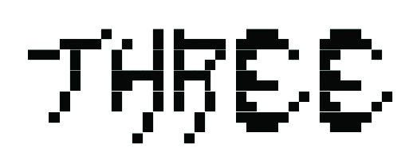
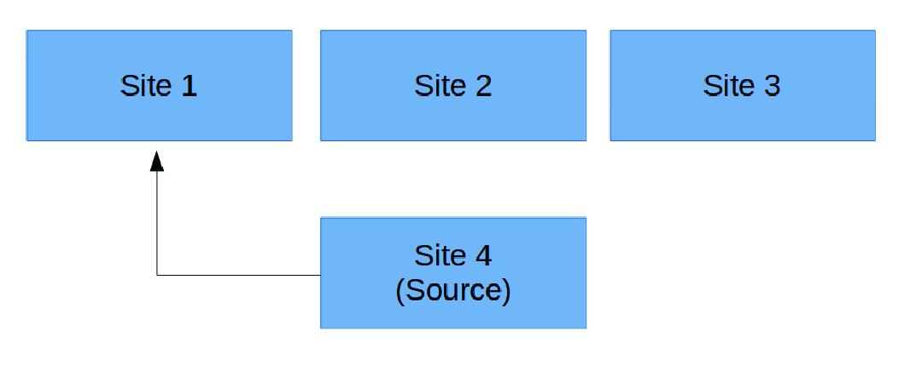
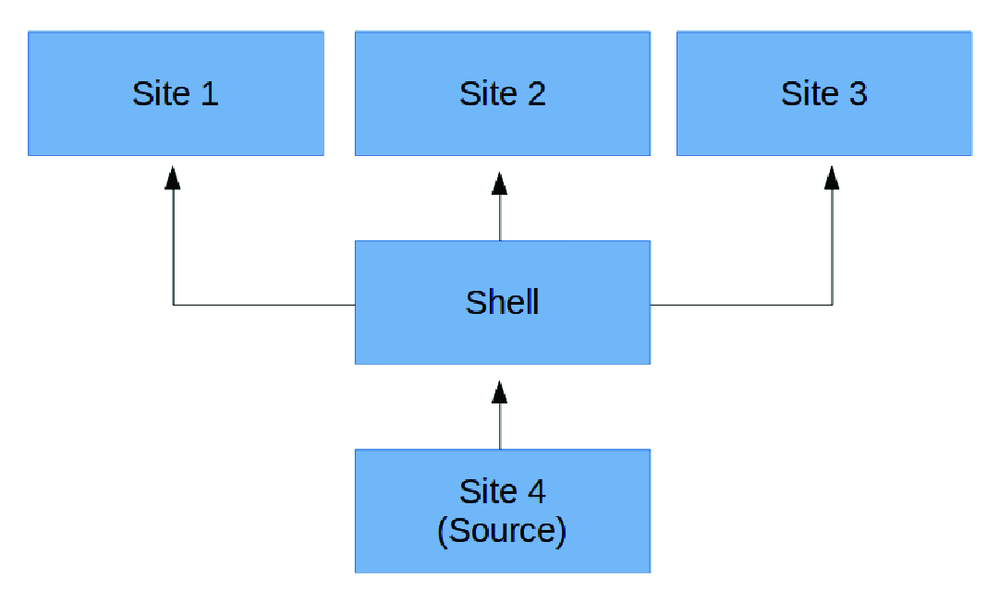
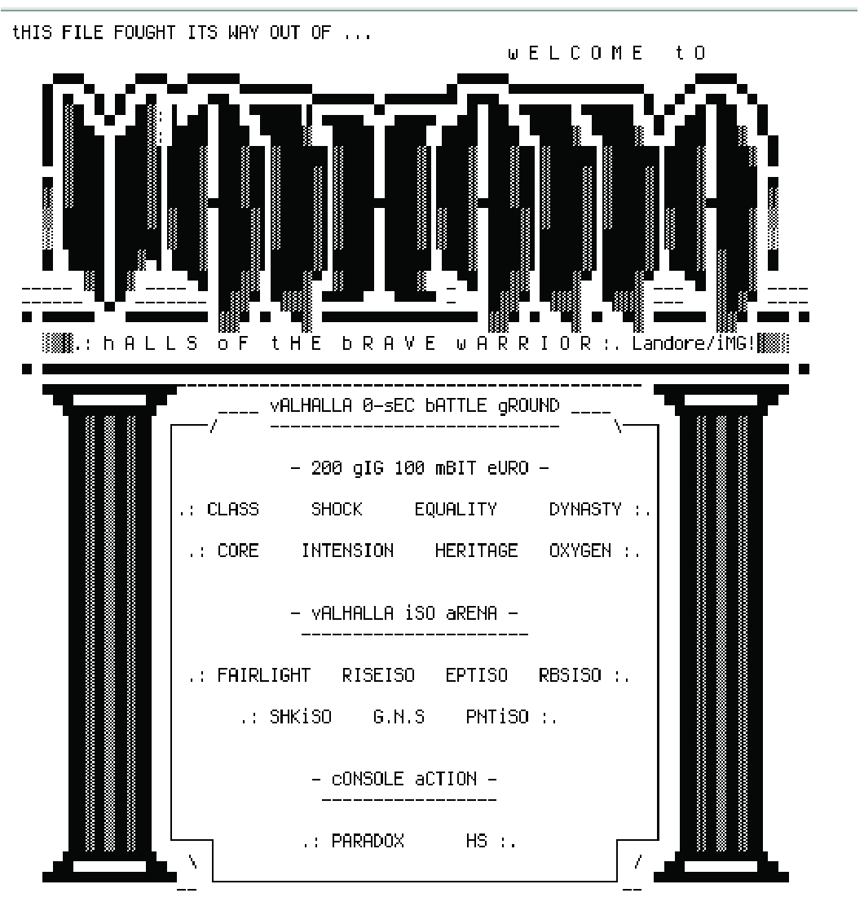
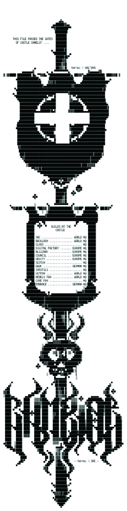

# Infrastructures of the Scene

In Chapter Two, I examined the portions of the piracy world that are not the Warez Scene. In a more positive vein, this chapter now turns to outline the systems that do make up this highest level of the piracy pyramid. In reverse engineering the functions of various elements of the Scene, I explore the set of technical infrastructures that underpins the social interactions constituting this alternative reality game. Infrastructures are a set of interlocking technical architectures. Yet what is infrastructure at its core and how does it help us to understand the Scene? How do we recognize it? And how might we study it?

In her well-known article, “The Ethnography of Infrastructure,” the sociologist Susan Leigh Star famously made a call to study infrastructures, which at the same time was a call to study “boring things.”[^1] In this phrasing Star is of course being a little coy. The first examples that she gives are the “International Classification of Diseases” (ICD) and the telephone book, both of which can seem mundane and ordinary or even “boring” but both of which can tell us several interesting things. For instance, Star points out that a telephone book reveals a great deal about the demographics of an area through how businesses present themselves, for example, restaurants and ethnicity. The ICD is likewise essential and exciting because it shows precisely what is considered a disease or illness and what lies outside of that purview. Given the degree of controversy around medical diagnoses of psychiatric complaints and volumes such as the Diagnostic and Statistical Manual of Mental Disorders (DSM), Star knows that the ICD tells us a lot too about that most socially studied of fields: medicine. While these objects appear tedious and routinized — “boring things” — we can learn things through their study.

The same is true of the software and hardware infrastructures of the Scene. These are the architectures that, although impressive in themselves, exist merely to support the social structures of the Scene. However, they form the core interface point that most individuals have when interacting with this underground piracy network. Indeed, the software and hardware facilities run by Scene operatives can be described according to the taxonomy that Star sets out in her article. We can describe elements of the Scene in terms of their:

* Embeddedness: the servers and networks are “sunk into and inside of other structures.” This is especially the case with the ways in which existing, public architectures are often repurposed in the Scene, such as university high-speed connections or public Internet Relay Chat (IRC) networks, running private chat channels for Scene activities.\

* Transparency: the infrastructure that “invisibly supports” the tasks of Scene operatives.

* Reach or scope: these infrastructures have “reach beyond a single event or one-site practice.” The diversity of materials disseminated among Scene members, ranging from music, to films, to software, to games often comes with different requirements from the infrastructure, which is adaptive to such needs. The generic model of File Transfer Protocol(FTP) servers is one that can easily be repurposed when new media formats come along.

* Learned as part of membership: communities of practice, such as the Scene, take their infrastructures for granted. No member of the Scene will be willing, in most circumstances, to explain how things work to a “n00b” (i.e., a “newbie” or someone who has just entered the space). Either you know, or you don’t. Of course, this is not actually strictly the case or nobody new would ever join. It simply means that the level of tacit knowledge among Scene members is great and transmission takes place through private channels of mentorship alongside observational practices.

* Links with conventions of practice: there is a type  of  path dependency on past conventions. Star gives the example of the QWERTY keyboard but the naming scheme for Scene releases (e.g., `Aeon_Zen-Inveritas-WEB-2019-ENTiTLED`) is a good example of something that developed over time but that has now become established practice, for reasons that will become clear. It appears very hard to change existing Scene practices. Once norms of practice have been embedded and validated, they become widespread and inflexible. A good example of this, to which I will turn, is the development of custom FTP daemons in the earlier years of the Scene, later replaced by the widespread adoption of `glftpd`, a piece of server software.\

* Embodiment of  standards: infrastructures work with other infrastructures through common interfaces. As we will see, the FTP servers of the Scene are no different, and, while sites isolate themselves from one another for security reasons, they also take advantage of the File eXchange Protocol (FXP) hack to allow direct transmission between servers. The rulesets that form the standards for each type of release (analyzed in more detail in Chapter Four) are further evidence of the importance of standardization for Scene practices.

* Becomes visible upon breakdown: the invisibility of  infrastructure fades away when it breaks. The legal busts of the Scene are good examples of the failures of Scene infrastructure but also its social patterns. Sites that have unreliable uptime or that behave erratically reveal infrastructural fault lines that draw attention to the quotidian nature of much of the technical architecture.[^2]

Bearing these points in mind throughout this chapter, the infrastructural components of the Warez Scene to which I will now turn can be subdivided into several discrete levels: topsites, IRC channels, bouncer systems, and command-and-control systems. Throughout, I will refer to the characteristics of the Scene’s infrastructures toward which Star’s framework points in order to understand how the technical components of the Scene facilitate its operation. As a point of note, most of the specifications that I detail come from around the turn of the millennium, the year 2000, gleaned from the DeFacto2 archive. It is likely and possible that many specific technological elements are now changed and work under different systems.

## Topsite Architectures

A topsite (“site”) is a high-bandwidth (by now at least gigabit), high-storage (tens to hundreds of terabytes) FTP site with affiliated release groups. Topsites are usually named and also given a two to three-letter abbreviation that identifies the site with greater safety than the full name (e.g., TWH is “The Wolves House”).[^3] The abbreviation is, in some cases, phonetic rather than an acronym (e.g., SLR is “The Cellar”).[^4] Mentioning the full name or even sometimes just the abbreviation of a site to a user not on the site is usually an offence that will incur deletion (“deluser”).[^5] Topsites are the core infrastructure of the Warez Scene. They are the places where pirate artifacts are released and traded. They are the archives that contain the files and the history of the Scene. Topsites are the sacred spaces of this world. It is hard to get into them, and it is hard to keep one’s account.

Before the FTP era of the Scene, pirates would dial in to a particular Bulletin Board System (BBS) site to upload or download material and communicate with others.[^6] Such BBS sites have been labeled the origins of virtual community by the Communication Studies scholar Fred Turner, and they provided the first truly virtual social space, rooted in the background of the American 1960s counterculture.[^7] Despite this framing, it is also clear that the BBS scene was geographically dispersed, with segmented underground cultures in countries as diverse as Italy, Portugal, and Uganda.[^8] Although BBSs were a revolution in terms of international communication, such systems also had the disadvantage of monopolizing a telephone line while a user was connected. This exclusivity made connecting to more than one board a painful process.[^9] The switch to FTP took place as a move to embrace the interconnectedness of the internet during the general demise of BBS in the period between 1994 and 1996.[^10] Ben Garrett, the maintainer of the DeFacto2 archive, describes how the BBS Scene faded after the closure of New York’s Park Central system in 1996. This central communication board was, as he puts it, “the ring and the referee” of deciding which groups had won a particular race to release a piece of software, a phrasing that chimes with my later analysis of the quasi-judicial nature of Scene rule documents.[^11]

It is beyond the scope and remit of this book to give a comprehensive history of the BBS pirate Scene, which has already been covered elsewhere.[^12] Importantly for the subject at hand, from 1994 to 1996, there emerged two parallel Scenes, with the BBS Scene existing alongside the emergent internet Scene. As Garrett describes it, this bifurcation led to challenges for the official status of releases. With the parallel Scenes in operation, a confusing situation emerged “where there was one group winning the release on the BBS scene and another winning on the internet.”[^13] This duality was unsustainable and, after Operation Cyber Strike shut down a number of significant BBS sites (an event that I cover in Chapter Six), the Scene decided to transfer to a series of secretive internet FTP servers.[^14]

The rival standard into which the Scene could have branched is the ubiquitous Hypertext Transfer Protocol (HTTP) and Hypertext Markup Language (HTML) combination that forms the contemporary web. That is, the Scene could have become based on the web. As was covered in Chapter Two, the FXP board Scene went in this direction, although this subset nonetheless uses the web-facing component to share hacked FTP sites. In many ways, this structure makes sense as a path from BBS sites: the logical successor of BBSs is online forums. For instance, the leading provider of forum software is called vBulletin. At first, some warez topsites likely did move to HTML forums, but, for protocol reasons, FTP won out. While one lower portion of the piracy world moved over onto internet forum boards, albeit still using FTP, the other, the portion to which this book is dedicated, instead went down the route of FTP and IRC.

In any case, FTP proved to be a valuable tool for the Scene. Given that the nature of the Scene involves the transfer of files, a protocol that is designed purely for file transfer made sense. Indeed, basic knowledge and understanding of the FTP protocol are critical to comprehend the Scene’s transfer systems and “racing,” covered below. In turn, understanding FTP also requires some comprehension of network socket communications, which I will roughly attempt to convey here.

In the TCP/IPv4 protocol, on which most of the internet operates, every server (i.e., computer) is assigned an address.[^15] These generally take the following form: `192.168.0.1`.[^16] Server software “listens” on a port on these addresses, so a web server might listen on port `80`. This would mean that if I connected to `192.168.0.1` at port `80`, I could expect to find a web server. FTP is implemented by FTP server software (i.e., a “daemon”). As there are 4,294,967,296 possible IPv4 addresses in the world (though many are reserved for special purposes and a figure that has been drastically superseded by the 340 trillion trillion trillion addresses in IPv6), and as each IPv4 address has 65,535 ports, FTP on the internet seemed an excellent way for the Scene to hide its activities while allowing those in the know to connect. 

Finding Scene operations by chance, Sceners reasoned, would be like locating a needle in a haystack.

FTP was born in 1971 in RFC 114, the “Request for Comment” system that the Internet Engineering Task Force uses to discuss new proposed specifications.[^17] It died, to some extent, in 2020, when major web browsers deprecated support for the protocol.[^18] FTP, as it exists today, uses a command channel to specify client-server interactions and various data channels to transfer the contents of files. The protocol begins, as with all network operations, with a server daemon listening on a port. In conventional or legitimate FTP servers, this port is usually 21, but for stealth, Scene topsites usually run on much higher port numbers, making it harder to guess their location. Next, a client connects and is presented with a banner message while the server then awaits authentication. A typical connection and authentication process for a regular FTP daemon and client might look as follows:

```
Server: 220 FTPD ready
Client: USER mpeve
Server: 331 Password required for mpeve.
Client: PASS password
Server: 230 User mpeve logged in.
```

In the File Transfer Protocol, responses are prefixed by a number that indicates the server’s state. This makes it easier for clients to ensure that they issue the correct directives at the right time. Each digit in the response indicates a different status. The leftmost digit, for instance, indicates the success or failure of the command (1xx = positive preliminary reply; 2xx = positive completion reply; 3xx = positive intermediate reply, etc.). The middle digit shows to what the status pertains (e.g., x3x indicates that the status relates to authentication and identification). The final digit specifies the precise status. Hence, the “331” response is a positive, intermediate reply pertaining to authentication and means the server needs the password for the specified account.When a user wishes to transfer a file to or from an FTP server, they use a set of commands that instruct the server either to listen for a data connection or to initiate a data connection to a remote system. These two commands are called, respectively, `PASV` (passive mode) and `PORT` (active mode). In `PASV` mode, the server listens on an additional port and returns a response to the user’s client, telling them what this port is. A typical response to the `PASV` command might read `227 Entering Passive Mode (192,168,0,1,216,4)`. This would mean that the server was now listening on the IP address 192.168.0.1 on port 55300. (For reasons that are too complicated to explain, the port is calculated from the last two digits through this formula: 216 x 256 + 4.) Usually, the client would then connect to this address and port and begin receiving or sending data on this second channel.

FTP can also work the other way around. The active `PORT` command is the inverse of `PASV`. In this case, the client listens on a port (let us use 55300 again) and tells the server to connect to its own address. So let us say that a client’s address was 192.168.0.2. A typical `PORT` command might read, `PORT 192,168,0,2,216,4`. Once this command has been issued, the FTP server will attempt to connect to `192.168.0.2` on port `55300` and then send or receive data on that channel.

As noted, usually in FTP, when a `PASV` or `PORT` command is opened, the client either connects to the server to send or receive data, or the server connects to the client. That is, normally, the parties using the data connection will be the same as on the command channel: The server and the client. However, although some servers do enforce this, ensuring that only an authorized party can connect, much of the Warez Scene exploits a vulnerability here to enact high-speed transfers between FTP servers without needing to download the file to the client machine and then upload it to the second site. This site-to-site transfer is called File eXchange Protocol (FXP).

How does this work? The simple answer is that a client can instruct one server to listen (`PASV`) and then issues a `PORT` command to another server telling it to connect to that server. In this way, two remote FTP servers can directly transfer files to one another. Consider the following example situation: we have a client (`192.168.0.1`), a server (`192.168.0.2`), and another server (`192.168.0.3`). The client connects to both servers and, at the appropriate moment, issues the following commands:

```
Client to Server 1: PASV
Server 1: 227 Entering Passive Mode (192,168,0,2,216,4)
Client to Server 2: PORT 192,168,0,2,216,4
Server 2: 200 PORT command successful.
```

When the client then initiates a transfer command (`RETR` [retrieve] or `STOR` [store]), the servers will connect to each other, rather than to the client, and the file will be transferred from server to server.

Why is this important? Warez topsites are extremely high-bandwidth servers. They have powerful connections that far outstrip the capacity of clients using residential internet systems (see the Appendix for known hardware links among a range of millennial-era topsites, indicating far-above-average connection speeds, usually of the “T1,” “T3,” “OC48” types and other high-capacity lines). The user class called “couriers” or “traders,” descended from the brokers of the antecedent BBS Scene, “race” releases from one site to another in exchange for download credit.[^19] To do so, couriers must transfer the files in new releases as fast as they can (and before others) from servers that already have the release to those that do not, provided the rules permit the release on the destination. Were this conducted by downloading each file to the local machine, using a home connection, and then uploading it to the second server, the race would unfold at tortoise pace. Instead, the high-speed, high-octane nature of trading from site-to-site is enhanced using FXP.[^20]

That said, some couriers instead use a method called shell trading — using high-speed remote boxes to move the files. This consists of using their local storage as an intermediary and then uploading to multiple sites.[^21] This latter method has the advantage, first, of using download credits only on a single source, and second, of leaving slots open on other sites. That is, in traditional sites, one may not download using two accounts at the same time. FXP locks a download slot from a site. Hence, if one is trying to upload to multiple sites, there are several ways of doing this, but shell-trading is the most efficient in leaving slots open (see Figures 3 and 4). Nonetheless, FXP couriering is still an efficient manipulation of the FTP standard as couriers can chain their sites together; for instance, in Figure 3, it would be possible to move the file from Site 1 to Site 2, then to Site 3, and so on. However, the speed at which races take place means that the shell trader who can lock the files during the transfer, using a shell trade, will have a distinct advantage.


Figure 3. FXP showing single site to site transfer. 


Figure 4. Shell trading showing transfer to multiple sites from single source.

Scene servers leverage other enhanced features of the FTP protocol. For instance, Scene FTP servers are additionally secured through multiple levels of authentication and authorization, on top of that provided by regular FTP. The foremost of these is the “AUTH TLS” extension to FTP specified in RFC 2228 (another Request for Comment document) to provide transport layer security to the site’s command channel.[^22] This means that all communication between the server and the client is encrypted and cannot be intercepted (i.e., end-to-end encryption). The same is true of the data channel in FXP transfers between servers, which clients can initiate through the `PROT` command, ensuring that data transferred between sites cannot be intercepted.

Scene servers and members additionally use the "IDENT" protocol alongside IP authentication to identify users.[^23] This protocol allows the user’s identification by a string of text in front of their IP address. So, for instance, my ident might be `martin@192.168.0.1`. The `martin` part is specified by the daemon listening on my IP address on port 113 for incoming requests. Specifically, the IDENT protocol distinguishes between users on a single machine or network who share an IP address. So let us say that I share the IP `192.168.0.1` with my brother, Richard. When I connect, my IDENT tells the server that it is me, `martin`, and not `richard`, who is connecting, which serves as an additional, albeit potentially spoof-able, level of authentication. Topsites will typically not send a 220 banner until a user with a correct IDENT and IP connects, thereby concealing that an FTP server exists at an address and port. Evidence for the use of IDENTD is prevalent in Scene magazines, such as the interview with Redbone of RTS in the Courier Weektop Scorecard issue 130. Here it is noted that tight IDENT and IP-based authentication are required and that “lame” (i.e., insecure) “ip masks like *@xxx.xxx* and ident@xxx.xxx.* are no longer accepted.”[^24] Once a user has passed the IP mask check and the IDENT check, and it is known that there is a possible user matching, the server initiates a standard FTP authentication process, which then places the user in the appropriate role-based authorization.[^25]

When users are invited to a site, they must give the site operator or group administrator their “addline.” This command will add the user to the site, specifying their login name, password, and ident. In theory, common security precautions should pertain to addlines. For instance, users are encouraged to have only a temporary password in their addline that they later change. According to many of the “Scene notice” packs that contain warning announcements, the reason for this is the presence of “addline stealers.” One of these documents, for instance, cautions that “when someone just pm you to add you to his leet gigabit.nl [a site in the Netherlands with a gigabit connection] or something like that, he just want your addline.”[^26] These documents warn that users should “use [a] temp password and change it in first login” and “use [a] diffrent [sic] password for each site.”[^27] Indeed, the threat of a security breach is high. Further Scene notices speak of how “some people got weird msges about a guy asking their addline and they gave it and he hacked their user on sites” while others detail instances of site operators being compromised.[^28] Of course, such a “ploy to steal ppls addlines” is also dependent on IP address masking via ident.[^29] That is, in order to benefit from knowing someone’s addline, even if the password is shared between sites, a would-be hacker would still need to obtain an address within the IP mask, thereby mitigating, though not eliminating, many of these risks. This is not, however, impossible. Many high-speed shells used for trading are bought from commercial providers. These all sit within similar IP ranges. Therefore, it is not beyond the bounds of possibility for a dedicated hacker to obtain an addline and then to be able to obtain an IP address that matches the requisite IDENTD mask.

Once a user has been added to a site, they will next be given the details on how to connect. This usually takes the form of an IP address or a hostname that resolves to an IP address. Because IP addresses of servers can identify the location of a machine on the internet, most Scene sites use bouncers (BNCs) to cloak their true location. BNCs are secondary machines that sit between an end-user and the site itself. The user connects to the BNC, not to the site. This means that the site’s main IP address, in many cases, can remain hidden from the view of any of the site’s users. It also provides an additional layer of security because the site can specify that only its bouncers are allowed to connect to the server, thereby making it harder to portscan for the site itself. A site will usually close any connection that does not come from one of its recognized bouncers. All the above authentication and authorization mechanisms must be routed through a BNC.[^30]

Typically, the point of the bouncer is to serve not only as a technical protection measure but also as an un-prosecutable legal intermediary. The BNC itself will not store any incriminating files and will simply forward on connections. If the police raid a site’s BNC — as happened in 2000 to the site, MS, whose “bouncer was narqed”[^31] — it is assumed that there will be insufficient evidence to prosecute the bouncer operator for copyright infringement. However, this may be a flawed supposition. There have been prosecutions of individuals for running IRC bots that did not serve any illegal files themselves but that aided and abetted the group in running its operations. For this reason, a topsite may wish to move location rapidly if a bouncer is busted as the configuration will reveal the true site IP address, which can often be geolocated to give a physical location. Further, bouncers introduce another point of failure that can cause anxiety among Scene members — a place at which infrastructural breakage may be introduced and that exposes the otherwise seamless infrastructure, as per Star’s schema. For instance, in 1999 there was speculation that law enforcement officers had raided the site ATX (“Atomic-X”) because it had gone offline. In reality, it was merely that the “site was temporarily down due to bouncer problems.”[^32] Despite the infrastructural fragility that this introduces, many Scene figures believe that “if the site doesn’t use a ip bouncer or firewall” there is a much greater risk of a police raid.[^33]

Due to the nature of FTP, bouncers come in two flavors: command-channel bouncers and traffic bouncers. A command channel bouncer is extremely easy to implement and passes commands directly between the client and the server. Notably, when the PORT or PASV command is initiated, the actual site server IP will be revealed, and all data traffic will be routed directly to the server. That is, because a command-channel bouncer simply relays commands between a user and the site, when the FTP server is instructed to open its port, the server will report its actual IP. On the other hand, a traffic bouncer gets around this problem by routing all traffic through its own system but at the cost of much greater complexity and bandwidth requirements. A traffic bouncer must process every command and response sent to and from the server and rewrite the output IPs for data channels when negotiated. In turn, this involves opening a channel to the specified remote address and forwarding the data. Finally, this comes with difficult setbacks in negotiating end-to-end encryption as the BNC must read the commands sent to the server and transparently pass the encrypted data channel, breaking end-to-end encryption. In this case, if a traffic bouncer is compromised, it becomes possible to intercept usernames, passwords, and other sensitive information sent to the site. For an example of a traffic bouncer and its complexities, see the Yet Another Traffic Bouncer project part of the glftpd repository[^34] Traffic bouncers are of similar complexity to FTP servers and are not trivial pieces of software.

Indeed, support for such bouncers must be baked into the FTP daemon (i.e., server) software itself and regular (i.e., nonwarez) server software does not usually feature such support. In the 1990s, this need for custom security implementations and other features led to the development of several Scene-specific FTP server daemons, the histories of which are documented in the Netmonkey Weekly Report, issue XXXVI from February 22, 1999.[^35] Beyond bouncer support, these daemons contain features not found in regular, FTP server software. These include:


* ident-based authentication;
* logging of user statistics;
* a userbase separate from accounts on the server’s operating system;
* group management functionality;
* ratio and leech accounts;
* private directories;
* the “pre” functionality that moves a directory from a private area of the site to a public space;
* interaction with bots and IRC.

In the early days of the shift from BBS to FTP, Sceners competed to develop FTP daemons that provided the richest feature-set.[^36]

The first of these noted in the Netmonkey Weekly Report was xftpd, called “probably the first major wide-scale [S]cene daemon that every site ran for years.” The challenge with this daemon is that it required custom coding “for pretty much anything,” leading to high maintenance/sysop requirements. This criticism indicates some of the hidden labor structures in maintaining the Scene’s infrastructure, one more of Star’s premises for studying infrastructure. Just as crackers are adept software engineers, writing secure custom FTP server software requires a level of sophisticated software development that verges on professional standards.bleachboy’s bftpd, written for “The Bleach Box” (BBX) topsite, overcame some of xftpd’s weaknesses. “This daemon,” writes the Netmonkey report, not only “successfully merged the dying BBS scene with the fledgeling FTP [S]cene” but would “revolutionize the way the [S]cene viewed ftp sites.” Specifically “coded for warez, by someone who knew what he was doing,” bftpd eventually died out when development stopped. The Netmonkey report also notes the difficulty in installing this daemon, one more instance of infrastructural breakage due to technical complexity. Nonetheless, this daemon appears to mark the start of a competitive phase among sites, where the software itself was a selling point for different servers. This proliferation of daemons meant that different sites were able to offer different user experiences. At the same time, this was a slight problem because, in each case, the authors were reinventing the wheel, starting from scratch whenever they coded a new daemon.

Alongside bftpd sat Reanimator’s rftpd. According to Netmonkey, around 1998, “[n]early every site that didn’t have a custom daemon used rftpd.”[^37] Evidence for this can be found in the list of software run by various historic sites in the Appendix; for instance, “The Rising Sun.” This daemon featured “[b]uilt in support for weektops, groupop, flags, nuking, and a bot .tcl,” which “made this THE daemon of choice for everyone.”[^38] As we will see, these features are key determinants of Scene hierarchies to this day. Wkups (weektops) refer to the weekly upload levels of participants on the site — to be “#1 wkup” is to have uploaded the most on any topsite in a given week, which is vital for courier chart scoring. Groupops refers to the ability for groups on the site to manage their own slots and is the equivalent of permitting a group owner to administer people in their group as they see fit. That is, a groupop will have permission to add and delete users, up to their slot allowance for the group. Nuking, as covered more extensively in Chapter Four, is a system of quality control and credit revocation when a release is found to be bad. Finally, as covered further below, the reference here to “bot.tcl” shows support for IRC daemon bots. These allow the site’s activities to be relayed to a secret channel, giving an overview of what is happening inside the FTP daemon, such as, for instance, new releases.

Although rftpd was purported to be in widespread use, a daemon called ftp4all was also apparently used by several Scene sites, including “The Raging Monkey” (TRM) and “Narkos” (NKS).[^39] An interesting characteristic of this daemon was that it was released under the open-source GPL license (The GNU Public License, which is an open source CopyLeft license). It may seem a strange quirk, but many of the FTP servers used by the Warez Scene are not open source. Hiding the source code is sometimes billed as a security feature, although information security professionals have thoroughly rejected security by obscurity.[^40] In any case, the customization allowed by ftp4all was a leading feature in its adoption.

Furthermore, the open license meant that others could study the source code to ensure that it was free of any vulnerabilities or deliberate backdoors. As the so-called “Linus’s Law” puts it, in software development, “given enough eyeballs, all bugs are shallow.”[^41] It was reasoned that with more people looking at the source code of ftp4all, it should be possible to craft a more secure daemon. Notably, however, ftp4all did not seem to attract the widespread adoption that one would expect from such an open-source project.

The most widespread daemon in the period under study was glftpd, authored by greyline. A closed-source daemon that is still maintained as of 2021, the Netmonkey report notes that “[n]early _every_ site uses” glftpd. Clearly, this homogeneity poses a challenge for sites to distinguish themselves from one another: “your site will have to have some other reason to stand out, as it will look JUST LIKE every other site out there.”[^42] Nonetheless, siteops are advised by Netmonkey that “[t]his is the daemon if you want the best, but can’t code your own.”[^43] Notably, some release groups began specifically requesting sites that run on glftpd.[^44]

This heavy dependence in the Scene on a single FTP daemon comes with both benefits and drawbacks. The benefits include centralized bug fixes, peer support for setup and operations, familiarity, and ensured interoperability between servers. The major negative, aside from the lack of aesthetic and functional distinction between sites, is that any security breach in the software will affect the whole Scene. As of November 2020, there have been six disclosed vulnerabilities in glftpd.[^45] The severity of these vulnerabilities ranges from trivial to significant. At the lowest end of the spectrum, a vulnerability in glftpd 1.23, disclosed in 2001, allowed a connecting user to overwhelm the server’s Central Processing Unit (CPU) resources. This vulnerability “allows remote attackers to cause a denial of service (CPU consumption) via a LIST command with an argument that contains a large number of * (asterisk) characters.”[^46] Given that users needed to be connected to the server to perform this action, though, the remedy would be fairly simple: to ban the user causing the denial of service attack.

There have been two critical severity vulnerabilities in glftpd. The first of these, in glftpd 1.18, allows attackers to enter a directory to which they should not have permission. This vulnerability relies on the fact that glftpd uses path completion. So, if there is a hidden directory called `/private/test`, attempting to change directory to `/private/t` will enter the `/private/test` directory, provided there are no other directories under `/private/` beginning with `t`. The problem here was that glftpd checked permissions against `/private/t` rather than `/private/test`. Therefore, the site mishandled access management. Such management is essential for the Scene as release groups have private folders on affiliated topsites, where they store their releases before they are “pred” (i.e., released) simultaneously on all of their servers. Others who have unauthorized access to these directories could therefore steal releases from different groups or gain an advantage in trading at speed.

The most serious vulnerability in glftpd to date was present in version 1.17.2, disclosed in 1999. This vulnerability allowed for total system takeover by connected users. As the description of this exploit puts it:

> [t]here are three known serious vulnerabilities in GlFtpd. The first problem is an account which is created by default upon installation of the software. The username and password for this account are both “gltftpd” and the uid is 0 (root). This account can only be used by users connecting from localhost. This is a problem because “local users” can log into a host’s glftpd with root privileges (and compromise the entire system). The second problem is world writeable `~/site- directory`. The last problem is the possibility to execute arbitrary commands on the target host. Glftpd comes with a feature called ZIPCHK, which is a command sent to the ftpd to check the integrity of a zip file on the server remotely. ZIPCHK executes “unzip” on the file without validating the filename input. With a special filename such as ` ; ls`, it is possible to execute arbitrary commands as the uid of glftpd.[^47]

While the first two of these vulnerabilities causes challenges, it is the last of these, the ZIPCHK script, that is the worst. For example, when one names a file ` ; a_linux_command` and then executes `SITE ZIPCHK ‘ ; bash a_linux_command’`, the file `a_linux_command` will be executed. This can contain malicious code that will open a backdoor on the server. As this leads to arbitrary command execution, the consequences for a server could be dire. At the same time, because glftpd runs as root — the most privileged account on Linux- and Unix-based systems — a compromise of the main account in glftpd can have system-wide repercussions.

Coupled with a network forensics investigation in 1999, the closed-source nature of glftpd led a later issue of The Netmonkey Weekly Report to declare that the software featured a deliberate backdoor that would allow the developers to login without valid accounts. The claimed implications of this were considerable, with the report’s authors noting that “[i]f ppl take this seriously (and they should), then 50 sites need to go down tonight, and stay down until they are 100% confident in their daemon.”[^48] Again, there is a bitter irony in the fact that a sizeable subset of the infrastructure running this underground darknet uses closed-source FTP daemons speculated to contain security holes. Using Star’s notion of looking for the hidden labor that undergirds infrastructure provision, it could be that the authors of this software felt that their efforts were not duly rewarded and so took steps to reward themselves. That said, later in 1999 it was claimed, as a rumor, that “greyline is going to release the full source code to his much celebrated (maligned?) daemon, GLFTPD.”[^49] At the same time, regardless of this, it “will not be an open-source project however, and the ‘official’ version will be maintained by greyline.”[^50] The report jokingly noted that there was “[n]o word on whether or not a certain infamous feature [the backdoor] will be included.”[^51] This is all to say that glftpd has had a controversial and somewhat checkered history. While it appears that the disclosed vulnerabilities were genuine coding errors, there have also been allegations of deliberate tampering to allow insiders to login to servers to which they should not have permission. The fact that the source code is unavailable helps provide fuel for such speculative fires. Nonetheless, it appears that glftpd remains in widespread use to this day and is the “daemon of choice” for most system operators.

The Netmonkey Weekly Report also details three private FTP daemons explicitly developed for certain sites or affiliations. For instance, eftpd was run exclusively on a site called E. Its “features include ‘enigma cookies,’ and an ‘anti-restarters’ feature.”[^52] The latter likely pertains to FTP’s `REST` command that allows resumption of uploads and downloads and prohibiting this as a technique to stop couriers simply hogging a file. As to just what “enigma cookies” are, this remains aptly opaque to an outsider. It could be some form of game on the site that features “fortune cookie” type messaging, or it could refer to “cookies” in the technical sense used in contemporary web parlance (used to track users and to maintain information across a single browsing session). From the outside, it is impossible to tell. Another private daemon, eqlftpd, was run on “EQUALITY-affilled sites.” EQUALITY was a courier group, which I cover below, and this daemon worked on a distributed basis: “[o]ne eqlftpd site shares its cpu and HD load seamlessly across 7 different machines.”[^53] The Netmonkey report notes that this daemon was a very closely guarded secret and that it is “unlikely it will ever become public.”[^54] Finally, the daemon hftpd (HADES FTPD), run on the site “HADES,” is described as a feature-rich daemon “coded by exile” that has “the ability to break down releases by groupname and disk-size.”[^55]


Figure 5. The distinctive NFO art for the site Valhalla (V) by Landore/iMG.

The purpose of these custom daemons is to give a topsite an identity that helps to distinguish it from others. This quest for identity continues into topsite aesthetics. Topsites are usually themed according to their name. For instance, the NFO ASCII art for “Valhalla” (V), shown in Figure 5, has a temple or giant hallway theme as indicated in Norse legend.[^56]


Figure 6. “Camelot” (CAM) ASCII Art depicting crusade imagery by ferrex\SAC.

“Camelot” (CAM), shown in Figure 6, has a theme that conflates the court of King Arthur with a crusade-like feel, akin to Chrétien de Troyes’s ironic retrospective mapping of crusade imagery onto Arthurian legend in his poem Cligès.[^57] While the culture and aesthetics of NFO files are detailed in Chapter Five, customizing artwork and a sitebot theme are all considered part of what makes for a high-quality site “experience.”[^58]

Notably, many topsites carry adult themes (e.g., “Titty Twister” (TT) and “Wet Dreams” (WD) in the Appendix) but also racist tropes. “Camelot,” for instance, bears the worrying hallmarks of crusade appropriation, which is common among contemporary far-right movements.[^59] It also features the Celtic cross in the NFO, which has become one of the most common white supremacist symbols in circulation, alarmingly coupled with human skull iconography.[^60] Other sites also have distressing racist traits, some even more explicit. For example, the NFO for the site “Dixieland” (DXL), which I will not reproduce here, is outrightly and incredibly racially offensive, depicting the Ku Klux Klan and using the terminology of lynching. Notably, in the site NFO, there is no indication that this site was specifically dedicated to racist content. Indeed, the affiliations listed include the prominent and respected mainstream Scene group, Drink or Die. However, the theme for the site is exceptionally racially offensive, and it sits alongside the many instances of hate speech, usually homophobia, found in Scene publications.

## Information Channels and Communication

Topsite theming continues into a site’s affiliated IRC channels, or sometimes even entire IRC networks, that alert users of on-site activities through a sitebot and give updates on the site status. Access to topsite channels is restricted to hardware providers, site operators (“siteops”), their friends, moderators (“nukers”), release groups (“affiliates”), and couriers (“traders” or “racers”). Site channels are protected by invitation-only scripts on the site, password keys on the channels to ensure that unauthorized users are not invited by mistake, and encryption using a variety of protocols.[^61]

IRC presents the risk of exposure to those who connect to servers. A direct connection can be used to incriminate an individual based on their internet protocol address. The usual output of the IRC `whois` command will show the connecting IP of the user. It is also the case that, since each site has its own channel or even server, users are often connected to multiple networks with many invitation-only and passworded channels. In order to mitigate the hassle of connecting on every startup to each network and channel and to protect the user’s identity, users typically connect through a third-party IRC bouncer. These are different from the bouncers used by sites. However, they perform a similar set of functions: the first is that they cloak the user’s actual connection source, and the second is that they provide an ongoing stable connection to the server, which negates the need to re-invite oneself to every channel all of the time.

These bouncers are typically provided by third parties or on secure servers elsewhere. For example, for some time the Netmonkey Weekly Report advertised www.socalsys.com as being a “Scene-friendly” provider of “shells, bounces, vhosts, and web space.”[^62] This provider was also one of the server providers for the LinkNet IRC network. Likewise, Courier Weektop Scorecard advertised a “ShellBox Y2K Special- $100/yr 3bg + personal vhost under shellbox.org, payment must be recieved [sic] by Midnight, Jan6 <http://www.shellbox.org>.”[^63] These shells are used to remain permanently connected to an IRC server and channels without ever exposing the end-user’s IP address. Instead, typically, a vhost, which is short either for “vanity host” or “virtual host,” is used to hide a user’s actual address. These vhosts, though, also often reveal the “friendliness” of a server to these types of activity, although it is no guarantee. For instance, as of August 2020, Jeah.net had an available vhost, “hangs.out.at.the.warezcafe.com.” (For example, a user’s `whois` result if someone queried it could appear as `martin@hangs.out.at.the.warezcafe.com`.) At the same date, xzibition.com’s “lost” server had `user.glftpd.org` as an available host, while “Endurance” offers “pirates.illegal-warez.net” and “has.9-million.gigs.of.illegalwarez.net.”

Different IRC bouncers provide different functionalities. The most commonly mentioned bouncer in the DeFacto2 warezscene-notices-2006-2010 pack is “psyBNC,” described as a “way to have a hostname that doesn’t tie you to your IP” by one very basic scene security document.[^64] psyBNC is a legitimate piece of software, with many users beyond the Scene. In its own words, it acts as “an easy-to-use, multi-user, permanent IRC-Bouncer with many features. Some of its features include symmetric ciphering of talk and connections (e.g., using the Blowfish and IDEA encryption schemes), the possibility of linking multiple bouncers to an internal network including a shared partyline, vhost- and relay support to connected bouncers and an extensive online help system.”[^65] As should be clear, many of these features, such as encryption, are highly valuable to the Scene for security purposes.

Within site channels, sitebots produce information about topsite activity in human-readable formats. For instance, a typical pre-line might appear thus: `<c***dealr> New Util-PRE! on ‘*’ by fjorre/AOD : COREL.PAINTER.V8.0.PROPER.RIPCALiMERO`.[^66] This tells us the name of the release and the section, “Util,” alerting interested users to the presence of a new output on the site. However, site announcements also often contain additional information that is of use to traders, including in this case the name of the person and group who has created the release. For instance, consider the test pre line shown in issue 171 of The Marshall Mussolini Show: `->PRE<-- Woot_a_releaze-trujd-CD-2006-AMRC from AMRC_PRE_MACHINE (1 file(s), 140kB, genre: ??)`.[^67] In addition to giving the name of the release, this line also provides information about the number of files, the size, and, although missing here, the musical genre in the case of an MP3 release.[^68] Regarding the later discussion of trading, this information dissemination channel allows for the automated discovery and transfer of releases between sites. This release happens in fact to be a trap though. It is not an actual music release and Sceners would recognize that “trujd” is a leetspeak synonym for “trade.” (Leetspeak is a sub-language of scene discourse to which I will turn later in this chapter.) The trap is set to catch traders who are automatically moving everything from one site to another — the autotrading to which I gestured in the introduction.

Sitebots also provide updates on the status of races on the site, that is, they do not just cover information about releases being pred, but about the particular state of the release on the site. For instance, consider the example provided by Craig:

```
<COGB0T> (COG-NEW) -0519- Flamingpear.Flexify.v1.98.for.Adobe.Photoshop.Incl.Keygen-SCOTCH by xxxxxx(RTS)

<COGB0T> (COG-UPD) Flamingpear.Flexify.v1.98.for.Adobe.Photoshop.Incl.Keygen-SCOTCH (1 files expected)

<COGB0T> (COG-COMPLETE) Flamingpear.Flexify.v1.98.for.Adobe.Photoshop.Incl.KeygenSCOTCH
(total: 1MB / avg. 2909kB/s) 1. xxxxxx/RTS [1.0M/1F/100.0%/2909KB/s]
```
[^69]

While the intricacies of racing and trading are complex, this site log from COG demonstrates many of the basic principles. The trader, whose pseudonym redacted by Craig to “xxxxxx” of the group RTS, creates a new release directory and uploads, first, a Simple File Verification (SFV) file. This file, which contains a list of files in the release and their checksums, allows the site to ascertain the release structure. This structure includes:

* the number of files it contains;
* the size of files;
* and, once the files are uploaded, whether there has been any corruption during the transfer.

The site can then infer which files to expect and report on the race conditions. New racers generate speed reports on the bot, which also alerts couriers that there is a competition underway. For instance, [20:25] <|Azrael|> [flashi] starts punishing the new victim [WHITEOUT-DEViANCE] with a speed of [3398k/s]`.[^70]

IRC channels are more than just information-dissemination mechanisms. They also form the core areas of sociality for the Scene. As Alf Rehn puts it, one “could write a monograph on warez chatting alone.”[^71] As such, and as one would expect, IRC channels are protected by various security mechanisms. As mentioned earlier, site channels are both password protected and invitation only, with the sitebot issuing invitations in response to a `site invite` command.[^72] While the latter aspect, the invitation-only feature, ensures that a user has access to the site itself and cannot gain admittance without passing all of the checks thereon, the former, the password, ensures that a user does not accidentally invite a user who is not themselves (for instance, through a nickname typo). In addition, sitebots and ops enforce access on an ongoing basis, with users who are deleted (for instance, `site deluser`) removed from the channel.

Typically, the IRC networks on which the millennial Scenes operated enforced a secure connection to prevent interception and eavesdropping. LinkNet, which specialized in encrypted connections, appears to have been a common network used for scene activities.[^73] The nature of IRC networks is curious for this setup, though. The “R” in IRC stands for “relay,” which is there because an IRC network comprises multiple servers that connect to one another. When a user connects to one of these servers, it relays any messages sent to it to the other servers. There is a chain of connection between a user, a bouncer, a server, and a network in the Scene. Each of these adds hop, lag, and time delay to message relay. Top traders will attempt to connect to the same server as the sitebot to minimize latency for new site updates about releases.

Notably, however, this multi-server approach combines both decentralization and risk. The fact that servers are decentralized means that the network can still stand if a single server is compromised. This decentralization is a fundamental principle of the Scene in general: it seeks to disaggregate risk from any central points of failure or security compromise. However, at the same time, such decentralization means that it may be easier for the network to be infiltrated by a bad server, which can then parse the entire logs of a site. For this reason, sitebots and channels also often had a blowfish encryption key to protect eavesdropping by the servers themselves.[^74] Essentially, the Scene attempts to operate on as low of a trust basis as is possible. Sites attempt to protect themselves from IRC servers. IRC servers can then operate on a zero-knowledge basis and can effectively claim plausible deniability. As ever, the weakest link remains individual users who can compromise a site, its IRC channel, or any other of its routes. Beyond maintaining a tightly knit community of totally trusted actors, there is little that the Scene can do to mitigate the risks of individual users.

Scene discourse, which takes place in these IRC channels, has its own conventions of humor and standards of interaction. Indeed, courier charts and Scene magazines nearly always feature a section of quotes of the week. As the courier raanu put it, there is a “community to goof around with on channels while waiting for pres.”[^75] Some Scene members such as turn|| claim that “chatting in site chans sux anyway” and that “it will only help you get into some lame quote bots,” suggesting that the sole purpose of such discourse is recursively to feed the quote sections of those very magazines.[^76]

Scene humor is frequently adult in nature yet immature in its content. Sometimes this is not the case. Indeed, some groups have deliberate rules that demand maturity and codes of decorum. For instance, RiSC demands that its members act “maturely” as they “get a lot of respect because of it.”[^77] It was important to this courier group’s image to project the impression that “[w]e’re not children here,” although the demand of members was only that they “NOT be rude or inconsiderate to other RiSC members.”[^78] It seems fine to be rude to members of other groups or to use crudity in humor.[^79] Not all Scene humor is crude, though. Some Scene comedy, for instance, is just zany or related to extremely niche practices that will not be familiar to those on the outside. For instance, the courier magazine, The Marshall Mussolini Show (TMMS), had a running in-joke in the issue header where many, but not every, issue after issue 120 was mislabelled “i S S U E . F i F T Y . E i G H T.” “Issue fifty-eight comming at yall,” as issue 124 claims.[^80]

Some of the humor is also related to trading and scene activities themselves. For instance, in TMMS 174 the quote joke reads:

```
<jack> btw, sidenote... i know you’re trading for stats, not creds
stats? I trade to pass quota
```
[^81]

The joke here is that while trading allows couriers to acquire credits (“creds”) on the site at a usual ratio of 1:3 (for every 1MB uploaded the trader receives 3MB of download), many couriers do not trade for the sake of credits. In fact, they often have more credits than they can use. Instead, they trade in order to compete in the upload-chart statistics that are produced weekly and demonstrate their couriering skill, thereby showcasing their elite access. Indeed, one “releases of the week” section in TMMS reads: “[s]orry i’m not into listening [to] music. Trading is my passion!”[^82] However, sites also have quotas for couriers, who must ensure that they upload a certain volume each month, or they will be automatically deleted from the site.[^83] Usually, for top couriers, passing quota is a trivial matter. Hence, the joke here is that jack says to sidenote that he knows that he is not trading for credits, only for the glory of the statistics, to which sidenote responds that he was, in fact, only trading in order merely to make the quota. Certainly, it’s not a very good joke, but this is the essence of Scene humor. It “might,” as a later issue of TMMS puts it, “also be that you’re just not funny.”[^84]

Indeed, many aspects of Scene humor are, to be blunt, just not as funny as its proponents like to imagine. As Jimmy Maher notes, with the Scene foreshadowing later in even more outlandish corners of the internet such as 4chan and 8chan, “[m]uch about this underground culture, made up as it was almost entirely of adolescent males, is distasteful, even shocking to adult sensibilities of both its time and our own.”[^85] For instance, a great deal of the humor revolves around a casual homophobia of this ilk:

```
<daneboy> <-- goin to san fran 20 days! :D
<daneboy> got any suggestions for things to see?
<weirdnick> gay people?
```
[^86]

Such offhand aggression and homophobia that pervades Scene magazines and quotes sections are emblematic of a hyper-masculine, geek environment. That said, it is not fair to characterize all Scene participants as adolescent men as Maher does. After all, the topsite environment requires sophisticated access to high-speed links, expensive computer hardware, and in-depth knowledge of system administration. These skills and levels of access are typically not available to teenagers. Instead, it might be better to characterize these slanging matches as childish or immature, with a male slant to the banter. Without excusing either, the notorious language of “locker room chat” might be the nearest parallel. Though, it is also clear from records of Scene busts and raids that women do participate. For instance, there is the case of Stacey Nawara, who used the handle “avec” and who was a courier for Razor 1911, although she was also the only woman arrested during this raid.[^87] Indeed, of those arrested and charged in Operation Buccaneer, detailed in Chapter Six, the age range was 20 to 34, and the breadth of professions included “corporate executives, computer network administrators at major universities, employees of large hi-tech companies, students, and government workers.”[^88] This represents a substantial diversity of participants. Nonetheless, as one ex-Scener put it in an interview elsewhere:

> [t]he thing that struck me when re-reading this 20 year old text was the level of aggression and gorilla chest thumping. Clearly I owe a lot of apologies. This was more apparent after I penetrated deep into my garage and dug out the old C64. Re-reading some of the scroll texts and Reason 4 Treason articles made me cringe. It appears I took aim at any dork, nerd, drop-out, non-music listener, anti-graffiti, pro-establishment, unfashionable person out there. I’m not sure why, perhaps it was because I occasionally copped a bit of flak myself for being a “computer head” at school. Being a Dungeons & Dragons geek and using a briefcase as a school bag didn’t do me any favours either.[^89]

As Maher continues, much of Scene discourse demonstrates an “adolescent need for acceptance and validation” and “a crude social Darwinism ruled the [S]cene, with the most skilled and connected crackers almost worshipped and lesser lights cruelly excluded and dismissed as ‘lamers.’”[^90]

This concept of “unfunny humor” at the expense of certain demographic groups has come under intense scrutiny from ethicists.[^91] However, I believe that explaining Scene humor as funny or unfunny misses its actual function. The jokes in NFO files are not present in order to make participants laugh. They are, instead, intended as demarcations of insider-outsider status. Scene humor is not supposed to be funny; it is supposed to provoke a knowing nod or smirk among those who get it. Further, it often depends on being able to identify the individual in question. While names are sometimes censored in the weekly quotes sections of courier charts, this allows Sceners who saw the original dialogue to show off their privileged levels of access to others. The affect that humor typically intends to provoke is transformed into a performed esoteric epistemology, an opportunity for Sceners to flaunt their insider status. Knowing someone who appears in the weekly quotes, or being able to identify them, and understanding what is faintly amusing about the context are all part of the elaborate ritual of insider-ness that permeates Scene life.

At the same time, there is a danger inherent in Scene humor and its quotes to the participants. While courier charts and other documents are supposed to remain interior to the Scene, they inevitably leak out into archives such as DeFacto2. When these documents contain the Sceners’ IRC nicknames, they expose these people to law enforcement officers as targets for investigation. Although some Scene-quotes segments anonymize participants, this represents a dangerous form of humor with inherent risk. Likewise, there is the danger that law enforcement will investigate any document that names sites, sitebots, Sceners, channels, and IRC networks. While it is probably not thought through enough to constitute a deliberate act, Scene humor nonetheless remains a risky business.

The other distinctive element of IRC and communication cultures in the Scene since the 1980s is the informal language development known as leetspeak (“elite-speak”).[^92] Leetspeak, in which words such as “hacker” becomes “h4xx0r” and so forth, initially developed to allow phreakers (old-school telephone hackers) to avoid detection by the FBI, who were monitoring connections for particular words and phrases. That is, law enforcement agents were searching for words that they believed to pertain to piracy and cracking. Leetspeak is thus a basic form of encryption that allowed BBS users to evade surveillance.[^93] It is, indeed, also from this linguistic culture that the term “warez” emerges, that is, as a shortened and modified form of “software.” As Maher puts it:

> like so many subcultures, the cracking scene developed its own distinct vocabulary of odd phrasings, distorted spellings, and portmanteau words that are still used in some segments of Internet culture today. They allegedly replaced the word software with warez, hacker with haxxor, and elite with eleet to circumvent electronic law enforcement filters that might be tracking their activities, but one senses that such constructions were in reality more important to these “[S]ceners” as markers of inclusion and exclusion.[^94]

While the vocabulary and syntax vary hugely, Bruce Sterling characterized many features of this discourse in his 1992 book The Hacker Crackdown, noting that “[s]pecialized orthography, especially the use of ‘ph’ for ‘f ’ and ‘z’ for the plural ‘s,’ are instant recognition symbols. So is the use of the numeral ‘0’ [zero] for the letter ‘O’ — computer-software orthography generally features a slash through the zero, making the distinction obvious.”[^95] This orthography can work because the cognitive overhead of parsing numbers as though they were letters is very low. As Perea et al. write, “the cognitive system regularizes the shape of the leet digits (and letter-like symbols) embedded in words with very little cost.”[^96]

Far from being an unreflective discourse, in its hyperbolic overloading, leetspeak is also deliberately ironic. For instance, the quotes sections of TMMS are titled “LAMURGH QUOTES,” meaning “lamer quotes,” with “lamer” being the term used to deride other participants. The almost but not quite homophonic “lamurgh” is emblematic of a culture in which the ridiculousness of the language is understood by participants, even while they use it. An example of the self-knowingness of this system can be seen in the Netmonkey Weekly Report #78, in which dennison writes that he “will be mailing them [his system specs] over to my great pal JEFFK after I type this report so he can ‘haxxxx0r’ [hack] my ‘computrar’ [computer].”[^97] That said, despite the knowing wink in the use of such forms, many Sceners take aliases that include leetspeak, such as LiV3D, bl44t, t0m, and others.[^98]

In all, though, these communication infrastructures of IRC provide two core functions to the Scene. First, they provide information channels about the internal working of topsites, which allows members to see new releases, monitor race statuses, and keep track of vital stats. Second, they provide the spaces of sociality and humor that make the Scene fun.

## Facilitating Infrastructures

If the alternative reality game of the Scene did not have topsites, there would be no place for pirated warez to reside. However, if there were no IRC servers and channels for these sites, there would be no enjoyment. The game of the Scene works well because participants can socialize with one another in a related but separate space to the site, bantering and jostling, even as those spaces relay the competitive economic data about races that are taking place on the site itself.

Hence, technology in the Scene, while nonetheless being core to the illicit activities, is there to facilitate social interaction and play. We cannot understand the Scene purely in terms of its technologies. We need to comprehend the technologies’ purposes in order to grasp their role within the overall function of the Scene.

It is to this functional, organizational element to which the next chapter is devoted. Here I turn to the organizational principles that govern the activities of releasing and racing warez on topsites. This will cover how the Scene’s organization can be conceptualized, examining Scene standards and rules, the principles of dupes and dupechecking, the roles of nukes and nukers, and the interaction between local site rules and Scenewide standard rules.
