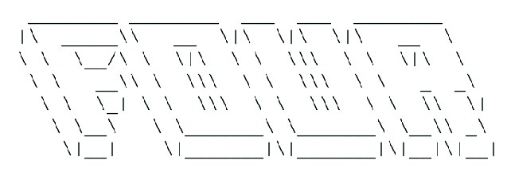
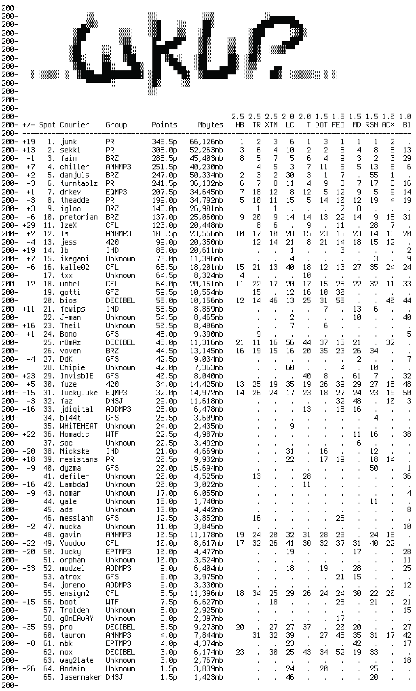
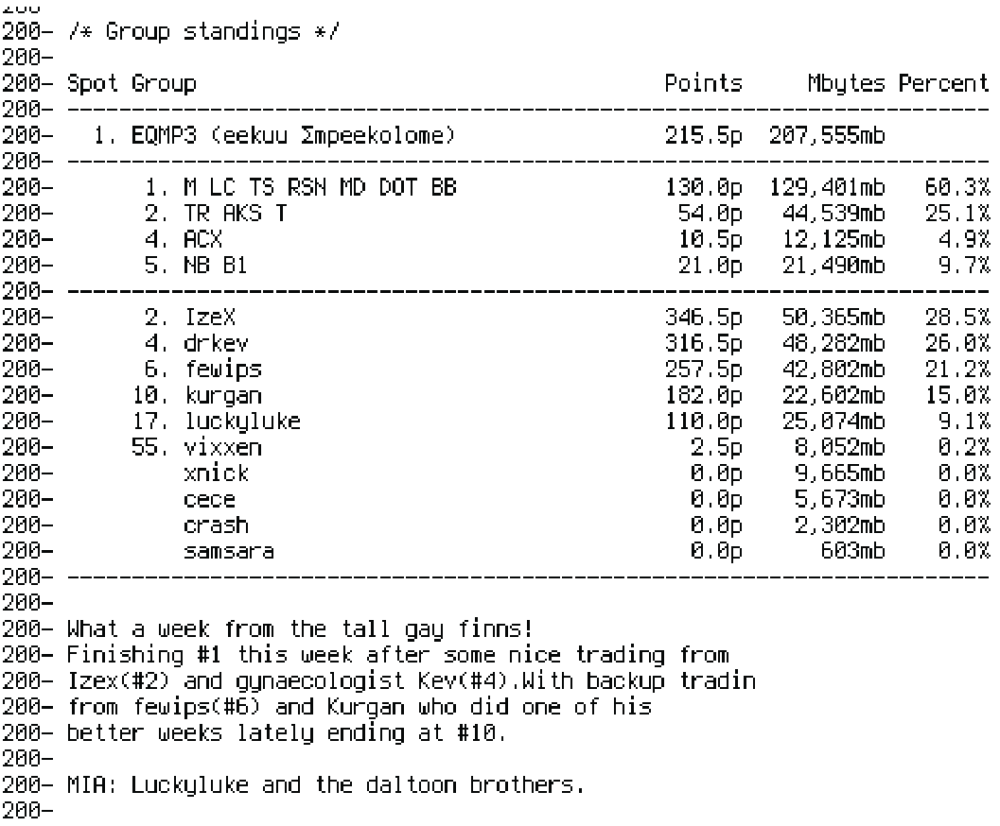
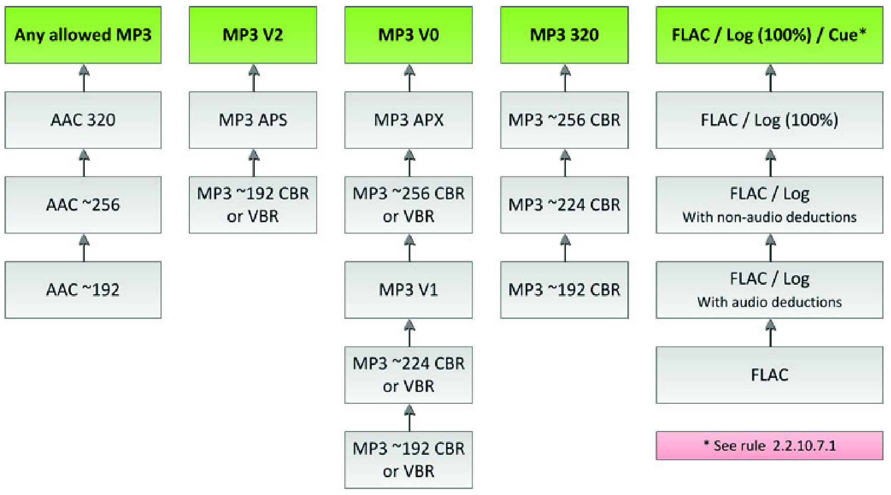
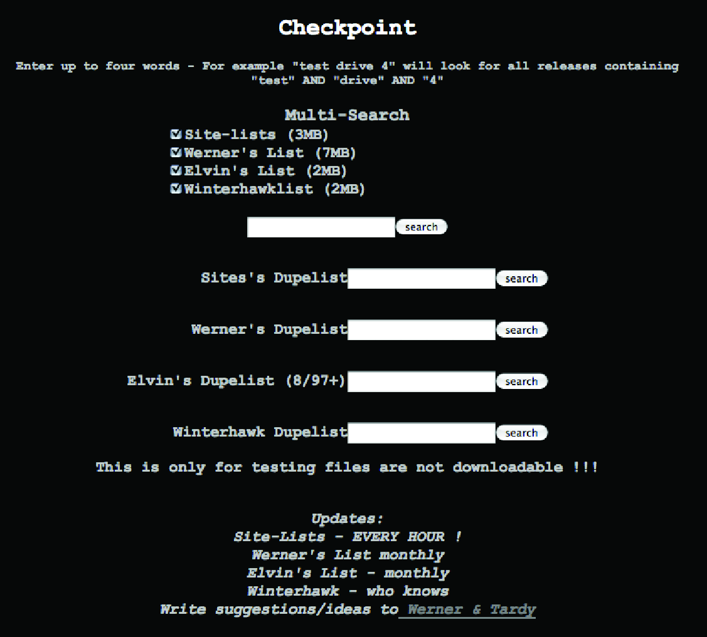

# Organization

## The Case of Courier Charts

The Scene is highly organized, but it achieves that organization in a distributed fashion. The Scene appears as an organized phenomenon that has emerged without hierarchical leadership or a self-organizing paradigm. In this chapter I examine aspects of Scene organization and operation. Before we turn to the formal structures, I want to give a few examples of Scene organizational paradigms as seen in site hierarchies, in release group affiliations, and in courier scoring systems.

In this organizational paradigm, consider foremost that not all topsites are created equal. Indeed, topsites are organized into a hierarchy. This hierarchy of topsites is determined based on its affi liated release groups, link speed, hardware setup and capacity, and other factors, such as linked courier groups.[^1] Indeed, the term “topsite” implies a hierarchy, but not every “site” is “top.” The ranking and judgment around what constitutes a topsite is a devolved matter decided by those who produce various types of charts and rankings. Sometimes, this can be decided democratically (i.e., “I pick a few weektop traders from the top groups to vote on ranks each week”[^2] ), but this is not always the case. For instance, the Courier Weektop ScoreCard issue 001 from February 1998 used the sites in Table 1. The sources I used here are as close to the date of the ScoreCard as I was able to ascertain, with additional information from other NFOs cited where used to populate other details.

<table>
<caption> The details of ranked sites in the Courier Weektop ScoreCard issue 001 from February 1998</caption>
<tr>
	<th>Sitename</th>
	<th>Known Affils</th>
	<th>Known Hardware / Software</th>
	<th>Location</th>
	<th>Siteops and Nukers</th>
</tr>
<tr>
	<td>AiR Force One (AF1)[^3]</td>
	<td>RiSE, ViCE, Game Group</td>
	<td></td>
	<td>Hungary[^4]</td>
	<td>Bandido[^5]</td>
</tr>
<tr>
	<td>Ambiquous (AMB)[^6]</td>
	<td>Renaissance, RiSE, GPF, Divine Canadian, RTN, GCRACK NA</td>
	<td></td>
	<td>Canada</td>
	<td></td>
</tr>
<tr>
	<td>Camelot (CAM)[^7]</td>
	<td>Backlash, Rebels</td>
	<td></td>
	<td>Germany[^8]</td>
	<td></td>
</tr>
<tr>
	<td>Digital Corruption (dC)[^9]</td>
	<td>Renaissance, PWA, UCF</td>
	<td></td>
	<td>Europe</td>
	<td>Ico, Sinister, SirMagik, Iceb, Novocaine, Toth, Vorteqz, Trade</td>
</tr>
<tr>
	<td>DaFat of the Land (DF)[^10]</td>
	<td>Request To Send, Sodom, Revolution</td>
	<td>“Powered by 34mbit T3 Ethernet” “24 Gigs”[^11]</td>
	<td>USA</td>
	<td></td>
</tr><tr>
	<td>DreamLand (DL)[^12]</td>
	<td>DiMENSiON, RAZOR 1911, The Corporation</td>
	<td></td>
	<td>USA[^13]</td>
	<td></td>
</tr>
<tr>
	<td>Enigma</td>
	<td></td>
	<td></td>
	<td></td>
	<td></td>
</tr>
<tr>
	<td>Etirnity (ET)[^14]</td>
	<td>DEVOTiON, MORTALITY</td>
	<td></td>
	<td></td>
	<td></td>
</tr>
<tr>
	<td>FalseHood (FH)[^15]</td>
	<td>RAZOR 1911, RiSC, GRS</td>
	<td></td>
	<td></td>
	<td>Gollie, Morbid[^16]</td>
</tr>
<tr>
	<td>Fortress of Solitude (FOS)[^17]</td>
	<td>RiSC, Drink or Die, RAZOR 1911, UCF, BLH, TRG</td>
	<td></td>
	<td>Europe[^18]</td>
	<td></td>
</tr>
<tr>
	<td>Lunatic Asylum (LA)[^19]</td>
	<td></td>
	<td></td>
	<td></td>
	<td></td>
</tr>
<tr>
	<td>PRimaryLink[^20]</td>
	<td></td>
	<td></td>
	<td>Europe[^21]</td>
	<td></td>
</tr>
<tr>
	<td>Quadcon (QC)[^22]</td>
	<td>RiSCiSO, Ranaissance, SHOCK, CoNCePT, RNG, GPF</td>
	<td>“2 Separate T1 Systems”
“43gb Main/ISO”
“7gb Release”
</td>
	<td>USA</td>
	<td>Katman, GaL, BanDiDo, Koyote, Poo, CorrupT</td>
</tr>
<tr>
	<td>The ROCK[^23]</td>
	<td>PWA, Phrozen Crew</td>
	<td></td>
	<td>USA[^24]</td>
	<td></td>
</tr>
<tr>
	<td>Silly Symphonies (SS)[^25]</td>
	<td>MiLLENNiUM, Drink or Die, DARK SiDE</td>
	<td></td>
	<td>Finland</td>
	<td></td>
</tr>
<tr>
	<td>Stairway to Heaven (STH)[^26]</td>
	<td>VENGEANCE, PREMIERE, CELEBRE</td>
	<td></td>
	<td></td>
	<td></td>
</tr>
<tr>
	<td>Total Technology</td>
	<td></td>
	<td></td>
	<td></td>
	<td></td>
</tr>
<tr>
	<td>The Rising Sun (TRS)[^27]</td>
	<td>SiEGE, CLASS</td>
	<td>“T3 Speed” “10 GiGS” “RFTPD”</td>
	<td>USA</td>
	<td></td>
</tr>
<tr>
	<td>The Wolves House (TWS)[^28]</td>
	<td>Equality, Shock, Parasite, Core, Backlash</td>
	<td></td>
	<td>The Netherlands</td>
	<td></td>
</tr>
<tr>
	<td>Virtual Dimension Research Lake (VDR)[^29]</td>
	<td>Devotion, Sodom, CLASS</td>
	<td>“Powered by 155Mbits”</td>
	<td>Europe</td>
	<td></td>
</tr>
<tr>
	<td>Watch Tower (WT)[^30]</td>
	<td>Pirates Gone Crazy, Teenagers in Crime, 2000AD, Revolt, Real Time Pirates</td>
	<td></td>
	<td>USA</td>
	<td>TxxxxxxCxxxxxxx, Mxxxxxxx, Ixxxx, Vxxxxxxxxxx, Kxxxxxxx</td>
</tr>	
<tr>
	<td>xquziit (XQZ)[^31]</td>
	<td>RAZOR 1911, X-Force</td>
	<td></td>
	<td>“Southern” USA</td>
	<td>“XQZ Staff”</td>
</tr>
</table>

Table 1: The details of ranked sites in the Courier Weektop ScoreCard issue 001 from February 1998.

As shown in Table 1, release groups — the basic social units into which pirate operations are organized — are often affiliated with sites, contributing to their status. Remember, release groups are those who obtain software, films, television shows, music, pornography, and other digital artifacts that they obtain through a supplier, someone who works within the media industry and can obtain these items before they are on general sale. Skilled technicians within the group (i.e., crackers) then disassemble the software or otherwise circumvent the Digital Rights Management (DRM) restrictions on the media and prepare this material for release. There is an organized division of labor. After this, the release is uploaded to the groups’ dump — a highbandwidth private server. From there, usually by an automated process called a prebot, the material is distributed to the private areas that the groups are assigned on topsites. Release groups are affiliated to multiple sites because different sites hold different types of content; because different sites are situated at different geographical locations thereby affecting possible speeds due to internet routing; and because this redundancy acts to militate against any single point of failure. Sites award a negotiable number of affilslots (i.e., affiliation slots) to release and courier groups when they take up affiliation, which is the effective rate of pay for affiliation within the Scene’s organized economics.[^32] Some of these have upload and download traffic ratio restrictions, and some allow unlimited download, or “leech.”[^33] This works because most accounts on topsites run on a ratio-credit basis at a rate of 1-to-3; for every one megabyte uploaded, the user is given three megabytes of credit to download. Suppliers, crackers, and other functionaries within the group will receive slots on sites in exchange for their services. However, the slots on every single site will likely not stretch far enough to reward all group members, so multiple sites are needed.

Release groups upload their releases to their private areas on their affiliated topsites and, when the material is present on all of these sites and has been dupechecked, the release is pred (pronounced “preed,” a verb referring to the prerelease nature of the material) in an organized and coordinated fashion. This action moves the content from the staging area to the publicly accessible area of the site. Dupechecking is, as the neologism suggests, a mechanism for ensuring that the release is not a duplicate of material that has already been released by another group, showing Scene-wide coordination. Duplicate releases are not allowed and, if found, will incur a nuke by a site’s nuker. A nuke marks the release as problematic — this can be for duplication or contravention of the site’s content rules — and comes with a multiplier credit penalty on the site. Therefore, a nuke multiplier of 3× means that the user loses credit to the tune of three times the size of that release. Higher multipliers, therefore, incur a negative penalty. There are various dupecheck mechanisms in place, but the most reputable databases are private and, in turn, affiliated to sites in exchange for ratio-free slots.

The release process is a time-critical, synchronized, organized operation. At any time, many release groups will be racing to be the first to put out a high-quality release as multiple suppliers tend to proffer their material simultaneously. There can sometimes be only seconds between releases and only the latter, the duplicate, will be nuked. Each topsite has multiple groups affiliated to it, and these sites will be the first to receive all the material that they release. It is therefore imperative that the operation to make a release public is executed at the same time on all the sites to which a group is affiliated. A siteop will usually become extremely unhappy if a group does not ensure coordination between all its affiliated sites for the public release of material.

Sites are then guaranteed to receive the content released by the groups affiliated with them. However, this will not ensure that they will hold all the content that is generally available. Release groups who are not on the site may still release material that siteops want to be present in their archive and available to their users. Therefore, to ensure full coverage, sites employ couriers to bring them material from unaffiliated release groups. Siteops also set specific rules that determine content that is allowed. For example, siteops might permit only the most recent material, only particular genres of music, and only certain high-quality release groups. The role of the courier is to earn credit by transferring releases from one site to another. This is accomplished by one of two routes. Either the trader uses the File Exchange Protocol (FXP) to transfer from site to site, or they use a shelltrading method, which I cover in the previous chapter. When a release is pred, couriers determine on which sites the release was pred and copy the release to the sites on which they have accounts and whose rules allow the release.

This courier race is supposed to be a game of reflexes, but in reality it boils down to sophisticated, automated algorithms — in a process known as autotrading[^34] — and high-bandwidth trading boxes. A variety of technological measures are deployed to make this possible. Firstly, the IRC channels for each site will announce new releases, as covered in the previous chapter. Successful couriers write custom clients, rarely shared with others, that integrate with this system. This likely contains several discrete components:

* a regular expression engine integrated with an IRC client that matches the sitebot announce and parses the release name and associated components into its discrete elements;

* a rule or status engine that determines the sites to which the release may be transferred and monitors the sites on which the release is already complete;

* a routing engine that determines the optimum route to trade the release;

* a server-based File Transfer Protocol (FTP) client component that remains connected to the sites in question and initiates File eXchange Protocol (FXP) transfers between sites from the routing engine, or using shelltrading approaches, usually initiated by a UDP (User Datagram Protocol) signaling mechanism.

This software may or may not prompt the trader for verification that it has made the right decisions. When it does so, it is deemed a legitimate tool in the arsenal of the site courier. However, when it is completely automated, the system is an autotrader and therefore problematic. Often siteops will lay traps for unsuspecting autotraders in the hopes of catching them, which is called prespam. For instance, a user named “trader” might be found out if they traded the following release:

```
<sitebot> NEW PRE! Hello.Trader-Are.You.A.Bot-2014-Prepare.For.Deluser was just pred by Group. It is 357mb of Electronic.
```

A human would quickly identify that this release was a decoy solely designed to snare the unsuspecting user. A poorly designed, regular expression engine that did not operate without a blacklist would see this as entirely legitimate, and would trade it to all applicable sites, incurring the user’s deletion on all of these sites. The tradeoff that couriers must make, then, is either to sacrifice their time to accruing the necessary levels of upload per month to remain on their sites, or to develop a successful autotrading strategy that will not get them caught. The organization of sophisticated, trading-client software is quite astounding.

This situation is further complicated by the system of organized rankings and prestige awarded to couriers through the various wkup chart systems in operation. These charts, which are often combined with commentary, and which form the basis on which I have surmised most of the information in this section,go under names such as Courier Weektop Scorecard, The Game Scene Charts, Weekly Wanking Stats, Scene Charts, Retarded Courier Scores, Ketchup, and The Marshall Mussolini Show. As above, in each chart, sites are ranked. In the above example of Courier Weektop Scorecard, every site was ranked on a 1x multiplier. However, different charts use different rules. Consider, for instance, at random, the rank section of The Marshall Mussolini Show issue 54 from 2003, shown in Figure 7.


Figure 7. Rankings in The Marshall Mussolini Show from 2003. Source: “Rank,” The Marshall Mussolini Show (tmms_issue_054-2003_48.nfo), December 2003, DeFacto2.

In this chart, points are awarded based on where a courier has placed in the weekly uploaded volume for the site. However, the multiplier for the site, which is based on how difficult it is to trade to that site, determines the points. Hence, scoring first on NB, TR, or XTM is better than scoring first on LC or T, which in turn trump DOT, FEO, etc. The wkup scores are shown in Figure 8.


Figure 8. wkup stats from The Marshall Mussolini Show in 2003. Source: “wkup,” The Marshall Mussolini Show (tmms_issue_054-2003_48.nfo), December 2003, DeFacto2.

Where a courier places depends upon having slots on each of the sites and then scoring within the top twenty wkup. Scoring twentieth awards one point, scoring nineteenth two points, and so on. These site scores are then combined with the multiplier to give a points score. For example, WHiTEHEAT came ninth in the wkup solely on the site LC. This means an award of twelve points. However, because LC is a site ranked 2×, the total points awarded are 24.00, which led to a final placement of position 35 in the charts, having transferred a total of 2,435 megabytes. By contrast, junk scored extremely highly across many sites (for instance, first on NB, T, FEO, MD, RSN), transferring 66,126 megabytes and placing first on the chart in total, with 348.5 points. Indeed, most of the couriers who scored in the top ten appear to be on most sites. sekk1 in position two, for instance, scored in the top twenty on every site. As we move further down the chart, we find couriers who did not place within the top twenty on every site, although it is unclear whether this is because the couriers do not have a slot on these sites or simply failed to score. Other charts use this same approach. Ketchup, for instance, writes that “[t]he points are gathered by taking the spot of the site the user achieved, and multiply it with the ranking of that particular site. Example; if the user gets #1 at a 3.0× ranked site; the points would be 20 × 3, which would be 60 points. The points are then being gathered from the sites, and allocated into the weekend score for that user.”[^35]

The introduction to the first issue of The Marshall Mussolini Show exhibits the typical scene traits of boasting, as loudly as possible, about secrecy, scarcity, elitism, and its own organizational setup. As the compilers write, “it is a pleasure to have you as our elite audience! By now, you understand why I call you an elite audience! […] Some people have access, some do not. If you have access, we are glad to have you. If you do not have access, you wouldn’t see this magazine anyway. [… P]eople who are not supposed to read this magazine will never have a chance to see this.”[^36] Of course, the irony of this statement will not be lost here.

The other common Scene traits that come through in these courier charts, though, and the reason that I have here expanded upon them, is an extremely high level of analytical organization, coupled with a bathetic plunge into puerility and crudity of language. Consider the group standings analysis that was a weekly feature of these charts shown in Figure 9.


Figure 9. Group analysis from The Marshall Mussolini Show. Source: “Group Standings,” The Marshall Mussolini Show (tmms_issue_071-2004_13.nfo), March 2004, DeFacto2. 


These feature intricate point calculations for the group’s overall score, including percentage breakdowns for each group member that show whether they have pulled their weight this week. However, each element of group analysis also carries a usually somewhat immature analysis section. Here we can see that EQMP3 (“jokingly” phoneticized with leetspeak to “eekuu Σmpeekolome” or “ee,” “kuu,” “em,” “pee,” and then, for some unknown reason, “kolome”) are referred to as “the tall gay finns,” exhibiting levels of casual homophobia that are reminiscent of 1990s children’s playgrounds and that we saw in Chapter Three’s analysis of Scene humor.


At the same time, the sophistication and organization of the chart system are evident in the way that the archive presents it. The courier obtains the chart in question by issuing a command on one of the sites that are ranked by the chart. This is clear from the 200 responses that precede each line and the command seen at the top of such files (“site tmms tmms_issue_071-2004_13.nfo”).[^37] It is clear, from the files in the DeFacto2 archive, that this chart was accessed by using a custom script assigned to a site, in this case “tmms-lister by spirhor version 200211191400.” In this respect, the chart makers are correct to assert that their system is elite and hard to access. The only way to obtain this chart, which nonetheless took a substantial amount of work and organization to create every week, is to be on one of the sites. On the other hand, the DeFacto2 archive has now made this work generally available, presumably against the wishes of the chart’s creators. The chart had stated that “if anybody with access talks, pastes, what the fuck ever in any way shape or form to distribute this text in any form beyond which we are already distributing it, they will have access removed, and their group may suffer a similar fate.”[^38]

Given the scoring system’s intricacies, it is also highly likely that The Marshall Mussolini Show charts were created automatically by parsing the site’s wkup commands. However, this is not universally the case. Courier Weektop Scorecards issue 72 was a total disaster, a case of organizational failure. Here, of the European Top Couriers, the authors write: “!!!THERE IS NONE, DUE TO LACK OF WKUPS / THERE WEREN’T EVEN 50 TRADERS TO SCORE / SEND WKUPS TO: weektops@cws.couriers.org!!!.”[^39] Further, in the “Sites Received” section, the authors extend “big thanks to prozax this week, he was the ONLY person to send in wkups.”[^40] The fact that the records from The Marshall Mussolini Show came from a few years later indicates a substantial escalation in technical proficiency concerning score integration in courier charts and, perhaps, the mass adoption of glftpd, a specific File Transfer Protocol Daemon. In 1999 the charts relied on individuals on the sites emailing in wkup scores. By 2002 to 2004 it seems that the charts were much better integrated with sites’ own systems.

From release groups, through to courier groups, through courier charts, and rankings of sites, what is revealed is a portrait of organization. The Scene is anarchic in many senses. However, it is also intricately structured and organized. Like every good game, it has strict rules. But how should we relate this type of organization to notions of organized crime?

## The Organization of Organized Crime

It may seem surprising that the Warez Scene has a strict internal system of rules and regulations. Considering that the entire structure is a clear violation of national and international copyright law, it seems ridiculous to expect that this criminal subculture would itself be subject to inviolable codes of conduct. Yet many criminal networks, such as the Japanese yakuza, have their own internal codes and laws, which is a distinguishing feature of organized crime.[^41] It is just that such codes and laws are not the codes and laws of the state. In the case of the Scene, it is these internal laws that are themselves the very component that make the Scene an organized crime network. How should we understand the Scene — a dangerous and illegal, alternative reality game — in relation to notions of organized crime?

Since the 1920s there has been scholarly debate that contests the notion of organized crime two primary axes. As Paoli Letizia frames it, the poles of this movement are between, first, “a set of stable organizations illegal per se or whose members systematically engage in crime” and second, “a set of serious criminal activities, particularly the provision of illegal goods and services, mostly carried out for monetary gain.”[^42] In the broader public consciousness, organizations, such as the Sicilian mafia, fit the former of these definitions, while elsewhere in countries without such well-known criminal gangs, it is the activities themselves that are the organized component. As Paoli and Tom Vander Beken posit, “the evolution of the organized crime debate worldwide over the past one hundred years can be synthesized in a shift from ‘What’ to ‘Who’ and a reverting tide from ‘Who’ to ‘What,’ with an increasing merger of the two.”[^43]

The Warez Scene sits in a strange relation to these notions of and debates about organized crime. When referring to activities, the loose term “organized crime” usually denotes serious and violent undertakings with a monetary component attached. However, the Warez Scene is potentially none of these things. There is no physical or violent component involved. As noted elsewhere in this book, the Scene tends to spurn all direct monetary involvement, although it costs money to build topsites, maintain the high-speed link architecture, meet the electricity costs, and so on. How serious one deems its activities presumably correlates to the extent to which the piracy of multimedia artifacts directly affects one’s income and livelihood. The conflation of “organized” and “serious” crime remains one of the core weaknesses of this terminology.

In a similar vein, if one takes the “who” framing of organized crime, the Scene is also oddly placed. As I note in the chapter on aesthetic subcultures, the Scene grew alongside the legal DemoScene groups of the 1980s.[^44] These Demo groups are legitimate organizations with a genuine artistic purpose as recognized, even, in some countries’ registers of significant cultural activities. However, many Warez Scene groups exist solely to perpetuate the spread of pirate artifacts. In other words, these groups are sometimes split between legitimate demo divisions and illegal ISO divisions (ISO refers to the file format for CD-ROMs specified in the standards document ISO 9660. It traditionally means “computer games distributed on CD-ROMs”). It then becomes complicated to know whether membership of such groups should be classed as illegal.

Nonetheless, whether one wishes to use the terms of illegal enterprises and networks,[^45] criminal groups[^46] or mafias,[^47] organized crimes,[^48] profit-driven crime,[^49] criminal entrepreneurship,[^50] or the organization of serious crimes for gain,[^51] the Scene remains organized in many ways.[^52] It is also possible, of course, that existing terminologies are insufficient to classify the way that globally dispersed cyber-networks of criminality emerge. As Kim-Kwang Raymond Choo and Peter Grabosky note, “[c]ontact made in IRC chatrooms between people who have never met each other (and may never meet each other) in physical space can evolve into hacker groups, piracy or ‘warez’ groups.”[^53]The primary ways in which the organized characteristics of the Scene present themselves are through Scene standards, nukes, NukeNets, dupes, and other quality-control mechanisms. It is to these sophisticated mechanisms of permission, qualitycontrol, and rules that the remainder of this section is devoted.

## Scene Standards: Internal Legal Documents

Scene standards are sets of rules for releases that have been agreed by a consortium of release groups. These rules are then implemented locally by topsites as the grounds for valid releases or otherwise, although a site technically could overrule the Scene-wide standards for a release. Releases found to violate these rules are deemed nukes and are systemically marked as such throughout the topsite network. In order to understand the structure and mechanisms of these rules, I will analyze the “Official.FLAC.Standard.Rules v3.0” document that forms the current ruleset for the Free Lossless Audio Codec (FLAC) Scene.[^54] In the interest of sparing the reader from endless “Ibid” footnotes, I will note that it is from this document that most of this section derives. I will also examine the controversy surrounding this ruleset and the disputes that played out over the consensus of its introduction. The development of these standards, including metadata standards, turns out to have import for understanding the development of digital media commodities. For instance, several commentators have argued that there is a reciprocal feedback loop between the standards of the pirate Scene and the improvement of the sold artifacts with which they compete.[^55] It is also crucial, as Maria Eriksson has framed it, to understand that “piracy standardization efforts are central to the ways in which digital pirate copies are brought forth as cultural artifacts; they do not only help to adjust these object’s production methods, but also assist in organizing their future lives by serving as a background for quality assessment.”[^56] That is to say that pirate standards are a crucial marker of Scene distinction and quality for releases, founded on a quasi-democratic, quasi-legalistic framework of rules, that feed back into mainstream culture.

The music standard under discussion, FLAC, provides a means of dramatically reducing the file size of music productions but without sacrificing any of the original file in the compression process. A FLAC file is smaller than its raw-audio equivalent, that is, PCM WAV, but the original raw audio is the same when decompressed. This differs from formats such as MP3 that work by altering the underlying audio stream, removing parts of the playback that are inaudible to human hearing.[^57] When an MP3 file is decompressed, the audio stream revealed is different from the original source. Information has been lost. This type of compression is referred to as “lossy.” By contrast, the FLAC format is lossless — the decompressed audio stream is identical to the input document. This lossless compression means that FLAC files maintain the exact same level of audio quality as the original, whereas formats such as MP3, that technically only remove sound information that is inaudible, have lower overall sonic fidelity at lower bitrates.

This FLAC rules document has been signed by the groups 2Eleven, 86D, ATMO, BCC, BriBerY, c05, CMC, CUSTODES, dh, dL, EMP, FATHEAD, FiH, FrB, FWYH, GRAVEWISH, HBFD, JLM, k4, LiTF, LoKET, MAHOU, Mrflac, mwnd, NBFLAC, PERFECT, psyCZ, SCF, SCORN, SMASH, SPL, TiLLMYDEATH, VOLDiES, WRE, and YARD, representing a broad church of acceptance for the principles contained therein. The rules set out in this document went into force on June 16, 2016.[^58] One of the most glaring elements of the FLAC ruleset is the quasi-legalistic tone of the document. The document begins, for instance, with a set of definitions and notes on interpretation, stating that “MUST=obligatory (release not allowed if rule not followed),” “SHOULD=suggested (release allowed if not followed),” and “CAN+MAY=optional (release allowed if not followed).” In legal documents, such definitional preambles usually follow the section known as recitals.

In legal documents, recitals are highly formulaic and widespread, appearing in approximately 85 percent of contracts.[^59] As Marcel Fontaine and Filip De Ly describe them, “[a] large number of contracts, particularly those dealing with international trade, begin with so-called ‘recitals.’ The parties to such contracts use recitals to set out a series of statements that they regard as useful before approaching the body of the contract. Often, the parties introduce themselves and state their respective qualifications. They describe the purposes of their contract and the circumstances that have brought about their collaboration. The history of their negotiations is sometimes given. Recitals record a wide variety of statements and acknowledgements.”[^60] The FLAC rules exhibit all attributes of formal legal recitals, although not in the conventional ordering. This even goes down to the level of the history of negotiations, which in this document takes the form of a changelog:

```
CHANGELOG:
2011-10-03 first version (v1.0)
2011-10-10 rule 1.10 with NOTE added to forbid single file+cue unless source is single track with index.
2011-10-10 rule 3.5.1 added (explanation for TYPE tag).
2011-10-10 rule 3.8.1 added (explanation for ARTIST and TITLE tags).
2011-10-10 rule 5.1 adjusted
2011-10-10 rule 5.5 adjusted
2011-10-10 rule 5.5.1 added
2012-05-15 GENERAL section 1.0 splitted.
2012-05-15 rule 1.3 adjusted
2012-05-15 rule 1.4 adjusted and NOTES removed.
2012-05-15 DUPES section created 2.0
```

The recitals here have an impact on the interpretation of the rules, just as they do in conventional contract law. While “[t]he classical theory of contracts says nothing whatever about recitals,” it is nonetheless the case that, in the recitals, “one reaches the threshold of the contract. There has been a meeting of minds and it is in the very document, which records their agreement, that the parties feel the need to describe some of the circumstances surrounding that agreement. It would be paradoxical if recitals were to be without any legal implications when such implications are recognized in certain aspects of the pre-contractual negotiations.”[^61] The postscript of the signatories to the FLAC ruleset also constitute a form of recital and document the mutual assent to the terms of all parties and the binding nature of the rules document.

The recitals of the FLAC ruleset also contain a preamble statement that clarifies the purpose of the document. The document’s drafters note that “[a]fter 4 years of enjoying the FLAC scene and with ruleset wording misinterpretations, it is time to revise and add/update some rules.” In other words, it is precisely the ambiguity of former Scene rule documents that has led to the evolution of these statements to quasi-legal, semi-contractual forms. This statement forms a declaration of objective for the parties agreeing. The document has been drafted to provide comprehensive clarity over what is and is not allowed within the FLAC Scene. Importantly, the recitals portion of the rules document does not indicate the spirit in which the signatories have agreed.[^62] This is significant because all parties should enter freely into the agreement in legal, contractual terms. In fact, it is not clear that all groups who have signed the Scene rules had an equal say in their drafting. The history of Scene groups shows various levels of domination by specific central figures, which may lead to a situation in which, with apologies to George Orwell, all groups are equal, but some groups are more equal than others.

Furthermore, while this document is drafted in a style that suggests consensus, with signatory groups agreeing on the terms set out as though they agreed to a contract between the parties, the reality is that the document is more akin to a piece of criminal legislation. Thus, any new FLAC group that enters the Scene would not necessarily be expected to sign this document as they would were its function contractual. Instead, they will be subject to its rules, as though it were national legislation, enforced both Scene-wide and at the local site level. In this way, the parties that co-signed the document are probably better viewed as lawmakers (appointed based on reputation and track record), with nukers as the judiciary branch who interpret the law and enact punishment, with topsites as the delegated court spaces in which the judgements take place. Of course, there are challenges with such a legal analogy. The Scene is also subject to real lawmaking and its enforcement in the external world. These internal rules are by-laws and codes of conduct. Nonetheless, given the fact that the Scene space is a separate “world” in some ways to the outside universe, there is some merit in laying aside temporarily the objections to this analogy.

Further, this document proved to be highly controversial. In response to its release, unknown parties pred a release called “INVALID_OFFICIAL_FLAC_STANDARD_RULES_V3.0SCENENOTICE”[^63] that set out why they felt the current new ruleset to be illegitimate. Using a bold, and impolite, “netiquette” (i.e., net etiquette) form of all-caps, the notice begins by stating that the current FLAC Scene regime is a “DICTATORSHIP” that has “A RULESET CREATED BY PEOPLE THAT AREN’T EVEN LEADING FORCES IN THE FLAC SECTION.” More specifically, the countermanding document alleged: “1. Rules get created by groups that are supplying a section since years and responsible for the content you all benefit from”; and “2. Our common understanding of a legit rule set is that a so-called ‘COUNCiL’ gets formed out by leaders of the most active groups in a section to control the quality and create the standards for future releases”; but in this case, neither of these features applied. The dissenting document claims that “[g]roups were forced to follow them and signed them without the chance to change them.” Clearly, quasi-judicial consensus lawmaking was not followed in this instance, although with the extensive signatory list, it is hard to tell whether this dispute is simply the work of one begrudging party or whether there is truly deeper division sown here. 

The rules themselves for this audio format can be broken down into a taxonomy of categories, with rules pertaining to:

* general standards,
* media sources,
* duplication,
* encoding standards,
* name formatting,
* metadata standards,
* bootlegs,
* evidential documentation,

The general standards rules contain a set of specifics that pertain to the structure of the release. For instance, the rules state that every release “MUST contain an SFV, NFO, and JPG proof.” The Simple File Verification (SFV) file contains checksums of all other files in the release. It allows topsite zipscripts to verify that the release contents have been accurately transferred onto theirdisks. The NFO file, as covered elsewhere in this book, contains iNFOrmation about the release including source, tracklist, reviews, and so on. Examples of source information that must be included are “[c]odec (DTS-HD Master Audio, Dolby TrueHD, LPCM),” the “[b]itrate (640kbps, 768kbps, 1536kbps...),” and the “[n]umber of channels (Stereo, 5.1, 7.1),” although the precise data vary by source type. The NFO file may also contain notes or errata on the release itself. For instance, it is noted that if “the tracklist has changes, for example, due to pressing errors, it is encouraged to correct and explain them in the .nfo.” Finally, the JPG proof file, to which I will turn shortly, shows evidence of the release’s original sourcing.

The general rules also provide some guidance for the conditions under which analog media rips can be considered bad. Concerning vinyl rips for example, the FLAC rules state that valid reasons to deem a rip “bad quality” include: “[t]he tracks are distorted and constantly clipping” or “[t]he tracks contain a constant hiss which was avoidable.” Some of the factors that lead to bad-rip, nuke-status are subjective. For instance, “[l]ow sound, mono rips (from stereo sources) and other factors easily heard by the human ear” will subjectively depend on the quality of the judger’s hearing. Nonetheless, these rules ensure that releases fulfill the criterion of being near-identical with the original media and being of a standard that can be played back as a substitute for that original.

The general rules further provide some assurance of intersystem operability. For instance, the requirement that “[t]he maximum directory and filename length is 128 characters” is designed to ensure that releases will be transferable between filesystems, some of which impose hard limits as to the length of filenames and directories. Given that many end-users operate on Microsoft Windows systems while topsites operate on Unix-derivative OSes and that both of these operating systems have support for multiple different filesystem formats, the approach is to work to the most reasonable, lowest common denominator. This is also clear in the directive that “filenames MUST only contain valid characters: a-z A-Z 0-9 _ . - (),” which is not technically true of all filesystems, although conforming to these standards is helpful for system interopability. This does pose some challenges for the Scene. For example, many musical artists take advantage of unique glyphs in order to style their names differently. For instance, `ŦĦ€ ØĐĐŇ€ŞŞ`, Prince’s “love symbol,” `BANNΞRS`, or even just `Röyksopp` are unacceptable characters for FLAC Scene filenames. This in turn can pose problems for site-indexing functionalities that rely on people knowing the idiosyncratic transcriptions that encoders have used to replace the underlying text.

The “Invalid Official FLAC Standard Rules” also details various workings of different formats, again designed most closely to preserve the original source medium. The FLAC Scene stipulates music may be extracted from “BLURAY, CD, DVD(A), HDDVD and VINYL” as valid sources, excluding cassettes, reel to reel recordings, and, it seems, born-digital releases. This latter element is curious. Much music, released only as digital downloads, is available behind paywalls. In this iteration at least, FLAC Scene rules do not allow for such releases. This could be an effort to save space on topsites rather than reaching for the comprehensiveness that such an approach would take. Within these forms, it is stated that “[a]ll physical mediums (including mixed CD(s) / e.g. DJ-Mixes) MUST be ripped as separate tracks according to the TOC (Table Of Contents) on the medium.”

The physical, media element is clearly of huge importance to the FLAC Scene and the rules make it clear that rippers must prove they own the original form. For this reason, the rules insist that “[r]eleases MUST always contain a proof CAMERA picture in JPEG format.” In fact, it is stated that “[p]roof camera pictures MUST contain both, medium(s) and cover together” and that “[i]f there is no cover, a booklet or promo sheet or anything valid MUST be included to prove that the ripper has the release.” The group must also prove that they have not stolen the release from another group. They do this by including a piece of paper in the photograph of the original medium with the group name written on it according to the rule, “[t]he proof picture MUST include a small piece of paper over the medium(s) and/or the cover with GROUP name.” Demonstrating the physical provenance here is all part of the inter-group competition, showing that the groups have a hard-copy supply chain in place.What is most interesting about the insistence on physical media and the proof that the ripper has the artifact in question is that crediting and claiming ownership over the rip appears more important than simply releasing music. While there are additional security risks that come with uploading tracks to topsites from commercial digital music stores — in particular, individually watermarked audio streams — it seems more likely that the obsession with the physical media is more about the status of elite suppliers. On the day of a digital release, anyone can pay to download an album and then upload it. Sceners are not interested in this model because it would then be easy to gain Scene access simply by buying digital media and uploading it. Instead, they are interested in elite supply routes that can obtain music releases before they hit the shops, pre-0day material (that is, before the release date). Having the latest Lady Gaga album three weeks before its released is the aim of the FLAC Scene, it would seem; it is not to develop a comprehensive archive of all music ever, including digital-format releases.

Indeed, the second part of the Scene’s dissenting document expressed outrage that web releases were forbidden in the new ruleset. While acknowledging that there was a problem with users “hacking google.play” to obtain web rips, the counterforce asserted that this “is no excuse to forbid all WEB content.” The dissident(s) also noted that higher bitrates (e.g., “24 Bit/96 kHz”) were possible in web formats, and that in many cases, there would be “NO DIFFERENCE to the retail product. There is just no physical medium anymore!” In other words, the focus in the FLAC Scene on physical media sources is by no means a shared concern of all members.

The inclusion of proof image files is also an interesting move in terms of risk-benefit balance. Images can reveal identifiable information about the poster both in the contents of the image itself and the EXIF (Exchangeable Image File Format) metadata. As the rules note, users should take “[s]ecurity precautions.” Forinstance, it is specified that “EXIF metadata should be removed from JPEG files! Uniquely identifying information such as the camera serial number and GPS coordinates can pose a security threat if not removed, so this is very ESSENTIAL!” At the same time, the astute reader will nonetheless recognize that this is only a “should” condition despite the end warning that is it “ESSENTIAL.” It is also noted that “[i]f the medium/cover/booklet contains anything that may expose your identity, then that part of image can be blurred or blackened.”

This rule should, I believe, cause some alarm among Sceners. While the entire enterprise is a balance of risks and of conducting clearly illegal activities while taking precautions and hoping not to be caught, the rules expressly acknowledge that there is scope to introduce identifiable information into the proof image. In the quest to ensure that rippers prove that they possess the original medium from which the rip came, there is a substantially increased risk of being identified. Indeed, if the FLAC Scene were entirely serious about security, this rule would not exist, allowing, as it does, for image modification “to hide anything that might expose [the] ripper.” As above, it is clear this proof rule is present to ensure that the Scene’s focus lies in obtaining prerelease albums and in having an elite supply chain.

Such a focus is also evident in the section of the FLAC rules on advance and promo releases. These releases demonstrate that suppliers are truly on the inside of the music industry, as advance and promo releases refer not just to having the material ahead of launch but instead having a copy that was specifically mailed out to special contacts before the release date. As the rules put it, “[a]n ADVANCE or PROMO is not available at retail and is usually labelled with some variation of the words Advance and/or Promotional. Having a release before its retail date does not automatically make it an ADVANCE.” The differential value placed on advance and promo releases is demonstrated compared to having pre-retail access. The latter can be obtained by persuading a shop clerk at a record store to allow access to material before it is released. In some cases, it will be employeesof music shops who are the suppliers. However, these individuals are unlikely to have access to advance and promo releases.

That said, it is not straightforwardly the case that advance and promo releases are accorded higher worth than pre-retail releases. For one thing, some of these releases are watermarked with voiceovers and other features primarily designed precisely to stop the kind of prerelease leaking in which the FLAC Scene specializes. Hence, the Scene rules tell us, “ADVANCE and PROMO releases with voice overs, silence, or cuts on tracks are not allowed.” Further, as I will discuss more below, in the section on dupechecking, the rules state that “ADVANCE and PROMO releases can always be duped by any retail release even if the tracks on both releases are identical.” That is to say that the final release version of a record can always be released alongside an advance or promo, regardless of whether the sonic qualities of the record are identical. This demonstrates a differential value placed on advance and promo releases. It is not that these titles are unilaterally viewed as superior to their retail counterparts; rather they are seen as a different category with a unique set of constraints in acquisition and checking involved. For one thing, given the ban on voiceovers, periods of silence, and so forth, it is clear that the ripper must actually listen to the material before it is released. Although this can be done in parallel to other activities, such as encoding, tagging, uploading, disseminating, and then pre-ing, it nonetheless adds an hour or so of work for each album-length release. Given the often time-critical nature of Scene releases, this is far from a trivial matter.

Other standards, such as encoding parameters, are present in the rules for different reasons. As noted earlier, in Susan Leigh Star’s appraisal, in addition to the fact that infrastructures function on the grounds of standardization, there are unique Scene characteristics and rationales for standardization. The encoding section of the ruleset, for instance, specifies that “[a] release MUST be encoded using FLAC 1.3.1” and that “[a] release MUST be encoded using the --compression-level-8 option.” The reasons for this rule are diverse. First, by specifying the same encoding parameters across releases, the rules ensure that release groups do not inflate the size of releases for courier racing purposes (that is, to give themselves more file credit). As lower compression settings yield larger files, and level eight is the highest level of FLAC compression, there could be a temptation for the ripper to inflate the release size to capitalize on the 1-to-3 ratio of upload to download afforded by most sites. While the ratio does not apply to all accounts, and many rippers will have exempt leech accounts, larger files change the dynamic of racing for the couriers and use more of the topsite’s hard disk space.

Second, though, this level of compression and the use of a unified, standard version of FLAC change the speed qualities of a race to release. By creating smaller files, the files that are more heavily compressed are quicker to upload and spread to all of the group’s topsite pre areas. On the other hand, compressing files at level eight requires slightly more CPU capacity and takes longer. Compared to the upload bottleneck, it is not likely that the additional CPU load will result in any substantial delay for a group. When a release comes down to seconds, anything that changes the time dynamics can be significant. Third and finally, some settings in the FLAC encoder can alter the lossless nature of the compression. One of these is replay gain, which attempts to normalize the perceived loudness of audio tracks. If this option is applied, FLAC’s decompression routine will produce a different output to the original input source. Hence, the rules state that “[a] release MUST NOT be encoded using --replay-gain or any kind of option that changes the audio source quality.”

The largest part of the FLAC Scene rules is dedicated to the naming conventions for releases. This ranges from insistences; the tag “FLAC” “MUST be in uppercase in the release name and always before -YEAR and -GROUP tags” to a list of valid “TYPE” tags, that include “Advance, Promo, Retail, Bonus, Mag, Split, OST, Digipak, Audiobook, Bootleg, Demo, Sampler, Whitelabel, Reissue, Remastered. <country> (eg: JP_Retail, US_Reissue), Ltd, Limited, Limited_Edition, Ltd_Edition, Tour_Edition, Deluxe_Edition, Special_Edition, Digipa(c)k, Digipa(c)k_Edition, Clean, Explicit, Expanded_Edition, Collectors_Edition, Boxset.” This culminates in a naming formatthat includes much pertinent artist and album information within the directory structure itself, with a minimum of “Artist-Title-SOURCE-FLAC-YEAR-GROUP” and a maximum of “Artist-Title-(CATALOGUE)-LANG-ADDITIONAL-TYPESOURCE-FLAC-YEAR-GROUP.” An example of a final release name is “VA-Masterpiece_Created_By_Andrew_Weatherall3CD-FLAC-2012-DeVOiD.”

As ugly as it is, the naming standard is sculpted to interact with the trading clients of couriers. Formatting release names in this way makes it easy to parse the year of publishing, the group who released it, the source, and other items. This is pertinent because different sites will have different rules for what is allowed. For instance, some sites may have a maximum limit of two CDs within a release. Hence, the above “3CD” can be parsed and algorithmically determined that the release should not be transferred to sites that prohibit it. Likewise, sites may specify that only releases from the current year or the year before are allowed. Encoding the year in the release name allows for easy parsing and site selection. That this automatic parsing is a crucial component is clear from the insistence in the rules on the ordering of information, allowing for a predictable sequence; for instance, “CATALOGUE and TYPE are optional tags (except for rule 4.10). When they are used, they MUST be placed in the correct order.” There are similar restrictions and prescriptions for filenames that, again, allow for easy parsing.

The penultimate section of the rules that I will discuss pertain to metadata within the FLAC files. These take the form of Vorbis comment tags, a metadata container standard that is common to many different types of media and that contains a set of field codes. Unlike their correlate ID3 tags in the MP3 format, Vorbis metadata fields are free-text, so consensus is required to decide, de facto, on which tags to use. The FLAC rules specify that the “TRACKNUMBER, ARTIST, TITLE, ALBUM, GENRE, and DATE (format: YYYY)” fields must be present. Of note here is the genre tag. For the same reasons as above, it seems that some topsites have genre restrictions. Embedding this information within the files allows sitebots to announce the genre and fortrading clients then to understand the valid target site set for the release. This is clear because the genre tag is specified as containing, compulsorily, text from a limited subset: “A Cappella, Acid, Acid Jazz, Acid Punk, Acoustic, AlternRock,” and so on.

The FLAC format also allows for the embedding of picture data. The FLAC Scene rules state that “[t]he FLAC picture block (METADATA_BLOCK_PICTURE) MUST be empty,” meaning that embedding album art within the file itself is prohibited. While it is not clear what the precise rationale is for this, it could be because allowing the embedding of arbitrary-length base64 encoded binary objects within the file can substantially inflate the FLAC file size, thereby changing the dynamics of a race. As players do not universally support this block, it may also be seen as redundant when rule 9.5 of the FLAC Scene’s “Invalid Official FLAC Standard Rules” specifies that releases must include images as separate files regardless.

This discussion has covered, for the most part, the high-level outlines of the FLAC Scene. Every sub-Scene has a similar set of principles that govern releases. For instance, in one of its clauses, the 0day Scene has a detailed specification document that neatly embodies the link between the rules or principles and the topsite Scene on the ground: “[t]hese rules and guidelines are intended for release-groups in the first place, and sites secondary. We hope that in time many sites will take over the majority of these rules.”[^64] (Confusingly, “0day” refers not only to meaning on or before the day of release of a piece of software, but also to a class of smaller applications, such as office system utilities.)Importantly, there is one area that I have not examined in this section that has used the FLAC Scene as a case study for Scene rules: duping, dupes, and dupechecking. It is to these important elements of Scene practice that we now turn.

## Dupes and Dupechecking

Perhaps the most notable and, for those outside the Scene, curious, aspect of the rules pertains to dupes and dupechecking. These refer to the idea that only one release group may put out a version of a specific pirate artifact. Duplicates, in other words, are not allowed. It is certainly somewhat surprising that a culture that works on the very basis of illegally duplicating software, games, movies, music, pornography, and other media forms should have rules stipulating that one group may not duplicate the work of another. However, this contradiction in terms does not pose a problem for Sceners who value novelty above almost anything else. As the 0day ruleset says, “[s]tealing cracks/keygens from P2P, WEB, or other scene groups is clearly not allowed!”[^65] A culture that specializes in stealing the work of others — despite all the problems with that term in the digital space — has a set of stringent rules about not stealing the work of others.

To return to the FLAC Scene rules document analyzed in the last part of this chapter, the section on dupes is extensive. In the FLAC Scene, the most important rule is that “[a] release MUST not be identical to a previous release, except ADVANCE/PROMO releases (Rule 7.2).”[^66] There are, clearly, ambiguities around what constitutes identical to a previous release, and the rules are clear in specifying this. “A release is not identical to a previous release,” the rules state, “if: 1 The previous version has a different mastering; 2 The previous version has a different tracklist; 3 The previous version has a different version of a track.”[^67]

An important note here is that the duplication rules for the FLAC Scene are much more lenient than those found on private, audiophile, Bittorrent music trackers. The ruleset for the enormously popular What.CD tracker is available and publicly archived on the web, and it makes for interesting comparative reading.[^68] In the What.CD rules, duplicates are determined by the precise audio characteristics of each edition, and they are not merely based on the tracklist. In the What.CD model, there are several key factors that determine whether a version of an album should be considered a duplicate — media Table of Contents (TOC); track peak level; track pre-gap; and CRC values.

In the What.CD rules, the CD TOC plays an important role. “The Table of Contents (TOC of the extracted CD),” as they put it, “lists the tracks present on the CD, the various lengths of each track, and the order of the tracks. The TOC also lists the exact data sector values for the boundaries of each track. Differences in the TOC between two album versions typically, although not always, denote separate album editions.” On What.CD, this TOC was combined with the track peak levels: “[t]he peak level value for each track (1–100% for EAC [Exact Audio Copy] and 0.001–1.000 for XLD [X Lossless Decoder]) indicates the loudness of the track. A value of 100% for an EAC-ripped track corresponds to the maximum loudness for that track. Different album editions tend to have substantial differences in the peak level values for corresponding tracks, resulting from distinct album mastering/remastering processes for the two editions.”

Two other factors combine to yield distinct albums in the What.CD model. The first of these is track pre-gap lengths. “The pre-gap lengths,” the What.CD rules explain:

> describe the amount of time separating two adjacent tracks. These periods of time typically consist of silence. This can be a good source of information for distinguishing album editions. However, because EAC and XLD both offer a number of choices with respect to gap detection the values can vary wildly (between either EAC and XLD or even between different versions of the same program) and still denote the same edition. For example, EAC offers three gap detection methods. On some CDs, using any one of the three methods will give you identical pre-gap length values. Yet on other CDs, gap detection Method A will give the most accurate results when compared to B or C. Pre-gap lengths have no effect on the audio data and are not as important in determining album edition as the two previous benchmarks.

The above factors are all seen alongside the CRC (Cyclic Redundancy Check) value of the track rips. “The CRC value,” the rules say, “is a representation of the data contained in an audio file. Each track for a properly-ripped album will contain a Test CRC value and a Copy CRC value. If the Test and Copy values match, you are assured that the data transfer from CD to hard drive was performed as faithfully and as accurately as possible. If there is a mismatch between the Test and Copy CRC values, you can be equally sure that there is some error with your rip for that particular track.” In addition, the CRC value may differ between different versions of the same album.

What.CD allowed multiple formats of audio file (e.g., AAC, MP3, and FLAC) and rips within these categories were of varying standards. Varying standards ranged from the mechanics of FLAC files to FLAC files with a log, documenting the rip and its provenance. Using the software “Exact Audio Copy,” for instance, with a 100% log score and a .cue file allowed the end download precisely to reproduce the original CD data layout. Due to these varying standards, dupes in this tracker were a complex matter, as demonstrated in Figure 10.


Figure 10. The What.CD Dupe/“Trump” Chart.

The system of duplicates and format trumping on the audiophile private tracker system of What.CD is much more inclusive and comprehensive than the system used in the FLAC Scene. That is not to say that there is not a hierarchy of releases and duplicates within the Scene. For instance, there are rules about the source media and what can dupe what: “BLURAY cannot dupe any other source, except HDDVD. HDDVD cannot dupe any other source, except BLURAY. CD cannot dupe any other source, except BLURAY and HDDVD. DVD cannot dupe any other source. VINYL cannot dupe any other source.” Vinyl and DVD releases, at the bottom of the list, cannot be duplicates of any other format. If a vinyl version of a CD is available and the CD has already been released in the FLAC Scene, then the vinyl version cannot be ripped and released. Any group who did so would incur a nuke and subsequent penalty.

This is to note that What.CD aimed for comprehensiveness while the FLAC Scene aims at functional uniqueness and privileged the unique rip. What.CD encouraged posting multiple editions that, at times, had inaudible differences, such as minor changes in the data layout on the CD due to manufacturing processes. It also allowed different sources to co-exist in any order. That is, on What.CD users could upload a vinyl version with the same tracklist as an existing CD and not be penalized. The FLAC Scene, by contrast, stipulates that a “release MUST not be a collection of discs that have already all been individually released. For example, releasing a 2CD that combines a CD and EP after they have both been indivually [sic] released is not allowed.”

Further, the checking process required to confirm uniqueness in the FLAC Scene is complicated. Rule 2.5 states that a “release MUST not have all its tracks included in one previous release. Examples: a CDS [CD single] cannot be released after a CDM [CD maxi-single] that includes all the tracks on the CDS. An album cannot be released after a boxset that includes all the tracks from that same album. A CDM or CDEP [CD extended play] cannot be released after a release has been reissued with all tracks.” In other words, a release group must check, at the file level, that the tracks in question have not appeared on other releases. That said, the rules on fresh mastering that constitute a new release can make this tricky to ascertain. I argue that the FLAC Scene should not be viewed as a quest for total inclusivity. On the contrary, the rules are designed to make it hard to find new releases, to introduce an element of scarcity into the proceedings, and to increase the Scene’s competitiveness. This fits with the other characteristics of racing and speed obsession in this space, making it a difficult alternative reality game. This “emphasis on only releasing new titles,” argues Virginia Crisp, “inevitably skews the titles that circulate online” in the Scene.[^69]
In order to determine whether a release is allowed, a ripper and group require access to a dupechecker. A dupechecker is a database of existing releases, often containing the file list and other information about the releases. Given that the Scene has been operative for several decades, comprehensive dupecheckers are large databases. Some dupecheckers — also known as pre-dbs — are public. At the moment, there are several public pre-dbs, of which perhaps the most prominent is srrDB. These sites do not host any warez themselves. Instead, they host metadata about releases. srrDB, for instance, notes in its footer that “srrDB is an historical record of the [W]arez [S]cene. We do not offer illegal downloads nor links to these works. All metadata gets added by our awesome users. Photographs or pictures can be part of these historical records, deemed fair use (news reporting and research) and are only a part of the complete work, but copyrights are owned by their respective creators or right holders.”

The public srrDB contains 6,142,334 releases and has stored copies of 6,131,900 NFOs alongside these releases, as well as stored proof JPG files and other metadata. Searches of this very large database tend to take up to four seconds to execute, although this time increases in proportion to the complexity of the query. As this database allows searching of files contained within the releases as per the FLAC Scene rules, it can be used to determine whether a title is a dupe or not.

Dupecheckers must be linked to the Scene in some way or another. While releases are spread far and wide, the critical point is that they must harvest their data from topsites in some fashion. This may be at a remove; for instance, users on topsites may run a script that pulls down the NFO and associated metadata and then automatically uploads it onto a metadata-only dump site. Nonetheless, regardless of whether the dupecheck is fed directly by sites or by third-party aggregation, this link to the Scene obviously makes such databases a target of interest for law enforcement.


Figure 11. Checkpoint in 1997.

This link to the Scene dates to historic dupecheck systems. One of the earliest of these, Checkpoint, was created by Werner & Tardy, a single individual who went by the nickname werner_t and who was a member of The Council Music Group (CMG). Checkpoint combined several existing Scene databases to underpin its system. These included dupelists from topsites themselves and lists compiled by the users Werner, Elvin, and Winterhawk. In 1997 the database sizes ranged from 2MB to 7MB but are undoubtedly much larger in the present day, given that metadata and images are usually now stored in dupecheckers. The note that the “Site-Lists” are updated “EVERY HOUR,” shown in Figure 11’s screenshot of Checkpoint from 1997, indicates that the update mechanism is drawing on sites themselves.

Riskily, Checkpoint and other dupecheckers sat and still sit on publicly accessible domain names. In its public acknowledgments, consider that a CMG NFO from 1999 listed “WWW.DUPECHECK.COM” and “WWW.MP3CHECK.COM.” The Internet Archive’s stored copies of these pages yield to the user a selection process where they can choose to connect to a European or American source for the dupechecking, again indicating that there is some link to a topsite behind the scenes. For instance, in the NetMonkey weekly courier report of the site dupe command that is embedded in glftpd, when lester notes that “most anyone in the [S]cene can go through and site dupe and if they are around long enough they will recognize dupes without even having to search real hard.”[^70]

glftpd has a built-in dupechecker that indexes all material uploaded and that allows users to search it. As the manual states, this command “[s]earches the dupe database (ftp-data/logs/dupelog) for a match. Searching a big database can take quite some time so please be patient. Do NOT include wildcards! This will only search for directories!”[^71] Notably, these latter limitations are significant and would not help with the need for file-level searches. It is also the case that not every site will have every release. A local search will only yield a subset of Scene releases. It is for this reason that third-party aggregating dupecheckers are created. Some courier and release charts even list the publicly accessible dupechecker as the source for their work. For instance, the Front Line Release Report notes that “the only source i use to create these stats is da well known dupecheck system (www.dupecheck.com). this duper is one of the most accepted in da scene, so i think its the best way to calculate the stats.”[^72] The decentralization of the Warez Scene and the lack of any official dupechecker poses real problems for participants. In another example, the Unbiased DOX Report points out, in its July 2005 issue, in a comment on Caterpillar_Construction_Tycoon_NoCD_Crack-TNT, that “there could be a prior NoCD by INDUCT, as one is listed in a dupechecker. However, it could be a fake dir, since only 1 out of 4 dupecheckers showed it. And it is not on any sites anywhere; we thusly ignore it!.”[^73] That is to say that even the weekly reporting systems suffer from a lack of reliable dupechecking.

Dupecheckers, therefore, could prove themselves to be fertile ground for law enforcement efforts. Given that the construction of a dupechecker is not itself illegal, as a mere documentary effort toward not infringing copyright, it seems possible that law enforcement agents could volunteer to establish a dupechecker and then to snoop on individuals who participate. This appears to be the case for werner_t’s dupecheck. On May 2, 2004, a user claiming to be werner_t posted to the ISO news forum, a thread that reads as follows:

> i have not shown my face on here for quite some time (and never with my true nick).
> 
> but over the past 9+ years i have ran the [S]cene dupecheck (#dupecheck on efnet and linknet as well as the old public dupe checker @ [URL].
> 
> I was contacted about 6 months ago regarding the bnc.us domain and the activities of dupeXXX bots on the irc networks. I have cooporated with the authorities in question, and ok’d advanced logging of the irc channels.
> 
> i dont want to alarm too many [S]ceners, as there is only so much info that may be obtained from your hostname/ip address once connected to the irc servers.
> 
> as it stands i was the sole operator of the dupecheck database, and quite honestly i never really understood why the [S]cene trusted me so much.
> 
> anyways, its been a great 10+ years.
> 
> peace
> 
> werner[^74]

Although the impact of this admission remains unclear, it appears to indicate that law enforcement efforts actively log dupecheck activities, knowing, as they do, that this is one of the major weaknesses in decentralized Scene infrastructure.

## Nukes and Nukers

The release rule standards, coupled with dupecheck procedures, make for an environment of quality control. It is a space with strict determinations on what is allowed, which is of course ironic given the illicit nature of the environment and its very raison d’être. Yet how is this enforced? In this wild west of a world, how can participants, who have already shown themselves to be lawbreakers in broader society, be compelled to behave according to codes of conduct and rulesets?

The answer is a system known as nuking. To nuke a release means to mark it as bad. Nukes are enforced at the site level. File Transfer Protocol Daemons (FTPDs), such as glftpd, contain a built-in site nuke command that staff can use to mark a release. Nukes also come with multipliers. That is, when a release is marked as nuked 1×, the user who uploaded the release will lose the credit they gained, but they will break even. If a nuke comes with a higher multiplier, the user will lose more than they gained from the upload. At the site level, a nuke of 3×, for instance, would mean that the uploading user would lose three times the credit of their upload size.

There are various reasons for nukes, some of which pertain to rules on individual sites, while others are Scene-wide nukes. On individual sites, reasons for nuking can be the preferences of site administrators. For instance, if a site specifies that only particular genres of music are allowed to be uploaded, then a local nuke can be applied to the release to penalize the courier or release group who uploaded a contraband item. A severe violation of the rules (e.g., uploading child pornography, revealing the site name to others, leaking details of the site, behaving in an insecure way, and autotrading) can also result in the user losing their site account. At times, other site operators will also be notified of these serious infractions, which result in a SceneBan. That said, it is difficult truly to enforce a Scene-wide ban. As users are identified only by pseudonyms and handles and can adjust their ident, nicknames, and even hostnames at will, it is tough to correlate one user with another. That said, to build one’s standing from zero, having been banned would be a tall order indeed. Other nukes are Scene-wide. For instance, a nuke for reasons of duplication will apply on all sites, unless the release is marked as internal. Likewise, non-working cracks, bad vinyl rips, poor video quality, and so on are all problems about the release, rather than pertaining to individual site rules. In these cases, the nuke is usually announced in a pre-channel and duplicated down to the site level.

The need for Scene-wide coordination of nuking has led to the emergence of so-called NukeNets. Using names such as “Nukleotide,” “Nuclear,” “SheepNet,” “ZoNeNET,” and “LocalNET,” these networks are trusted to nuke releases simultaneously across a number of sites when Scene-wide nukes come into effect. As you might expect, these networks compete to be the best and fastest at ensuring accurate, timely nukes.


Figure 12. The ASCII Art Logo of the Nuke Council by mR n0v08.

First formulated in 2008, NukeNet conduct is determined by and set out in the Nuke Council Rules.[^75] This document states that “The Nuke Council is a coalition of nuke networks working together to ensure nukers bias, nukewars and many other problems that plague the nuke scene become a thing of the past. It is our goal to create a universally accepted and proper nuking environment that adheres to basic rules agreed upon by all who sign this document.” Among other things, this document specifies a precise format for issuing nukes to ensure a standardized log of record. For instance, the document states that duplicates should use the format “dupe.GRP.YYYY-MM-DD (do not use sameday)” while, say, out-of-sync errors in video files are to be tagged with “out.of.sync (correct timestamps must be used see sec 1.3).” Perhaps most importantly, the general rules of the Nuke Council set out the conduct of nukers and NukeNets. For instance, the document specifies that a nuker “may NOT nuke with personal opinions/comments” and “may NOT nuke with profanity in the reason.” Reiterating this first point, it is stipulated that “[a]ll nukes MUST be valid, nuking with a bias is strictly forbidden.” The main reason for these rulesets is the presence of so-called nukewars.

According to the Nuke Council rules, Nukewars are the cases where a release “has been nuked or unnuked 4 or more times.” Such a nukewar typically happens when nukers disagree or the evidence for a nuke is contentious. For instance, the rule that a nuker “may NOT nuke mp3’s for being re-encoded without substantial proof ” is prone to subjective interpretation. What counts as substantial? Who judges? In short, just as Scene rulesets acted as laws, the nuke rules act as principles of allegation, prosecution, trial, and conviction. They set out the terms on which the enforcement principles will be applied and provide basic standards of fairness in the application of penalties. Nukewars also sometimes occur when nukers are unable precisely to identify the timing of a release. The result is confusion over which release is a duplicate. The precedent for when releases are pred in the same second as one another is that both releases will be allowed, showing how truly competitive these situations are.[^76]

As might be expected with the formation of different NukeNets and groups, a set of competitive practices has emerged among these rival factions. As a result, there are prohibitions against stealing the work of an enemy network. We can see this in the Nuke Council document, which stipulates that “[s]tealing nukes/unnukes is STRICTLY FORBIDDEN, if discussed on a network it may not get nuked on a different network unless nuker (or the one who gave notice of the nuke) gives permission, this also applies to NUKE-REQ’s that are echoed to only one network.” Groups of nukers compete to show themselves as the best arbiters of quality and work to become known for finding the most flawed releases. If a nuke group or net finds a valid nuke reason, it is forbidden for other NukeNets to appropriate this reasoning and propagate it through their systems. Of course, individual site nukers may take the reason and duplicate it, but automatic nuking by other networks is prohibited, thereby introducing a competitive element into nukes. NukeNets also hold themselves to a high standard and work to ensure that bad moderators are quickly removed: “[b]ad nukers (multiple time offenders) will be added to the council ban database, which will permenantly [sic] ban the user from all council member networks.”

Nukes are a controversial topic. Several Scene magazines have discussed them over the years. Of particular significance is lester’s article in the NetMonkey Weekly Report #17, where he decides to write about nukes because “in the past week I have experienced quite a few, how shall I put it, complete fucking morons trying to nuke? (I think that covers it).”[^77] For lester, the position of nuker is to be considered separate from other roles. 

It requires people who are free of external, competing interests: “[y]ou want,” he writes, “unbiased, experienced, and levelheaded people to nuke for you.”[^78] He goes on to claim that this explicitly excludes couriers because they have a motivation in nuking releases that other traders have transferred: “[s]o right off the bat you have to say no traders get nuke, why does someone being #1 qualify them to nuke properly? It doesn’t, most of them just mirror another sites [sic] nukes anyways. And why do traders want nuke so bad anyways? Because it can enhance their trading position. Yes traders are that pathetic and competitive:).”[^79]

The issue of bias is not easy to exclude, as Lester concedes: “[s]o you want someone with knowledge, but without bias. This is virtually impossible, because the average Joe who isn’t in any group or has ANY feeling on any particular group, isn’t going to know jack shit about what to nuke.”[^80] lester’s solution to the issue of bias is itself, however, slightly problematic. He suggests a list of people who can be trusted and have experience but can act dispassionately. The challenge is that the list includes lester himself: “there’s some options, you find people who have been nuking for a long time, obvious choices are Winterhawk/Jess/Myself, and anyone who has been around that has done this kind of thing long enough where they know wtf is going on.”[^81] lester claims that these people are as unbiased as is possible, given their group memberships, but he does not comment on the fact that he has immodestly recommended himself: “[n]ow, even these people are in groups, and have their own preferences to who wins, but in my experience they are fair and do not nuke to let their guys win or not nuke something because that group upped it, etc. etc. …”[^82]

There are two other complaints about NukeNets. As with any top-down imposition of rules and authority in the Scene, the first is that the nuking standards set by the Nuke Council are “just some master control program by networks not doing any real release work for the [S]cene.”[^83] This is the flip side of lester’s complaint. Namely, if siteops employ dedicated nukers, who are not part of any group or recognized as longstanding members of the Scene, they will not be respected in their role as nuker. The fundamental issue here is one of authority to nuke and to enforce the rules. Just as judges in broader society must derive their authority from a combination of legal expertise and an appointment process linked to, but independent of, other branches of government, the system of nuking requires respect and authority for it to work.[^84]

The second complaint pertains to site security. To enact Scene-wide nukes, it seems that NukeNets have accounts on many sites. While it is clear that in some site systems, local nukers copy information from NukeNet echo or announce IRC channels to the local site’s nuke database; in other cases, the NukeNets themselves have accounts on the sites. The dissenter(s) who authored the critique of the official FLAC Scene rules document, for instance, decry the creation of centralized rings and databases of sites: “[t]he worst thing is that those individuals created decent siterings and a database with all [S]cene sites listed.”[^85] Likewise, this commentator adds, “[i]f one big ring is infiltrated and busted, a whole part of the [S]cene is shut down! GREAT! AGAIN GET A BRAIN! Or imagine this database(s) get leaked!?”[^86]

While this grousing document does not specifically mention NukeNets, some of the measures it mentions pertain to securing sites and sharing information about bad users. It thus seems clear that there is a NukeNet-like component here: “[t]o hide their missing operating system skills and understanding of Linux, programming languages and everything you need to secure a server probably they even invented an IP-banning system that forcing couriers and groups to drop all sites that are rented/colocation or with setups not common for their understanding.”[^87] In other words, NukeNets and other common security systems that have slots on multiple sites, in this allegation, pose a security threat.

The author certainly has a point. Any centralization within the Scene carries with it additional risk. NukeNets that hold accounts on a range of sites present themselves as targets for law enforcement action, leading to the discovery of a whole subset of topsites. On the other hand, this constitutes a trade-off against convenience as it does with all matters of security. As lester puts it, “what is a poor siteop who doesn’t want to spend his time nuking everything to do?”[^88]

## Local Site Rules

All rules in the Scene and nukes are eventually enforced and enacted at the site level. The ReScene archive provides topsite rule NFOs that sample the types of laws and enforcement prevalent in the Scene.[^89] The number of available topsite rulesets is far fewer than other types of Scene artifacts, but those that do exist in the archive document the rules of the sites ANZ, HS (“HyperSpace Unit”), and a suspected Hungarian site, whose name I do not know.

All sites have one basic rule: “[n]ever talk about this site.”[^90] There is also a set of privacy rules that are common to all rulesets: “[d]o Not give any info about Axx/Chan,” and “[d]o not talk about IRC chans.” In other words, as in the Chuck 

Palahniuk novel and film Fight Club (1996, 1999), the number one rule of all sites pertains to security and the need to keep a low profile. That this is the case hardly needs to be said. Nonetheless, it is reiterated throughout the Scene. Some sites have additional security requirements that go beyond the basics. For example, on HS, if one does not “use BNC @ chan” — that is, use a bouncer to connect to the channel — one will be deleted from the site. On some sites, there are also rules that prohibit trading to FXP boards: “[d]o not trade to FXP boards” on penalty of “DELUSER.” This is a security principle. By instructing the site to conduct a site-to-site transfer to a hacked box, anyone investigating the FXP board Scene and its hacked pubstr0s (covered in the previous chapter on FXP Boards) could find themselves in possession of a topsite IP, enabling them to track it down. This principle, generally enshrined among Sceners, is meant to protect the topsite Scene from the dangerous, hacking activities of FXP boards.

There is also a set of meta-rules that pertain to the circumstances of arbitration. Users learn that “THE STAFF CAN DELETE YOUR ACCOUNT AT ANY TIME” and that, on pain of “DELUSER,” one should “NOT COMPLAIN ABOUT NUKES.” One should also not “ask for leech or credits” or “beg for credits, money, or weed.” One should never “ASK FOR EXTRA LOGINS.” These rule-setting elements yield, in a sense, the meta-judicial qualification of site membership. They provide the rules that pertain to disputing the rules. These statements map the terrain of understanding the rules’ enforcement and what it means — in a social contract — to be a site member. Arguing with the law, this rule says, is futile and grounds for termination of that contract. In this same category of meta-law is the penalty of deletion if one receives “15 NUKES a week.” A set of minor infractions amount, in their totality, as equivalent to one serious, deletable offense. In such a rule, it is not clear whether Scene nukes (which are beyond the ability of racers to determine) versus local site nukes (which are violations of the rules) count differently. Nonetheless, “[g]eneral stupidity,” it is noted, “will not be tolerated.”Sites also specify the rules of conduct for racing. For instance, one must “[b]e on chan, at least while racing,” at the risk of a 5GB penalty. One must also not delete any files after a race is “HALFWAY” complete, on at least some sites. Different sites have different policies on many matters of racing. For example, on some sites, “DUAL UPLOAD in same dir is allowed,” whereas it is not clear that this was the case on other sites. There are also different pre-time limits. Some sites stipulate, for instance, that there is a “[m]ax [of] 5 minutes after PRE” for any newly transferred release. Others have a blanket statement that “PRETIME [is] 20MINS IN ALL ENGLISH SECTIONS.” These rules on racing and timing enforce the parameters of competition. Sites do not want to be in a situation where users upload material that is several hours old. Therefore, they only allow material released within a specific, very narrow time limit. That this is determined in minutes gives a flavor of the speed and level of competition here involved. Users are further told that they must “COMPLETE UPLOADS WITHIN 3 HOURS OF STARTING,” ensuring that races do not drag out over extremely long periods. It is also often specified that “LEECH IS NOT FOR TRADING.” User accounts that are not using a ratio — and thus have unlimited credits effectively — are not to be used to build credits on other sites.

Other parameters of competition are also apparent in the site rules. Users must, for example, “UPLOAD SFV, NFO AND SAMPLE FIRST.” This changes the dynamics of a race. The individual who creates the race or release folder and begins the transfer must, under these parameters, upload three minor, small files first. The SFV, as noted elsewhere, contains the checksums of the files in the release. It allows the site’s zipscripts to anticipate the files that will be received and verify their integrity when uploaded. The NFO file contains information about the release. The sample is, literally, a sample of the video, which demonstrates the quality of the encoding and the nature of the movie. These three files are small. They are not likely to result in any significant credit gains. However, due to the nature of FTP and FXP, uploading a file contains several commands that take time to issue to both servers. In a server-to-server FXP, both servers must then open a channel between them by involving Transport Layer Security (TLS) negotiation, which adds seconds to the clock. There are significant disadvantages to being the person who initiates a race. In addition to the “mkdir” command (which creates the directory), the first three files transferred are not likely to help the user build credit. Therefore, these principles, while potentially necessary, add a curious, strategic angle to couriering and racing. In an MP3 release, where there may only be an SFV, an NFO, and one small MP3 file, a courier who starts the race may get no credits for the upload if they have to transfer the SFV and the NFO first. Waiting until someone else has created the directory and the SFV, and then transferring the content file just as the initial racer begins the NFO, is likely to be a winning strategy. To pull this off requires a combination of guesswork and cunning. Such a strategy requires traders to develop their clients in such a way to help with this goal. For instance, a client may only join a race once someone else has started, unless the release is approaching the pretime limit. Such a client could, at the 2:50-mark, begin a race itself if nobody else has started it. This gives just a taste of the tricky dynamics of racing.

There are also requirements of users concerning inactivity and pruning. For example, the rule that one must “NOT BE INACTIVE FOR MORE THAN FOUR WEEKS” is a deletable offense on one site. Others have even stricter limits. For instance, on ANZ, “[u]ser[s] without an excuse is [sic] idle longer than 7 days” are deleted. These enforce Scene activities as a crucial part of a user’s working week. Such rules send a clear message: if you are not willing to make a firm commitment to the Scene, logging in every week, participating in site channels, trading weekly, then you are not welcome on the site.

This inactivity also has a second component: low activity. On ANZ, the “[t]op 10 Trader[s] are Save[d] for the next Month.” Those in the top ten monthup (the highest scoring uploaders in any monthly period) retain their accounts. Anyone who falls outside of this group is offered a stark choice: “the other -150gig at the end of [m]onth or delpurge you [d]ecide.” That is, any trader who is not in the top ten must decide whether to lose 150GB of credits on the site or to be permanently and irrevocably deleted. If a clearer indication of enforced competition were needed, it would be hard to find. The message here is: participate and compete or lose your slot. It is unclear what would happen to users who do not have 150GB to lose. While glftpd and other daemons do have support for negative credits, it is likely that such a stance would not be tolerated for any lengthy period by siteops.

New users also face a brutal challenge in being added to sites such as HS. This site specifies that “[t]rial is 7GB first week,” or the new user will be deleted. Further, trialers are “NOT allowed to fill REQUEST” (that is, they may not upload releases that others have requested). Filling a request would, usually, be an easy way for a user with an archive to complete their trial period. Some releases will total 7GB, and a trial user with access to an archive site could meet the criteria simply by uploading this one, asked-for release. By forbidding trialers from filling requests, the site rules here ensure that traders who join will participate on a sustainable basis in the future. It is made impossible to fluke the trial by filling requests. Not every site has rules about the trials of new couriers or users. Those that do ensure that users who join fulfill the elite requirements that the site expects, making it clear that users will need to continue participating if they wish to retain their slots.

There are also media-specific rules that take the form of section demands. These often pertain directly to the content of the media, as opposed to the meta-standards of Scene or site rules. For instance, in the “XXX” sections of the sites, it is often stipulated that various forms of (sometimes illegal) pornography are not allowed: “[n]o Gay, Children, Animals etc.” This is important for the degree of criminality of sites, although it is interesting that this rule problematically juxtaposes two illegal categories against a wholly legal form in many countries (i.e., “gay”). Siteops may be willing to break copyright law to pursue their illicit hobby, but facilitating the distribution of videos of child sexual abuse, one would hope the vast majority of people would agree, is an entirely different level of wrongdoing. Frequently, as noted above, the section rules do also specify characteristics of the release. For instance, one site specifies that the “MAX SIZE IS 1 DVD OR 4 CDS”; on another site, HS, the “[m]ax release size is 5 CDs, 1 DVD unless approved.” In addition, particular release sources can be allowed or disallowed, which is another important reason for storing this information in the release or directory name. For example, on HS it is stated that “NO CABLE, SBD, TV, DVB, FM, DAB” releases are allowed in the MP3 section.

There are also often approval processes for releases characterized as internals. These releases seem to occur when a group puts out a release version that would otherwise be a duplicate. Potential reasons for this behavior include:

* creating a higher-quality encode, even when the original release did not break any rules;
* re-releasing something subsequently popular that went unnoticed at the time of its release;
* putting out a release that likely has a broad audience when the original release was quite some time ago.

This can be of merit when a group’s encodings are highly respected, for instance, or when a media form has a particularly lengthy afterlife. An example of this is iNCiTE’s internal release of the James Bond film, GoldenEye (1995). In the NFO for this release, they state that “[t]his speaks for itself. Enjoy the entire collection of the legendary 007 James Bond series. We’d like to give credit to QiX” — the Warez group who originally released the first Scene version of the film — “for encoding the whole set a few years ago but feel that it’s time for a new release.”[^91] Such releases, when not released by affiliates onto the site itself, usually require approval (i.e., couriers may not transfer internal releases). Approval may be granted in the case of culturally significant releases or when a work comes to prominence long after its initial release (Moby’s 1999 album, Play, for instance, climbed the charts years after its first appearance).

Site section rules often have language rules. Although I cannot tell for sure, it seems that ANZ is most likely a German site. Many of its sections specify that “[o]nly German Releases” or “germ/engl” languages are allowed. One of the other sites to whose rules file I have access is clearly Hungarian, stipulating in several sections that “ONLY ENGLISH/HUNGARIAN” releases are permissible. In this way, we can see segmentations of the Scene into geographical release clusters. While English language releases generally seem to transcend the geographic locations of sites — just as, due to colonial legacies, the language itself does likewise — there are micro-Scenes based within each country, releasing content in particular languages.[^92]

There are two final areas of sites whose existence we can infer from the available rules files: speed test areas and requests. The speed test area is, presumably, important for couriers who wish to test the routing from various shells and sites. If one is to win a high-speed transfer race, it is essential to know which sites will yield the fastest transfer to another via FXP or what the routing is like from one’s own shell. However, in order not to clutter the site, any files in the speed test area that are not deleted will incur a nuke penalty, potentially costing the courier credits. “DELETE YOUR SPEEDTEST FILES WHEN FINISHED,” thunders one ruleset.

The final area that we can understand through reference to site rules is the request system, which allows users to ask for specific releases that are not already on the site. While I have touched above on the rules around trialers filling requests, additional rules show how this section works. First, requesters must use the formal request system. One must “USE SITE COMMANDS FOR REQUESTS” and not post, say, requests into IRC channels. This is not a problem in some sites as only certain classes of users have permission to make requests: “[r]equests only by STAFF.” At the same time, this rule sits oddly in tension with others. For instance, the same site that stipulates that only staff can make requests also specifies that user must “[n]ever ever fill an own request” on the penalty of “DELUSER.” It seems odd that a staff member on a site might be deleted for filling their own request. In the interests of keeping the site tidy, requests must be placed in the directory of the request: “UPLOAD RELEASE DIRECTORY WITHIN REQ- DIRECTORY.” Likewise, to keep the site clean, on some sites, “[r]equests are removed if not filled 7 days after request.” This ensures that there is not an accumulation of requests that remain unfilled. Finally, one must mark requests as complete so that others do not waste their time searching for something that is no longer required: “MARK REQUEST AS FILLED WHEN COMPLETE WITH SITE REQFILLED.” This yields an ordered system of requests that sit within the same highly regulated framework as other Scene parameters.

Numbering the rules for future reference is a notable marker of the Scene’s quasi-judicial process. Sometimes split into subsections that issue period-delimited sub-rules, these rules are meant to be referenced and are set in stone with hierarchically addressable content (for example: “as per rule 2, subsection 4…”). By studying these enactments of Scene rules, we can understand their actual enforcement. I have argued, throughout this chapter, that the Scene has developed a set of shared operational principles that are enacted as de facto standards, stemming from de jure pronouncements that have community consensus. In this way, the Scene goes through cycles of internal legalistic development, based on shared understandings between participants, that shape how the alternative reality game is played. As I showed with the dissent with the FLAC rules, occasionally this consensus principle breaks down. However, over time, with this alternation between pronouncement, consensus, dissension, adoption, nuke-implementation, and legal-esque framework, a system emerges that “just works.” It is a strong demonstration of anarchic principles resulting in organized chaos. As we will now see in the following chapter, as with most organized societies, the Scene also has its own spaces of artistic practice, as though work (trading) and play (art) must go together within the game space.

## Footnotes

[^1]: [S]peedy, “What was the best site of Alltime?” Netmonkey Weekly Report (nwr-19.txt), October 5, 1998, DeFacto2.
[^2]: LS, “SiTE OPS AND TRADERS READ BELOW,” Courier Weektop Scorecard (CwS-137.txt), February 3, 2001, DeFacto2.
[^3]: AF1, “AiR Force One Topsite (AF1-air.force.one.1998.02.12.nfo),” February 12, 1998, DeFacto2, warez.scene.nfo.collection.v1.0.24351.shroo.ms.zip.
[^4]: “opfastlink.txt,” 2002, http://144.217.177.36:1421/EBooks/paraZite/opfastlink.txt.
[^5]: “SceneBusts10 (scenebusts10.htm),” 2000, paraZite. 
[^6]: AMB, “Ambiquous Topsite (AMB-ambiquous.1998.02.18.nfo),” February 18, 1998, DeFacto2, warez.scene.nfo.collection.v1.0.24351.shroo.ms.zip.
[^7]: CAM, “Camelot Topsite (CAM-camelot.1998.11.13.nfo),” November 13, 1998, DeFacto2, warez.scene.nfo.collection.v1.0.24351.shroo.ms.zip.
[^8]: CAM, “Camelot Topsite (CAM-camelot.XXXX.XX.02.nfo),” n.d., DeFacto2, warez.scene.nfo.collection.v1.0.24351.shroo.ms.zip.
[^9]: Note that there are several sites with the acronym dC and it may be that this does not refer to this specific site, which is my best guess. DC, “Digital Corruption Topsite (DC-digital.corruption.1998.02.12.nfo),” February 12, 1998, DeFacto2, warez.scene.nfo.collection.v1.0.24351.shroo.ms.zip.
[^10]: DF, “DaFat of the Land Topsite (DF-da.fat.1998.02.23.nfo),” February 23, 1998, DeFacto2, warez.scene.nfo.collection.v1.0.24351.shroo.ms.zip.
[^11]: DF, “DaFat of the Land Topsite (DF-da.fat.1998.09.16.nfo),” September 16, 1998, DeFacto2, warez.scene.nfo.collection.v1.0.24351.shroo.ms.zip.
[^12]: DL, “DreamLand Topsite (DL-dream.land.1999.01.21.nfo),” January 21, 1999, DeFacto2, warez.scene.nfo.collection.v1.0.24351.shroo.ms.zip.
[^13]: DL, “DreamLand Topsite (DL-dream.land.1999.04.27.nfo),” April 27, 1999, DeFacto2, warez.scene.nfo.collection.v1.0.24351.shroo.ms.zip.
[^14]: ET, “Etirnity Topsite (ET-etirnity.1996.08.10.nfo),” August 10, 1996, DeFacto2, warez.scene.nfo.collection.v1.0.24351.shroo.ms.zip.
[^15]: FH, “FalseHood Topsite (FH-false.hood.1998.02.26.nfo),” February 26, 1998, DeFacto2, warez.scene.nfo.collection.v1.0.24351.shroo.ms.zip.
[^16]: FH, “FalseHood Topsite (FH-false.hood.1998.08.27.nfo),” August 27, 1998, DeFacto2, warez.scene.nfo.collection.v1.0.24351.shroo.ms.zip.
[^17]: FOS, “Fortress of Solitude Topsite (FOS-fortress.of.solitude.1998.02.10.nfo),” February 10, 1998, DeFacto2, warez.scene.nfo.collection.v1.0.24351.shroo.ms.zip.
[^18]: FOS, “Fortress of Solitude Topsite (FOS-fortress.of.solitude.1998.12.23.nfo),” December 23, 1998, DeFacto2, warez.scene.nfo.collection.v1.0.24351.shroo.ms.zip.
[^19]: LA, “Lunatic Asylum Topsite (LA-lunatic.asylum.1995.04.21.nfo),” April 21, 1995, DeFacto2, warez.scene.nfo.collection.v1.0.24351.shroo.ms.zip.
[^20]: PL, “Primary Link Topsite (PL-primary.link.1997.12.19.nfo),” December 19, 1997, DeFacto2, warez.scene.nfo.collection.v1.0.24351.shroo.ms.zip.
[^21]: PL, “Primary Link Topsite (PL-primary.link.1996.11.03.nfo),” November 3, 1996, DeFacto2, warez.scene.nfo.collection.v1.0.24351.shroo.ms.zip.
[^22]: QC, “QuadCon Topsite (QC-quadcon.1998.02.09.nfo),” February 9, 1998, DeFacto2, warez.scene.nfo.collection.v1.0.24351.shroo.ms.zip.
[^23]: TR, “The Rock Topsite (TR-the.rock.1998.08.14.nfo),” August 14, 1998, DeFacto2, warez.scene.nfo.collection.v1.0.24351.shroo.ms.zip.
[^24]: TR, “The Rock Topsite (TR-the.rock.1999.03.13.nfo),” March 13, 1999, DeFacto2, warez.scene.nfo.collection.v1.0.24351.shroo.ms.zip.
[^25]: SS, “Silly Symphonies Topsite (SS-silly.symphonies.1998.05.13.nfo),” May 13, 1998, DeFacto2, warez.scene.nfo.collection.v1.0.24351.shroo.ms.zip.
[^26]: STH, “Stairway to Heaven Topsite (STH-stairway.to.heaven.1998.03.04.nfo),” March 4, 1998, DeFacto2, warez.scene.nfo.collection.v1.0.24351.shroo.ms.zip.
[^27]: TRS, “The Rising Sun Topsite (TRS-the.rising.sun.1998.01.18.nfo),” August 18, 1998, DeFacto2, warez.scene.nfo.collection.v1.0.24351.shroo.ms.zip.
[^28]: TWH, “The Wolves House Topsite (TWH-the.wolves.house.1998.02.15.nfo),” February 15, 1998, DeFacto2, warez.scene.nfo.collection.v1.0.24351.shroo.ms.zip.
[^29]: VDR, “Virtual Dimension Research Lake Topsite (VDR-vdr.lake.1998.02.09.nfo),” February 9, 1998, DeFacto2, warez.scene.nfo.collection.v1.0.24351.shroo.ms.zip.
[^30]: WT, “Watch Tower Topsite (WT-watch.tower.1998.03.02.nfo),” March 2, 1998, DeFacto2, warez.scene.nfo.collection.v1.0.24351.shroo.ms.zip.
[^31]: XQZ, “Xquizit Topsite (XQZ-xquizit.1998.03.25.nfo),” March 25, 1998, DeFacto2, warez.scene.nfo.collection.v1.0.24351.shroo.ms.zip.
[^32]: “Stats for CFL (CONTiNUOUS FLOW),” The Marshall Mussolini Show (tmms_issue_196-2006_44.nfo), October 2006, DeFacto2.
[^33]: For more on leech slots, see skimp, “Interview with glimerman of RiSC,” Courier Weektop Scorecard (CwS-137.txt), February 3, 2001, DeFacto2.
[^34]: See “iSSUE FiFTY EiGHT,” The Marshall Mussolini Show (tmms_issue_533-2013_14.nfo), 2013, DeFacto2 for an extensive discussion of bans on autotrading.
[^35]: “RULES OF KETCHUP,” Ketchup (ketchup_issue_19-2003.nfo), April 2003, DeFacto2.
[^36]: “news,” The Marshall Mussolini Show (tmms_issue_001-2002_47.nfo), November 2002, DeFacto2.
[^37]: “Group Standings,” The Marshall Mussolini Show (tmms_issue_071-2004_13.nfo), March 2004, DeFacto2.
[^38]: “news.”
[^39]: “European Top Couriers,” Courier Weektop Scorecard (CWS-72.txt), October 2, 1999, DeFacto2.
[^40]: “Sites Received,” Courier Weektop Scorecard (CWS-72.txt), October 2, 1999, DeFacto2.
[^41]: Jake Adelstein, “Global Vice: The Expanding Territory of the Yakuza,” Journal of International Affairs 66, no. 1 (2012): 156–57.
[^42]: Letizia Paoli, “Introduction,” in The Oxford Handbook of Organized Crime, ed. Letizia Paoli (Oxford: Oxford University Press, 2014), 2.
[^43]: Letizia Paoli and Tom Vander Beken, “Organized Crime: A Contested Concept,” in The Oxford Handbook of Organized Crime, ed. Paoli, 14.
[^44]: Markku Reunanen, Patryk Wasiak, and Daniel Botz, “Crack Intros: Piracy, Creativity and Communication,” International Journal of Communication 9 (2015): 798–817.
[^45]: Carlo Morselli and Tom Vander Beken, “Opportunistic Structures of Organized Crime,” in The Oxford Handbook of Organized Crime, ed. Paoli, 288–302.
[^46]: Carlo Morselli, Mathilde Turcotte, and Valentina Tenti, “The Mobility of Criminal Groups,” Global Crime 12, no. 3 (2011): 165–88.
[^47]: Federico Varese, “Introduction,” in Organized Crime: Critical Concepts in Criminology, ed. Federico Varese (London: Routledge, 2010), 1–35.
[^48]: Derek B. Cornish and Roland V. Clarke, “Analyzing Organized Crimes,” in Rational Choice and Criminal Behaviour: Recent Research and Future Challenges, eds. Alex R. Piquero and Stephen G. Tibbetts (New York: Routledge, 2002), 41–64.
[^49]: R.T. Naylor, “Towards a General Theory of Profit-Driven Crimes,” The British Journal of Criminology 43, no. 1 (2003): 81–101.
[^50]: Peter Gottschalk, Entrepreneurship and Organized Crime: Entrepreneurs in Illegal Business (Cheltenham: Edward Elgar, 2009).
[^51]: Adam Edwards and Michael Levi, “Researching the Organization of Serious Crimes,” Criminology & Criminal Justice 8, no. 4 (2008): 363–88; Michael Levi, “Organized Crime,” in The Oxford Handbook of Criminology, ed. Mike Maguire, Rodney Morgan, and Robert Reiner, 3rd edn. (New York: Oxford University Press, 2002).
[^52]: This taxonomy of terms is derived from Paoli and Beken, “Organized Crime,” 25.
[^53]: Kim-Kwang Raymond Choo and Peter Grabosky, “Cybercrime,” in The Oxford Handbook of Organized Crime, ed. Paoli, 484.
[^54]: The only other scholars to examine Scene release rules in any detail are Maria Eriksson, “A Different Kind of Story: Tracing the Histories and Cultural Marks of Pirate Copied Film,” Tecnoscienza: Italian Journal of Science & Technology Studies 7, no. 1 (2016): 87–108; Virginia Crisp, “Release Groups & The Scene: Re-Intermediation and Competitive Gatekeepers Online,” Cinéma & Cie 17, no. 29 (Fall 2017): 67–79; and Alf Rehn, “Electronic Potlatch: A Study on New Technologies and Primitive Economic Behaviors” (PhD diss., Royal Institute of Technology, Stockholm, 2001).
[^55]: Christopher Charles, “Psyculture in Bristol: Careers, Projects, and Strategies in Digital Music-Making” (PhD diss., University of Bristol, 2019), 138; Basilisk, “The Beginner’s Guide to Ektoplazm,” Ektoplazm, July 12, 2012, https://ektoplazm.com/blog/a-beginners-guide-to-ektoplazm. See also Jeremy Wade Morris, Selling Digital Music, Formatting Culture (Berkeley: University of California Press, 2015), 70–71.
[^56]: Eriksson, “A Different Kind of Story,” 103.
[^57]: For more, see Jonathan Sterne, MP3: The Meaning of a Format (Durham: Duke University Press, 2012).
[^58]: 2Eleven et al., “Official.FLAC.Standard.Rules v3.0 (nfo_2016_FLAC.nfo),” Scenerules.org, June 15, 2016, scenerules.org.
[^59]: Marcel Fontaine and Filip De Ly, Drafting International Contracts: An Analysis of Contract Clauses (Ardsley: Transnational Publishers, 2006), 60.
[^60]: Ibid., 59.
[^61]: Ibid., 60.
[^62]: Ibid., 67.
[^63]: The quoted material henceforth refers to the document, “Invalid Official FLAC Standard Rules V3.0 (INVALID_OFFICIAL_FLAC_STANDARD_RULES_V3.0-SCENENOTICE.nfo),” January 9, 2017.
[^64]: ACME et al., “0day Scene Release Rules (nfo_2010.1_0DAY.nfo),” Scenerules.org, January 12, 2010, scenerules.org.
[^65]: Ibid.
[^66]: 2Eleven et al., “Official.FLAC.Standard.Rules v3.0 (nfo_2016_FLAC.nfo).”
[^67]: Ibid.
[^68]: “Rules,” What.CD, n.d., http://rescene.wikidot.com/what-cd-rules.
[^69]: Crisp, “Release Groups & The Scene,” 75.
[^70]: lester, “Deep Thoughts,” Netmonkey Weekly Report (nwr17.txt), August 16, 1998, DeFacto2.
[^71]: greyline, “glftpd-LNX-2.04_1.0.1e-glFTPD TLS README (2+deb7u3_x86_docs/README.TLS.txt),” mewbies.com, 2014, http://mewbies.com/glftpdLNX-2.04_1.0.1e-2+deb7u3_x86_docs/README.TLS.txt.
[^72]: dustie, “some little notes,” Front Line Scene Release Report (frontline_week_010.txt), July 7, 1999, DeFacto2.
[^73]: Lamer, “TNT,” The Unbiased DOX Report (DR200510.TXT), July 11, 2005, DeFacto2.
[^74]: werner, “FLT Busts,” Theisonews, May 2, 2004, https://www.theisonews.com/forums/index.php/topic,117995.msg1559546.html?#msg1559546.
[^75]: Most of this section comes from SheepNet et al., “Nuke Council Rules (nfo_2008_NC.nfo),” Scenerules.org, November 8, 2008, scenerules.org. Unmarked citations should be considered to reference this document.
[^76]: See “UNNUKE fine_pred.same.second.so.both.rls.are.fine/ZoNeNET” in a pre-db such as srrDb.
[^77]: lester, “Deep Thoughts.”
[^78]: Ibid.
[^79]: Ibid.
[^80]: Ibid.
[^81]: Ibid.
[^82]: Ibid.
[^83]: “Invalid Official FLAC Standard Rules V3.0 (INVALID_OFFICIAL_FLAC_STANDARD_RULES_V3.0-SCENENOTICE.nfo).”
[^84]: For more on the intricacies and recent development of juridical selection in the context of the UK, for instance, see Erin Delaney, “Searching for Constitutional Meaning in Institutional Design: The Debate Over Judicial Appointments in the United Kingdom,” International Journal of Constitutional Law 14, no. 3 (2016): 752–68.
[^85]: “Invalid Official FLAC Standard Rules V3.0 (INVALID_OFFICIAL_FLAC_STANDARD_RULES_V3.0-SCENENOTICE.nfo).”
[^86]: Ibid.
[^87]: Ibid.
[^88]: lester, “Deep Thoughts.”
[^89]: “Topsite Rules,” ReScene, 2020, http://rescene.wikidot.com/topsiterules#toc4.
[^90]: The below material all draws on the topside rule documents found at ibid.
[^91]: iNCiTE, “007 GoldenEye 1995 iNTERNAL DVDRip XviD (incite-goldeneye-xvid.nfo),” March 23, 2005, srrDB.
[^92]: For more on multiple sub-Scenes, see Crisp, “Release Groups & The Scene,” 70–71.
