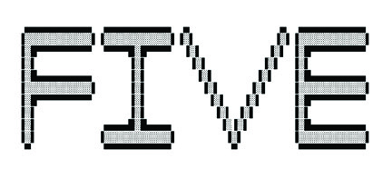
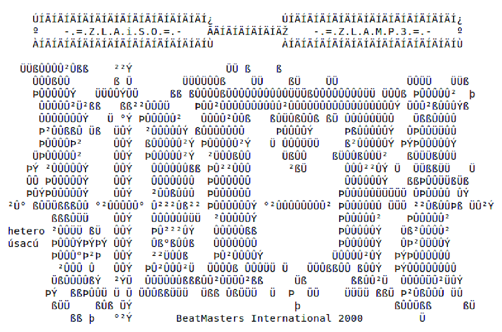
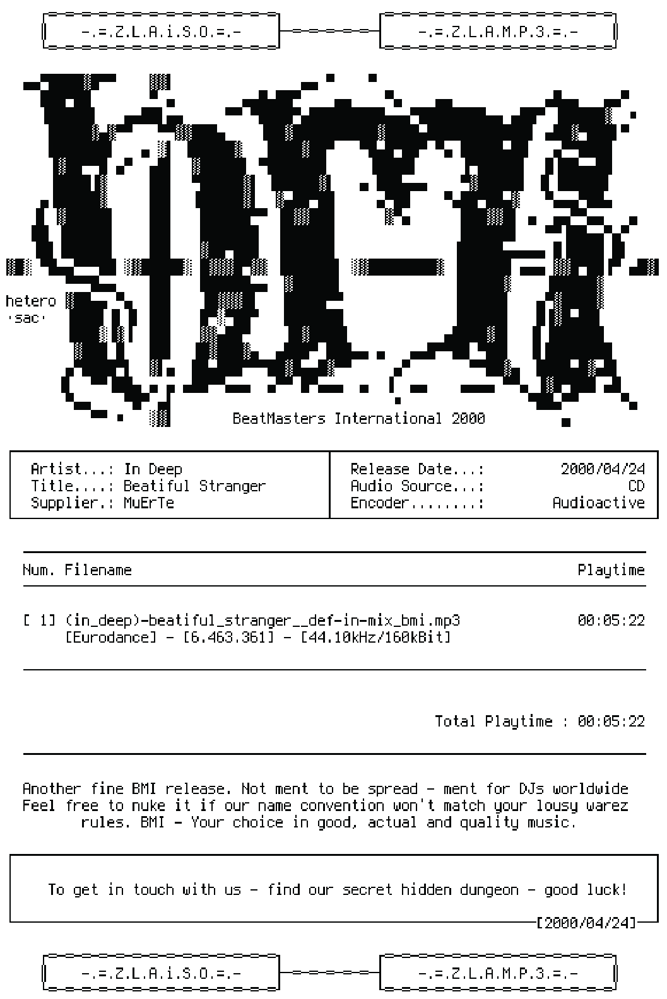

# Aesthetics

> "Art’s made by artists, but artists are enabled by a scene.”
> 
> — David Mitchell, *Utopia Avenue*[^1]

## Antagonistic Remixes

As I pointed out in the introduction to this book, if one is to understand the motivations of Warez Sceners in playing their dangerous game, it is first necessary to grasp the histories and cultures from which they emerged. Specifically, the Warez Scene must be understood within the academic purview of the study of “subcultures.” In his landmark and genre-defining study of subcultures, Dick Hebdige wrote of the style of underground groups as denoting “form as the status and meaning of revolt, the idea of style as a form of Refusal, the elevation of crime into art.”[^2] While, for Hebdige, “the ‘crimes’ are only broken codes,” in the case of the Warez Scene, this is certainly not the case; there is a genuine set of crimes being committed, albeit in ways that I contend constitute an aesthetic act. I argue that, like Hebdige, we should pay attention to the “expressive forms and rituals of those subordinate groups — the teddy boys and mods and rockers, the skinheads and the punks — who are alternately dismissed, denounced and canonized; treated at different times as threats to public order and as harmless buffoons.”[^3] This view, originating in the Centre for Contemporary Cultural Studies at the University of Birmingham in the 1970s, has been contested. It is also one that prioritizes the aesthetic or style as a mode of resistance in and of itself. I do not go this far and continually note that the actual illegality of the Warez Scene is core to its identity and to any perceived resistance. That said, this does not preclude an ongoing understanding of the Warez Scene as a subcultural phenomenon in which style plays a key role.[^4]

In the case of the Scene, this analysis of style in the alternative reality game equates to understanding two differing artistic or aesthetic cultural roots. An important part of the Scene I have hitherto only touched upon is its intersection with two unique digital art communities: the DemoScene and the ASCII art space. It is due to the shared genealogy with the former of these two activities that the Scene is called “the Scene.” In this chapter I turn to the background contexts of the DemoScene and chart a history of ASCII art in a lineage of concrete poetry and information aesthetics.

Many of the traditional accounts of the Warez Scene and its root in Bulletin Board System (BBS) cultures focus on the liberatory power of digital copying. Pirates are viewed misguidedly as operating within an economic system in which they view themselves as “helping others” to get something for nothing. This ethos may be true for the development of later peer-to-peer (P2P) networks, for example Napster, as Douglas Thomas suggests and the sharing therein.[^5] However, it has been one of my fundamental arguments that this view is mistaken with respect to the Warez Scene.

To return to the argument in Chapters One and Two, the Scene values originality and the importance of being the first to release the “liberated” copy: they see their creations as original, pirate material. There is a fundamental valorization of speed but also of the creation of a “new original.” Releases embody craft and skill, functionality and beauty. The supply routes of a group imply elitism and scarce access. As I noted, because the Warez Scene is directly descended from computer-artistic cultures where programming skill, musical ability, and visual flare were key elements of its practice, the Warez Scene should be understood primarily as an aesthetic subculture.

In the first two chapters, I suggested that we might consider the Scene’s activities as a form of remix culture. How does thinking in terms of remix help us to conceptualize the activities of the Scene, though? Across many spheres of endeavor, creative practitioners have made arguments for the reworking and reuse of other, often in-copyright works. As T.S. Eliot put it: “[i]mmature poets imitate; mature poets steal; bad poets deface what they take, and good poets make it into something better, or at least something different.”[^6] By this characterization, in a strange and perhaps even sick utilitarian inversion of which Eliot would surely disapprove, we might consider Sceners to be good poets who improve the end-user experience by removing the annoyances of Digital Rights Management (DRM) and other copy protections.

Nonetheless, this debate about creative reuse runs right up to the current era. For instance, Jonathan Lethem, a well-known contemporary novelist, has written several pieces calling for a reevaluation of artistic reuse. “Lethem,” writes Joseph Brooker, “questions the way that copyright goes as unquestioned as the law of gravity.”[^7] Building on work by Lawrence Lessig and others, Lethem suggests, as have many others, that artistic practice is continually building on other ideas and silently or not so silently appropriating previous work.[^8] Indeed, one might even suggest that there is no such thing as true originality and that all works are, in some way, derivative. For example, David Shield’s collage work, Reality Hunger: A Manifesto (2010), weaves together many other published writing pieces into a new, tapestry form.[^9]

Various sampling music cultures have also been embroiled in legal battles over what is “fair” in the reuse of other work. These have ranged from the reuse of melody lines from traditional music that are nonetheless held under corporate copyright (e.g., Men At Work’s 1980 hit, “Down Under”) through to disputes over original song authorship (e.g., Procol Harum’s 1967 “A Whiter Shade of Pale”).[^10] Perhaps the most well-known disputes have been in hip hop music. In 1991 the first lawsuit on sampling was decided in court, Grand Upright Music Ltd. v. Warner Brothers Records. While previous cases dealt with sampling and reuse, all other instances had been settled outside of court. In this case, though, Judge Kevin Thomas Duffy ruled that Biz Markie’s “Alone Again,” a composition from that same year that sampled Gilbert O’Sullivan’s 1972 “Alone Again (Naturally),” violated copyright. Further, the judge advocated for the criminal prosecution of the individuals involved, noting that:

> “[t]hou shalt not steal” has been an admonition followed since the dawn of civilization. Unfortunately, in the modern world of business this admonition is not always followed. Indeed, the defendants in this action for copyright infringement would have this court believe that stealing is rampant in the music business and, for that reason, their conduct here should be excused. The conduct of the defendants herein, however, violates not only the Seventh Commandment, but also the copyright laws of this country.[^11]

Notably, the lawyers in Biz Markie’s case did not argue for any fair-use principle, although it is doubtful whether this would have been any more successful. Other types of reuse, though, have been found fair. For instance, in 1994 the Supreme Court of the United States heard Campbell v. Acuff-Rose Music, Inc. This case turned on whether the sampled guitar from Roy Orbison’s 1964 “Oh, Pretty Woman,” alongside lyrics that distinctly parody Orbison’s own, should be considered a copyright violation.[^12] Because the nature of the reuse here was for parody, the court upheld the right to reuse. In this instance, the lyrics’ interaction with the musical elements contributed to the sense of parody and let the samplers off the hook.

To understand when and where sampling is legally permissible, one must look at the social context within which the piece is produced and received. Judgments are contextual. There are also, in some accounts, different typologies of sampling and reuse that come with different legal connotations. For instance, Amanda Sewell produces a taxonomy or typology of sampling that includes structural, surface, and lyric reproductions. Under these high-level headings, she gives percussion-only, intact, non-percussion, and aggregate for “structural”; constituent, emphatic, and momentary, for “surface”; and singular and recurring for “lyric.” In the period that Sewell studies, there was a marked drop in surface samples. In contrast, lyric samples increased; hence the effect that legal rulings have on sampling and reuse is not a direct inhibition.[^13]

What does this all mean for the analogy of the Scene? The outputs from the Scene are not really going to cut any mustard for fair use. It is not as though these works “sample” an original and create a new work through tapestry. It is, instead, more as though they take the original and graft their own smaller sample underneath it. To continue the musical analogy, this is akin to the edit culture of contemporary electronic dance music, in which often famous works are taken and have relatively minor additions made to them. This form of remix is an inversion of a rework, in which instead of massively altering the original track, a more subtle approach to overlay and modification comes to the fore.

Such an inversion is also prevalent in mainstream remix work. An excellent example of this is the Jason Nevins remix of Run-DMC’s “It’s Like That” in 1997. A sleeper hit that sold five million copies, the remix far outperformed the original single. However, Nevins was paid only $5,000 or so for the remix, despite this astonishing commercial performance. The main reason often cited is that many critics felt that the Nevins remix only added minor details to the track — and details that did not necessarily improve it. For instance, Freaky Trigger, which publishes popular musical criticism on every number-one single in the UK, wrote of the Nevins remix that:

> Jason Nevins, encountering this bomb-blast of a record, decides it would be improved by a crunching, unflinching house beat. He is wrong. This remix is, admittedly, loud and effective, almost as brutal in its unrelenting way as the original. But it’s far less accomplished and interesting. Its inane additions — the sped-up “Run DMC and Jam Master Jay!” squeaks, for instance — just disrupt the relentless, overlapping forward motion of the original MCs.[^14]

Indeed, the artist credit for the remix version was “Run-DMC vs. Jason Nevins.” Tom Ewing notes that “[r]arely was a ‘versus’ more earned.”[^15] In other words, this is a remix context that is billed as confrontational, one in which the remixer is pitted as an opponent against the original and adds his or her own stylistic elements, which may not be significant but that nonetheless transform the original. This now sounds much closer to the media piracy practices of the Warez Scene. Indeed, the analogy here is to an adversarial relationship of transformative modification, in which the original looms larger than the changes, but in which there is, despite this, an element of skill and craft in the antagonistic edits. Further, such edits are often not welcomed by the original producers. In seeking credit for these antagonistic changes, the Scene begins to emerge as an aesthetic subculture.Nonetheless, while I here argue for an understanding of the Scene as an aesthetic subculture, it differs from other such subcultures in some distinct ways. Consider, for instance, Sarah Thornton’s influential study of club and rave cultures. Her work probes the disco and dance music scenes, examining how a quasi-economic exchange of “cool” works as though it were itself a currency. Designating such club cultures as “taste cultures,” Thornton notes that “[c]lub crowds generally congregate on the basis of their shared taste in music, their consumption of common media and, most importantly, their preference for people with tastes similar to their own. Taking part in club cultures builds, in turn, further affinities, socializing participants into a knowledge of (and frequently a belief in) the likes and dislikes, meanings and values of the culture.”[^16] To a limited extent, such an analysis can be carried across to the Warez Scene. There are certainly parallels in how club cultures manifest a “veiled elitism and separatism,” in which the “majority of clubbers” define themselves against a “mainstream” culture, which itself relies on a non-mainstream culture for its definition.[^17] Yet the fact that the activity of Sceners is illegal and that they must congregate behind avatars of anonymity renders the binding of these groups very different, although commentators such as J.P. Williams have already examined how subcultures can develop across time and space on the internet.[^18] It is also clear that a shared love of media type is not really key to the identity of Sceners. Sceners are not film or music lovers, for instance, or, at least, they do not usually define themselves by such identities. Instead, the mainstream against which they pitch themselves oscillates between the poles of mainstream computer users, who are not elite enough to participate in the Scene; mainstream media purchasers, who do not have the access needed to avoid paying for software, movies, music, and so forth; and even lower levels of software piracy, which are deemed simply inferior to the Scene.

As a closing note before turning to the DemoScene, it is worth pointing out that the terminology of subcultures has been hotly contested. In recent years, the competing field of post-subcultural studies has emerged. Subcultural studies demarcate style itself as a resistive element, a way in which subcultures distinguish themselves from other groupings including the mainstream. The field of post-subcultural studies emerged to contest the “romanticism” of the Centre for Contemporary Cultural Studies (CCCS) at the University of Birmingham, where subcultural studies emerged. This was a view in which “radical potential” lay “in largely symbolic challenges” to a hegemonic norm.[^19] A post-subcultural inflection is one in which “the potential for style itself to resist appears largely lost, with any ‘intrinsically’ subversive quality to subcultures exposed as an illusion.”[^20] Indeed, some post-subcultural approaches have even adopted the label “scene” to describe their field of endeavor.[^21] Others have been critical of this direct substitution of the term “scene” for “subculture,” believing that it has substantially muddied the waters: “its use has been very ambiguous, or perhaps more accurately, downright confusing.”[^22]

While it is problematic to think that “scene” could be a straightforward drop-in substitute term for subculture — the latter of which, in the heyday of subcultural analysis, was predominantly concerned with examining class — the term is the self-selected, grouping word used by the pirates. Hence, the term “scene” registers a loose affiliation that lacks the precision of class-based subculture dominant in the CCCS ideology. There are also many strands to post-subcultural theory, some of which attempt entirely to jettison the CCCS approach to subcultural theory and discard them as useless while still analyzing subcultures themselves. Other attempts seek to further abandon the notion of subculture as a useful paradigm within which to think.This work adopts the former of these approaches. I treat the Scene as a distinct subcultural entity with codes of practice and aesthetic frames of existence (i.e., style). Although I treat the stylistic and aesthetic practices as significant and even key elements of practice within this domain, I do not claim that on their own these represent the elements of resistance. Instead, the legal transgression allows us to understand the Warez Scene as a space of misguided resistance in its antagonistic remix edits. The aesthetic forms and practices are key to understanding the Scene’s demarcation as a subcultural space, which I persist in calling an aesthetic subculture, but they are not themselves the transgressive enablers. Indeed, it is the complicated legality of the artwork components of the Scene that are most curious here, with both above-board, legitimate DemoScenes and ASCII art communities coming to distinct prominence. Nonetheless, in the “art of the crack,” where there is demonstrable skilled ability among sceners in removing copy protection routines, these legal and illicit functions combine to yield a subcultural form of resistance that sits at the Scene’s heart.

## The DemoScene

The Warez Scene is integrally linked to the computer art practices and histories of a space called the DemoScene. As Antti Silvast and Markku Reunanen describe it:

> [t]he demoscene is a technically oriented community that emerged in Europe in the 1980s. Concurrently with the growing popularity of the home computer, the members of the demoscene wanted to distance themselves from the common uses of computers such as productivity or gaming. Instead of utility or entertainment, their interest lay in creative experimentation […]. They formed an international community, eventually called “the demoscene” or just “the [S]cene,” once it became aware of its existence. The main artifacts of the demoscene are demos that showcase the programming and artistic skills of their creators. Simply put, a demo is a computer program that displays a series of real-time visual effects combined with a soundtrack.[^23]

Much like the Warez Scene, in essence the DemoScene is a male-dominated space for showcasing programming, graphics, and music-making skills. The demos are relatively short, but they often involve a file-size limit. That is to say that part of the skill is working under severe, programming constraints. There are also different competition categories, for example, at Finland’s annual DemoScene party, “Assembly,” that often correspond to the hardware on which the demo must run. For instance, there are Amiga categories, PC categories, and so on. The National Inventory of Living Heritage in Finland, which adheres to UNESCO’s Convention for the Safeguarding of the Intangible Cultural Heritage, has the DemoScene as one of its protected “objects.”[^24]

The DemoScene collides with the Warez Scene because, early in its history, software cracking was not illegal. Indeed, as Ben Garrett puts it, “[w]hen nfos were first popularised in the 1990s there was no issue with regards to the Feds reading the files. Not for profit software piracy was not a criminal act during this period. It was the signing of the World Intellectual Property Organization Copyright Treaty in December 1996 by 89 WTO member countries that started the change. It gave software the same protection as other copyrighted literary works and it criminalised the act of bypassing copy protection and rights management.”[^25]In this early phase of legality, software crackers sought credit for their work and wished to showcase their skill for their antagonistic remixes. To do so, they often coded brief and notso-brief demonstrations of their skill, demos, that would play either at the start of a game or within the key generator.[^26] In this way, crackers were able to highlight their skill in the crack itself and in the competition to bundle the best demo with their work. As Silvast and Reunanen put it, “the game cracking scene […] was the forerunner of the demo scene.”[^27] Garrett also reiterates this interrelation of the Warez Scene and the artistic DemoScene, noting that it was the former that provided the germination space for the latter: “[t]he art-scene never merged into the warez-scene, rather in the very early 1990s much of the art scene spawned from the warez-scene. The split came about from artists who had mostly worked for ‘elite’ bulletin board systems but either outgrew the warez-scene or just wanted more creative freedom.”[^28] This is also linked to cultures of attribution and merit that are core both to cracking and to the subsequent DemoScene, that is, “including your name in the crack and being seen as ‘good’” are two sides of the same coin.[^29] Nonetheless, as Reunanen et al. argue, “[t]he visual style of Amiga cracktros had a major impact on the aesthetics of future cracking scenes such as those of the IBM PC and game consoles. Communicating the act of cracking remained the main purpose, and the visual form of the crack intro served as an advertisement within the scene.”[^30]To comprehend the skill involved in demo coding, one must know a little about comparative file sizes and graphical programming practices. Many contemporary computer games feature state-of-the-art graphics. However, these games often have enormous accompanying file sizes. For instance, Doom Eternal, the latest in the Doom first-person shooter series, released in 2020, required 50 gigabytes of space (approximately 50,000,000 kilobytes). The 64k category of the DemoScene gives programmers 64 kilobytes total as an upper bound for what they can submit. In other words, DemoScene programmers in the 64k category have 781,250 times less space to work with than did the programmers of Doom Eternal (64 vs 50,000,000). For one more comparison, the original version of Doom, written in 1993, took 2.39 megabytes of space (2,930 kilobytes).[^31] In other words, DemoScene programmers are still working with 45 times less space than was afforded to programmers creating a three-dimensional graphic game in 1993.

DemoScene programmers must work fractally, coding procedural generation of images, rather than bundling enormous texture files and so forth. Of course, since 1993, the application programming interfaces that are available to programmers have drastically increased in quality. That is, programmers today can take advantage of the DirectX and OpenGL ecosystems, which handle much of the interaction with low-level hardware, thereby providing an easier way to render high-quality graphical outputs. The contemporary iterations of Doom are also able to use these infrastructures, yet they would not, nonetheless, fit on a floppy disk.

An example of the types of output that the DemoScene creates can be seen in iq, puryx, and mentor’s demo, *elevated*. While additional software was provided by kusma, skrebbel, and blueberry, to get the executable file size down, this production weighed in at a mere 4 kilobytes; that is, sixteen-times smaller than a 64k demo and 12,500,000 times smaller than Doom Eternal. *elevated* presents a procedurally generated flight over a mountain range, covered in snow-topped peaks, shown in Figures 13 and 14. As the authors describe it, with all original phrasing preserved, “this a (too) low density flat mesh displaced with a procedural vertex shader. there aren't any texturemaps for texturing, instead texturing (and shading) is deferred and computed procedurally in a full screen quad. this means there is zero overdraw for the quite expensive material at the cost of a single geometry pass. then another second full screen quad computes the motion blur. camera movements are computed by a shader too and not in the cpu, as only the gpu knows the procedural definition of the landscape.”[^32]

 

Figure 13. Screenshot from *elevated*. Copyright, the authors. Used by permission of Iñigo Quilez.

As this highly technical description indicates, *elevated* is a complicated mathematical proposition implemented by skilled practitioners. One of its lead authors, iq, Iñigo Quilez, has a formidable background, having worked for Pixar (for instance, creating, painting, shading, and coding the forest’s grass, moss, bushes, tree canopies and weeds in the 2012 film, Brave) and for Facebook’s virtual reality outfit, Oculus. It is also notable that the trick here is to offload much of the processing onto powerful graphical processing hardware (GPU). “[S]ize optimizations,” write the authors, “forced us to ask you for a pretty decent graphics card.”[^33]

 

Figure 14. Screenshot of *elevated*. Copyright, the authors. Used by permission of Iñigo Quilez.

*elevated* combines sophisticated lighting effects, camera motion and motion blur, shadows, and lens flare effects, all while flying over lakes and snowy mountains. Admittedly, for our comparison to games such as Doom, in *elevated*, the user does not interact with the mountain scape. Instead, the demo plots its own route over the hills and valleys. The demo also has a cinematic, musical soundtrack built-in with sound-to-light visualization. A virtual synthesizer inside the application, written by puryx, plays the score.

In short, *elevated* creates a three-dimensional world and flies through it. Of course, it possesses nowhere near the sophistication and complexity of the three-dimensional engines that sit behind third-person shooter games such as Doom Eternal. However, the sheer ambition and skill of implementing this world in such a small volume of code and resource space are staggering. Most jobbing programmers would struggle to design something of this quality even with no constraints. To operate within such confines is nothing short of remarkable. It demonstrates just the sort of elite skills and abilities, that few possess, that are treasured by the DemoScene and also by the Warez Scene.

Understanding the ethnography of the DemoScene and the etymology of its terminology can help us place the Warez Scene within a broader, hobbyist, computing phase. However, it can also help think through various behavioral traits that emerge therein. Key to this notion is the idea of community and performance. As John Irwin writes, “the word ‘scene’ reflects an emergent urban psychological orientation — that of a person as ‘actor,’ self-consciously presenting him- or herself in front of audiences.”[^34] Performance in the DemoScene and in the Warez Scene consists of playing back one’s skillful and artistic computer creations in front of others. However, it is as much about the hacker ethos as it is about the artifacts themselves.

The mentality of tinkering or working things out by experiment, as a “psychological orientation,” is core to this presentation of hacking that one sees in the DemoScene.[^35] The terminology of “hacker” here refers not to someone who breaks into computer systems (as it did in the previous chapter on FXP Boards) but to someone who is willing to hack things apart in order to understand them and, ideally, to (re)build them. Indeed, Gabriella Coleman charts instances of outrage at media presentations of hacking as an illegal activity. For instance, when Kevin Mitnick was described as a hacker in the media for his computer and wire fraud, a free-software activist retorted, with an interesting inflection for the discussion in this book, that “Kevin is not a hacker. He is a cracker.”[^36] While the term hacker was used among hobbyist software developers and those who worked within the DemoScene, the term cracker was introduced in the mid-1980s to attempt to counter the negative associations of the term that began to appear in the media at that time. As Coleman notes, “[a]ccording to The Hacker Jargon File, crackers are those who hack for devious, malicious, or illegal ends, while hackers are simply technology enthusiasts. Although some hackers make the distinction between crackers and hackers, others also question the division.”[^37] This is because, to quote the individual whom Coleman cites, “[v]ery often the same techniques that are used in hacking 2 [the more illegal kind] are an important part of hacking 1.”[^38]

No doubt, as readers will have noticed, the terminology of a “crack” in the Warez Scene pertains to this particular ethos of coding for illegality. Software cracking was, at least for a time, referred to as “breaking” in the 1980s. As Morton Kevelson puts it, “for those unfamiliar with this term, ‘breaking’ a program refers to the process whereby the true hacker disassembles a copyprotected program and removes the original protective code,” an etymology that he compares to the “activity burglars perform in the still of night.”[^39] Nonetheless, as the term “cracker” arose to describe nefarious hacking activities, despite the fact it has never caught on in the popular press, it became applied to the Warez Scene and the artifacts that it produces.

The skillsets of coders in the DemoScene and crackers in the Warez Scene overlap with one another. Consider, for instance, that *elevated* achieves its extreme compactness because much of it is written in assembly language. This allows for precision control of memory and avoids the bloat that is introduced by high-level language compilers as they attempt to optimize code automatically. Although, it should be noted that in most cases, high-level language compilers produce better assembly code than a human would or could. Nonetheless, familiarity with low-level assembly language and memory architectures is also crucial to the activities of crackers in the Warez Scene. Being an extremely skilled software engineer is core both to crackers in the Warez Scene and coders in the DemoScene.

It is also worth noting that the skillsets are nonetheless different. The mathematics of geometry and two-dimensional and three-dimensional graphics inherent in creating demos are different low-level programming expertise to those possessed by warez crackers. Instead, what is desired from DemoSceners in the crossover to the Warez Scene is an appreciation of credit and the hacking skill that can go into making the coolest demo, alongside the pirated software. That said, the usual claimed history — that the DemoScene branched out into a purely legal spinoff of the Warez Scene — is contested. As Markku Reunanen notes, “the actual story might be more complicated” because “many groups continued the legal and illegal activities in parallel, cracking games and making legal demos at the same time.”[^40]It is also true that DemoSceners need to specialize along several different axes; it is not all about programming skills. Just as the Scene itself has individuals who fulfill various roles (e.g., siteops, nukers, couriers, suppliers, encoders, and crackers), the DemoScene requires artists and musicians alongside coders. It is a mistake to believe that the DemoScene is all about programming skill, although this remains a core attribute. Musicians and artists are appraised by different criteria to their programming counterparts but are nonetheless held in high regard within this space. It is also true that there is no hard and fast distinction between coders and these other groups. The coders must embed the graphics and music within a compressed context and ensure synchronization of playback with the rest of the demo. In short, the lines between these disciplinary areas are not fixed, and there is a team dynamic at play.

The same can be said, in many ways, of release groups in the Warez Scene. While certainly individual skill and ability are core assets and there is some disdain between classes of users (i.e., it is universally accepted that there is more skill to cracking software than to being a Scene courier), the Scene is composed of pirate groups. Although the ability of individuals is vital, release groups, courier groups, NukeNets, dupechecks, and topsites all require individuals to work in concert with one another. It is the nature of piracy that pirates do not work in isolation, even while individual pirates may gain notoriety and fame.

In its intersection with the legitimate DemoScene, the Warez Scene finds its artistic and stylistic home. A minimalist aesthetic aiming for maximum impact, the DemoScene showcases extreme programming skills combined with aesthetic flare. We should not, however, lose sight of how odd the DemoScene seems to those outside it. Why would one choose, as a hobby, to make small, self-contained, computer graphics demonstrations? Similar questions, though, can be asked of the Warez Scene. Why would one choose, for fun, to spend hours every day moving material from one high-speed remote server to another, attempting to do so more quickly than one’s rivals? The answer, as ever, is the gamified nature of prestige accumulation within an economy-like environment that makes this hard. Given that recognition and flare are key to individuals’ standings in the Scene, the DemoScene’s artistic side, the showcasing spectacle, must not be overlooked. However, there is an exciting point to be made about the Warez Scene’s aesthetic practices and style in terms of subcultural analysis. In traditional subcultural analysis, the codes of style are themselves the violation, the act of defiance and resistance. In other words, it is the aesthetic act that is the violation.

Within the context of the Warez Scene, there are two ways in which demos function as aesthetic illegality that contravene society’s normative standards. First, demos were often part of cracks and key generators (i.e., keygens). That is, demos were often not bundled as standalone applications that sat apart from the pirated software themselves but were themselves part of the distribution. Users saw the demo when they opened the keygen — the illegal artifact that allowed for circumvention of copyright protection. In this case, the illegality or transgression did not come from the style of the keygen but from the fact that it was the skeleton key to the illegally copied software. At the same time, keygens and cracks were aesthetically styled through demos. That is, they exuded a “geek cool” that cannot be overlooked. These pirate artifacts come with a style of their own.

There is a second stylistic-illicit crossover point in the art of the crack, to which I have already alluded. Cracks themselves are an artform that possess a particular style. Admittedly, the audience who can appreciate the elegance, or otherwise, of acrack is small. It is more likely that most users will simply appreciate whether a crack works or not. A small cadre of individuals will appreciate elegance and beauty in a crack. It is this toward which crackers strive. Exact parallels are not necessarily found in other areas of the Scene (i.e., music and movie piracy), as there is no skilled equivalent to cracking; although access to an elite supply chain may carry similar prestige connotations and confer admiration upon an individual. Within the subculture of the Scene, the aesthetics of a crack will carry prestige and reputational benefit. Again, the illegality of the artifact makes it counter-hegemonic and disruptive, not so much the fact of its internal aesthetic composition. In the antagonistic remixes of the Scene, these elements combine to create an aesthetic environment predicated on extreme programming skill. In the formation of the legal DemoScene, the Warez Scene created its legitimate cousin. However, to this day, demo-esque aesthetics remain core to the makeup of the Scene and, in some ways, signify its transgressive nature.

## NFO Files and ASCII Art

Throughout this book I have documented the structures of the Warez Scene using NFO files. In reading a surfaced archive of documents for iNFOrmation, I have been able to piece together the practices, histories, and even humor of this subcultural space. NFO files yield insight into topsites, releases, courier groups, and scene busts, as I discuss later. Although these files are informative, a crucial element overlooked in much of the secondary literature[^41] is that there is also an aesthetic to NFO files and their text-based artworks.[^42] This is to say that while NFOs are information communication tools, groups also encode visual-textual artwork inside these NFO files, even though they are “plain” text.[^43] This form of plain-text decoration is called ASCII (American Standard Code for Information Interchange) art. It uses textual character codes to create a visual effect. ASCII is an underlying standard that converts a binary, numerical representati]on into universal character representations, in the same way as children might devise a simple code in which A=1, B=2 etc.[^44]Ironically, given that NFO files advertise activities, the format’s extension was first introduced by a group called “The Humble Guys” (THG) in 1990.[^45] The standardization of the file extension unified the disparate cultures of “phile” distribution that had developed throughout the BBS Scene histories and spelled out alliances, feuds, and credits.[^46] As with demo groups, these NFO/ASCII Art groups competed to be the best in the business and to develop notoriety for their creations. As Garrett puts it, these groups “earned their reputation at being one of the best groups by creating art for the best pirate boards of the time.”[^47] In parallel to other elements of Scene practice, there is a level of craft and skill involved in the work of creating the ASCII Art of NFO files, which was, itself, descended from mid-twentieth-century typewriter art.[^48] As one report put it, NFO files have become the de facto “press releases for piracy groups.”[^49]

NFO files have changed form over time. As Garrett charts, evolutions in the form of NFOs have taken place “both in the information they conveyed and aesthetic layout,” with the changes being spurred through “competition or from a needs basis.”[^50]In Garrett’s historical account, one of the general directions of movement was the redaction of identifying information from the files. “One early change,” as he writes, “was groups or crackers that listed their BBS phone numbers so they could increase their membership of long-distance callers. They believed this could increase users and would improve the catchment and variety of uploads to the bulletin boards.

As in the early BBS days there were no true cross-continental groups, let alone an international [S]cene on the PC.” Alongside this editorial function, however, early NFOs also served a verification role. “Later groups,” he writes, “added membership lists and official bulletin board affiliations into their NFOs to stop people from claiming false association with a group.”[^51] As criminalization of Warez activities grew in the 1990s, the NFOs became increasingly cagey. Once “the act of bypassing copy protection became a criminal offence, the more revealing pieces of information had gone from the NFOs.”[^52] Nonetheless, Garrett claims, “even with this selfimposed security censorship, NFO files still were great tools of propaganda for rival groups.”[^53] For this reason, the artistic sentiment and styling of NFO files remained.

When viewed in a standard text viewer, NFO files can appear very messy. For example, Figure 15 shows one of these files from around the year 2000. As is clear, the file is composed of several accented characters not used in the English language. These include “Ü,” “Ý,” “Þ” and many others.

Figure 15. BeatMasters International (BMI) NFO from the year 2000 with ASCII art by hetero/sac.

What may not be immediately clear here is that if one switches the font to an appropriate monospaced terminal style, these characters are transformed into blocks, as shown in Figure 16.

Figure 16. the same BMI NFO file transformed into its intended viewing format. ASCII art by hetero/sac.

While the possibly deliberate spelling errors in this document, or “ment,” might dissuade some of the literary merits of such artifacts, the significant point here is very different. Indeed, following the work of Bronaċ Ferran, I believe that these digital documents can best be located within a broad history of visual and spatial concrete poetry that exhibits both constructivist and de(con)structivist tendencies.[^54]

The history of concrete poetry — a form of writing in which the visual elements play a key, poetic role — is difficult to explain concisely. The terms of engagement are contested, and the debate’s terrain is international, spanning West Germany to Brazil from the 1950s onwards.[^55] Concrete poetic form has a complex relationship to literary modernism and particularly the work of Ezra Pound, from whose work the noigandres journal and loosely affiliated group, the authors of the “Pilot Plan for Concrete Poetry,” took their name.[^56] Key properties of concrete poetry include a focus on typography, spatial layout, positioning as poetic quality, and some idea of movement and kinesis, a “critical evolution of forms” as the Pilot Plan has it.

Core to much concrete poetry are ideas of economy and sparsity, an aesthetic that discards the superfluous in breakdown. Hansjörg Mayer’s 1965 oil, for instance, resolutely sticks to its deconstructing, minimalist use of three letters, repetitiously placed within its invisible grid. At the same time, though, there is a concurrent, constructivist countertendency of overloading at work. This often takes the form of repetition and over-printing, in which typographical elements are overlaid atop one another in the printing process.

Such a model for poetry thereby yields a double temporality, one in which the building and the breakdown are simultaneously present. Ideas of construction and destruction are prompted into temporal translation on the page of the concrete poem. Even the final logical endpoint of overloaded construction (e.g., overprinting to the extent that the page is black once more) leads to a form of destruction. When translated into temporal terms by a reader, this dialectical formulation is how the concrete poem includes a notion of motion within its otherwise static environment.

The NFO file shown above possesses some of the qualities of this temporal movement across the multiple display forms in which it can be accessed. Indeed, as well as possessing the spatial framing layout seen in much concrete poetry that prompts the dialectic, where alphanumerical, typographical elements are laid out in a particular form on the page for aesthetic effect, these digital artifacts are versioned and mutable in their display. The reader can access the form in its textual or graphical modes, demonstrating the principle of kinesis attributed to much concrete poetry but in a very different way. For while Mayer and others were interested in typographical control (e.g., the sustained use of the Futura typeface that Ferran notes was perceived to be a highly neutral font), the movement of NFOs comes from reader control over display technologies. The text moves from its constructivist phase, where ASCII characters are visible in their alphanumeric forms, into a breakdown of those characters into solid blocks as the correct monospacing font is applied. In this movement, there is at once a distinct loss of detail — we no longer know what the underlying linguistic or symbolic representation of the character might be, even though it has not changed in its fundamental digital representation — and a further construction as the image form of the document becomes visible.

In many ways, this is the type of metaphorical slippage that Dennis Tenen has charted in his book on plain text.[^57] It is a model in which the digital-metaphorical form presented to the end user is only tangentially associated with the physicality and materiality of the operation. The example that Tenen gives is the delete operation on a computer system. One might assume that pressing delete within one’s operating system would lead to the removal of the relevant file’s contents from the hard drive. However, this is not actually the case. In many contemporary computer file systems, files are stored in at least two and sometimes three separate locations. The first, the metadata inode, contains a pointer to the second storage location called the indirect block. The second storage location, the indirect block, contains two numbers that point to two further locations on the disk: a start block and an end block for the file in question. In some file systems, the inode directly contains the information from the indirect block, hence there are sometimes two stages and sometimes three. The file is then actually written on disk to the space between these location numbers. This is to say, there is a pointer on the disk that directs the operating system to the actual physical sectors on the storage device where the file’s contents lie. When one deletes a file, the file contents itself are not usually removed from the disk. Instead, the inode is unlinked. That is, the metadata for the file is removed, but the actual contents remain on the storage and the space where the file is stored is made available for the storage of other files. This means that in specific circumstances, it is possible but difficult to recover deleted files. Over time, the file’s location will be overwritten with new file data, linked to different inodes. Files will also be distributed between inodes at different on-disk locations for different fragments of their data.

The metaphor of deletion, often signified by a skeuomorphic trashcan in the iconography of computer operating systems, rarely performs an analogous “trashing” of the underlying data. Instead, it is more akin to saying that one will empty one’s bookshelf by crossing out the books one does not want from a list of books, only to remove the books later when one has a new book to add. Certainly, such metaphorical slippage is helpful to an end-user. But few users are aware of the implications masked bysuch metaphorical terminology. One’s files remain on the disk, even after you have deleted them.

The NFO is subject to an analogous metaphorical representation between its layers where different font overlays transform typographic blocks into visual versions of the underlying characters. Because the format takes advantage of unique, typographic features that rely on the selection of particular fonts and highly specific domain-knowledge requirements, elements of the process of metaphorization become more visible as we shift between the graphic and typo-graphic modes. Once one knows that certain accented characters in the Unicode format are misrepresented as solid blocks when one switches the font to a monospaced terminal layout, the perspectival and metaphorical trickery of the mediating layers are rendered transparent. Of course, for some readers, this will remain opaque; they might not understand why the file can appear in two different forms, and the metaphor will continue to function. This is not to say that metaphor does not function even when we know it is metaphor. It is just that a critical ability to appraise metaphor depends on recognition of substitutability.

Further, there is a history of computational colonialism at work in this double-layered process that can be read out the NFO files. The characters that translate into ASCII art blocks when used in an appropriate font are all drawn from the non-English alphabet. Just as search engines have premised their models on the cultural assumption of the transcendental, white subject, and the history of computing has worked to erase women from its record, here we see a geographic and linguistic bias to which the final chapter of this work will return.[^58] The acutely accented “u” (“ú”), for instance, is a glyph used in Czech, Faroese, Portuguese, Spanish, and Vietnamese, among others. It does not occur in English. For this reason, this character appears in the Latin-1 Supplement of the Unicode specification.

This translation of certain non-English characters to blocks is just part of how a longer, computational, linguistic colonialism has emerged in contemporary writing. Another instance of this can be seen in the response to the Unicode implementation of the Ho language. In 2007, K. David Harrison and Gregory Anderson noted in a letter to the Unicode consortium that:

> [t]he current Unicode proposal (authored by Michael Everson, dated 1999-01-29) is incomplete in its current form and notably requires consultation and fact-checking with the user community. While it is crucial that the Ho orthography be included in Unicode, this can only be done in close consultation with Ho scholars at every step of the process. As a practical and ethical matter, we urge the Unicode consortium to accept only proposals that emerge from or are formulated in close consultation with native speaker communities. To do otherwise is to espouse a kind of linguistic colonialism that will only widen the digital divide.[^59]

Indeed, one of the basic premises seen in the Unicode specification is that English-language, Latinate characters are the first to appear in the table, while other linguistic systems are often relegated to much higher assignations. Sometimes, as Sharjeel Imam points out, these other languages are spread across many different blocks rather than in the more concentrated forms of the Latin alphabet.[^60] “Internationalization” here means a spread outwards from a “centered” English to other “peripheral” cultures, demonstrating a strong Anglocentrism. As Don Osborn writes, for example, “[a]part from Arabic, the development of the use of African languages in computing and the internet has been relatively slow for a number of linguistic, educational, policy and technical reasons” while “a particular problem for a number of languages written with modified letters or diacritic characters — or entire alphabets — beyond the basic Latin alphabet (the 26 letters used in English) or the ASCII character set (that alphabet plus basic symbols) has been the way in which computer systems and software handle these.”[^61] As “an industrial standard controlled by the industry,” in Domenico Fiormonte’s words, we should be skeptical around “claims about the neutrality or impartiality of ” Unicode, a schema that has pretenses towards universal character representation.[^62]

The doubled nature of the layering here at once both highlights and masks this history. Those from countries using Latinate alphabets who open the text file while using a font that supports the extended set will encounter characters from Cyrillic alphabets, as just one example, and may be perplexed about why their screen is full of unfamiliar accented characters. After all, the artwork is not clear, as the above image shows, without the correct font being used. In this instance, a savvier user will understand that the problem lies in the intermediating font’s lack of support for the extended character set.

To explain this a little further: the font’s depiction of the underlying ASCII character is contingent upon an economy of choice. For each character displayed, the font must provide a corresponding glyph that the operating system can render. That is, the designer must craft an “a,” a “b,” a “c,” but also a “ú.” Given that there are thousands upon thousands of characters that each need a glyph, often, font designers may restrict themselves to a subset of the complete Unicode specification, selecting only the glyphs that they feel will be commonly used. They may then substitute all other glyphs with a different display character, such as a solid block (or different types of block, such as 50% grayscale). As the first contiguous block of the Unicode specification, Latinate alphabets are far more rarely blocked out. The priority is placed upon these characters while the disregard for glyphs that are specific to non-Anglophone cultures continues.

In another sense, though, this intermediation of font design masks this relegation. If a user goes straight into the “correct” font, they will be unaware that below the surface of the smooth blocks lurks this economy of choice in font design. Indeed, it will be utterly opaque that the character is anything other than the design block as which it appears. In other words, the exploitation of marginalized font glyphs that are apparent in the crafting of NFO files is at once one that hides and highlights colonial histories of computing culture, even when this is not apparent to those working within the subcultures that produce such artifacts.There is also another level of intermediation here that can act to mask these historical systems. This is because often designers of NFO files are working with software that assists them in their designs. A designer would rarely craft an NFO file entirely by hand. Instead, pieces of software will attempt to match a set of undefined or unspecified, non-Latinate font glyphs to the pixel shades within an image. Under this creation model, there is a greater obfuscation of the underlying histories because even the designer is unlikely to be aware that the shadings that they are producing result from undefined glyphs within the font set.

Notably, the NFO, as its abbreviated name implies, is not a poem. However, it is an artifact that contains a textual, aesthetic (i.e., “literary”) component as a core part of its existence. Instead, it is primarily the vessel for the dissemination of information about material that is being circulated in contravention of civil copyright law and perhaps even criminal copyright conspiracy laws. Thus, as Jacques Rancière wrote, the “ideal effect” of a work that entwines art and politics, or, I would argue, information, “is always the object of a negotiation between opposites, between the readability of the message that threatens to destroy the sensible form of art and the radical uncanninessthat threatens to destroy all political meaning.”[^63] The NFO is a documentary object, often poorly written with crude slurs made on other groups — “lousy warez rules” is about as mild as it will get. At the same time, the artifacts have an aesthetic quality due to the ASCII art frames. These are enmeshed within a complex play of symbolic and material capital that Alan Liu has framed as “cool.”[^64]

Understanding how the laws of cool play out within this space requires a little more background social context. Certainly, James F. English has traced how the cultural prestige of prize culture works among the big literary prizewinning novels of our day.[^65] Likewise, Ted Underwood has examined the phenomena that lead to literary status and prestige over a long period.[^66] Yet what is in it for “hetero ‘sac,’” the originator of this NFO file’s design? (The individual here is “hetero” while “sac,” “superior art creations,” is the group.) Indeed, this work will not be entered into any high-brow poetry or design competitions, and it would not win anyway if it were. Nevertheless, the author has taken considerable time and effort to craft the logo, understand how it will appear across multiple systems, and produce the template within which the release group can insert its documenting information. Why? It seems most likely that “hetero ‘sac’” will have some kind of topsite access as a reward for designing the NFO.

However, this simple answer — a material reward — is also wrong or overly simple. Those who hold such slots often have them across multiple sites and almost all releases end up on all sites within a few second of release, that is, the exclusivity of affiliation to groups is a matter of minutes or seconds difference in whether a site has access to such material. Hence, although the terminology of subcultures is hotly contested, it strikes me that there is a prestige economy of a subculture at work here that does not translate back into determinate and precisely commensurable, material reward.[^67] That is to say that the levels of prestige of design work and the groups for whom a designer works will determine the quality of the sites to which they are given access. This quality has not anything to do with access to pirated material. It is, instead, more about the “cool” of the site; boasting rights of access and eliteness of status here are seen as far more important than actually downloading the material that is released.

Overall, then, it seems only fitting to conclude that the artistic subculture of ASCII art falls into the same types of competitive, quasi-economic alternative reality game-playing that pervades the other structures of the Scene. It is not true to separate the artistic practices from other core practices. The Scene, while an alternative reality game, is also an aesthetic subculture.

## The Feedback Loops of Digital Rights Management

The craft, skill, and aesthetics of piracy also feedback into mainstream cultural production. Indeed, it was never a tenable division to believe that mainstream producers simply made material that pirates then copied. Writers such as China Miéville, for instance, have long noted how new, cultural artifacts can be generated as a result of “piracy,”[^68] although one has to query whether, if one has permission or the author’s blessing, such practices remain “piratical.” As Adrian Johns has pointed out, when the term “pirate” was first banded around to denote illicit copying, during the early book trade, the interplay between copy and original was extensive and bidirectional.[^69]

We see the same in innovative copyright protection measures that modify gameplay in contemporary computer games.[^70] That is to say that the Scene’s cracking activities have altered the aesthetics of computer games themselves. Early games in the 1990s from Sierra On-Line and Lucasfilm Games, for example, required a user to input phrases from a physical manual shipped with the game in order to prove that they possessed the material correlate — another example of introducing a pure, rivalrous scarcity into the digital space.[^71] A failure to identify oneself as a legitimate user altered the gameplay itself in games as far back as 1988’s Zak McKracken and the Alien Mindbenders. In this title, if the user entered the serial key incorrectly five times, they were moved to a pirate jail, where they received a severe admonishment for stealing the title.[^72] Despite debates over the efficacy of such DRM technologies, more imaginative interplay loops between piracy and content have emerged.[^73]

Take, for instance, the example of The Sims 4, a game in which the player works to build a simulated environment within which their characters can thrive. In regular gameplay, one’s characters are afforded the basic decency of having their genitals pixelated out when using the bathroom and other activities in a state of undress. In pirated editions of the game, however, the pixelation spreads gradually to engulf the whole screen, thereby rendering the game unplayable.[^74] In other words, the anti-pirate mechanism fills the screen with a giant pixelated genital organ, presenting a phallic rejoinder to the illegitimate user.

Other games have opted for more subtle approaches that nonetheless prevent the player from progressing. Serious Sam 3: BFE developer, Croteam, embedded an unkillable Adult Arachnid “boss” character in the game when a pirated edition is detected. This enemy chases the player indefinitely throughout the game.[^75] While this may sound like a nightmare scenario, resourceful modders actually went so far as to develop an add-on that would deliberately spawn these “DRM scorpions” throughout the game as a challenge to players.[^76] This is a strange instance where legitimate customers have felt left out from participating in the elements of the artform that are directed solely at pirating users.[^77] The list goes on. Grand Theft Auto IV features cars that accelerate beyond the pirating user’s control. In Command & Conquer: Red Alert 2 the illegitimate player’s base would self-destruct after a short period of time. In Settlers 3, pirates can only produce pigs, not iron. Croteam’s The Talos Principle featured elevators that would become stuck halfway to their destination if one has pirated the game.[^78] Bohemia Interactive’s “FADE” or “DEGRADE” DRM protection is specifically designed gradually to destroy the experience of pirates as games progress.[^79]

To end this catalog of creative, video-game responses to piracy, I would like to draw attention to perhaps the most meta example of which I am aware, that of 2012’s Game Dev Tycoon, produced by Greenheart Games. To be clear, this game is exactly as it sounds: it is a simulation of running a video-game development studio. The aim for the player is to develop and bring to market a set of video games. In pirated versions of the game, the user is repeatedly warned that “it seems that while many players play our new game, they steal it by downloading a cracked version rather than buying it legally. If players don’t buy the games they like, we will sooner or later go bankrupt.” The player of the pirated edition would then gradually find that over time, they would lose money in the game, until they eventually did indeed go bankrupt.[^80]

It is not clear whether such creative DRM responses to piracy have the desired didactic effect upon players. After all, proper cracked versions of video games nearly always emerge eventually as versions in which even these humorous DRM elements have been removed. In the end, developers are always playing catch-up against the pirates and can hope only to delay, rather than to avoid, the illegal distribution of their games. However, I contend that two key points emerge from these instances of gameplay-modifying DRM systems:

1. that piracy has had an active effect on the art form of these works, feeding into them and contributing aesthetic elements to their development that would not exist otherwise; and\

2. that certain executable, media forms, such as games and other software applications, are particularly susceptible to this type of activity in a way that other art forms, such as music, are not.

On this second point, it is the self-executing nature of games and software that makes these creative DRM responses tenable. It may be the case that this is not generalizable to a broader media ecology. Understanding this difference requires a brief foray into an explanation of file types. Some computer files are executable. They contain sequential instructions that the computer understands and can process. Other types of files contain data that another program can read, such as musical or pictorial data. The effect of processing each of these file types is very different.

In the case of games and software, one of the mechanisms that can be used is for the program to verify its checksum. A checksum is a mechanism for verifying the contents of a file. Checksums are produced by one-way hashing algorithms that essentially take an input message and digest that message. In each case, the process is irreversible. A checksum will be replicable for the same input and should feature a low number of collisions — cases where different inputs produce the same output. However, it is impossible to reconstruct the input if one has only the digest output. For instance, the SHA1 (Secure Hash Algorithm 1) program produces the output “a94a8fe5ccb19ba61c4c0873d391e987982fbbd3” for the input “test.” This output digest does not contain the data “test,” and so it is not reversible except by guessing and by the fact that this is a very well-known, short input message. For the present discussion, it is only important to know that this hashing process is possible not only on strings of text, as I have demonstrated here, but also upon whole files. A file can be fed into a hashing algorithm to produce an output message that is unique for that file but that will remain the same every time the process is run. Even small changes to the file will result in a completely different hash.

This is useful and relevant because such algorithms can ascertain whether a file has been modified. “Crackers” in the piracy scene work to break the digital protection measures in software and games so that they may illegally distribute the files.They do this by altering the software’s logic within the distributed executable binary. In so doing, however, crackers change the checksum of the executable file. Hence, the simplest way of detecting an unwanted modification to an executable file (e.g., in cases where copy protection has been removed) is to see whether the checksum is the same as expected. If it is not, then it is likely that the user is playing a pirated version of the game in question.

This is the type of logic that leads to these in-game situations. The software checks itself to see whether it has been modified and, if so, alters the game states to achieve the desired effects. Such checks are often missed during the first round of cracking because they do not behave like generic, copyright protection systems that might simply block the program from starting. That is, crackers who wish to pirate a game are on the lookout for logic within software code that shuts down execution entirely, the most common kind of DRM. They will also be searching for messages that indicate that a piece of code is designed to prevent piracy. In the case of logic such as that in Grand Theft Auto IV, however, the anti-piracy detection system is cunningly tied to an in-game alteration to automotive physics, which is not the expected usual outcome of DRM technologies.

Executable software can verify whether it has been modified; however, there is no guarantee that pirates will not, in turn, modify the logic that causes these creative responses. The situation is very different in non-executable media, such as movies, music, and pictures. These file formats contain data interpreted by separate executable software, such as a movie player. The movie player reads the data from the movie file, which contains a frame-by-frame description of how to illuminate each pixel on a screen to produce the illusion of film, and then displays it. The movie file itself cannot perform branching logical instructions, as did the software, and it is instead reliant on third-party software to display its contents.

This has far-reaching consequences for piracy’s creative loop. For while we have seen a limited number of examples of software that has been influenced by the knowledge of piracy, there arefew instances where films and music have had such reciprocating loops of practice (System of a Down’s 2002 album, Steal This Album!, might be one of the few counter-examples in using its title to refer to piracy). There are no DRMed films, for instance, where the antagonist becomes suddenly unstoppable or where a different, less satisfying ending is presented to those who have not paid for the movie, beyond deliberate, bad, Scene releases by the studios themselves. This is because non-software artifacts such as music files rely on DRM implementation elsewhere as a generic feature. That is to say that films and music certainly are frequently protected by DRM and other technological protection measures. This usually works by the software being provided with a specific license key for decryption once it has shown that it will adequately implement the requested DRM system. In most circumstances, this means that unauthorized players will be unable to decrypt the media content and, therefore, unable to copy it. However, these media depend on the developers of this viewing software, which must handle all movies and not just a specific list of movies. Hence, there is little creative freedom in the aesthetic DRM responses for music and movies, as opposed to software and games.

This is not to say that piracy has no aesthetic consequences for illegally copied film and music. As Virginia Crisp drew to my attention, there are pirate covers created for these artifacts. There are also instances of professional studios adopting a “pirate aesthetic” as part of their own marketing efforts, recuperating piracy in the service of official sales. For example, Sony sent out The Girl with the Dragon Tattoo (2012) “in its box as a blank home-burned DVD with the title carelessly hand-written in a black permanent marker.”[^81] This gave the impression that the media was, itself, a pirated form and that people had received a “rip-off ” edition. Finally, enthusiasts can create remixes and fan edits that come with their own aesthetic. These edits are facilitated by access to materials that have the DRM protections removed. That is to say, piracy may facilitate such more legitimate creative endeavors.

This is to make a more limited case for how the economic logic of piracy conditions aesthetic responses. It is certainly the more exciting argument to believe that underground networks of piracy could have positive feedback loops that change mainstream production. This is true in some cases, notably in the space of self-executing software. Most digital artforms do not respond aesthetically to piracy in quite such innovative and creative ways. Whether for technical reasons or simply because they were unaware, most works do not contain witty ripostes to DRM circumvention. Thus, we should take care not to overstate the case of these outsider examples, no matter how amusing they may be.

## Disrupting Aesthetic Forms

A key question for those interested in the Scene is, what motivates Sceners to participate in this alternative reality game? As this book has argued all along, it varies hugely, and there is no single motivating factor. However, I would argue that prestige and status are key elements that Sceners seek, over and above pirate artifacts. From the observations of this chapter on Scene aesthetics, we might posit that kudos and “cool” are also vital.

This insight yields some interesting observations. If participants are active because there is a certain level of kudos and cool associated with being “in the Scene,” then there is a potential avenue by which law enforcement can disrupt the Scene that has not previously been explored. If the Scene were to be made boring or uncool, interest would dry up. There are many ways that law enforcement might approach this, some of which have dubious ethical status. For instance, infiltrating the DemoScene or ASCII art communities is a possibility. However, this would involve infiltrating a legitimate internet subculture on the offchance a connection can be found to the Warez Scene that can be exploited.

The fact of the matter remains, though, that topsites are FTP sites. They are fundamentally dull and, in many ways, uncool. Giving them a veneer of sheen and aesthetic cool is what lures people to these sites, coupled with their secrecy, exclusivity, and powerful hardware. Making the Scene boring is a route that seems to have gone relatively unexplored — perhaps because it is impossible — but could be a viable law enforcement tactic as subcultural theory seems to suggest.

Of course, the type of cool that applies to geek underground subcultures is hardly the same kind of cool that applies in society more generally. The word “geek” is a pejorative term that originally referred to “a carnival performer, often billed as a wild man whose act usually includes biting the head off a live chicken or snake.”[^82] In contemporary technological usage, the counterpoint to the term “geek” is the more pejorative “nerd.” Certainly, these terms both sit within a sphere of a sort of masculinity. Their conversion to prevalent slang is best framed on “the continuum of masculine improprieties,” even though Sceners are and can be female, as I have noted elsewhere.[^83] While the etymology of “nerd” is unknown, though the word first appeared in a Dr. Seuss book in 1950,[^84] the distinction between these two terms is famously debated in Douglas Coupland’s Microserfs (1995), where there is an extended discussion on “[w]hat, exactly, is the difference between a nerd and a geek?” In Coupland’s novel, the difference is subtle and instinctual. The reply is that “geek implies hireability, whereas nerd doesn’t necessarily mean your skills are 100 percent sellable. Geek implies wealth.”[^85] While “geeks were usually losers in high school who didn’t have a life,” the novel goes on, “not having a life [then] became a status symbol.”[^86] Although it is not just the accumulation of wealth that has led to this, through figures such as Sheldon Cooper in the TV series, The Big Bang Theory, the “transition from geekas-sideshow-freak to geek-as-intelligent-expert has moved the term from one of insult to one of endearment.”[^87]

This use of the term “wealth” is curious in Coupland’s description. It is true that, within the context of Coupland’s novel, geek knowledge went on to lead to highly paid Silicon Valley jobs. For Warez Sceners, wealth is access to pre-release software rather than directly material in terms of money. It is nonetheless from their investment in geeky activities that this access and wealth arises. The wealth of the Warez Scener is, in fact, though, more akin to fanatics’ or comic book completists’ spirit of collecting.

Consider, for example, that in the comic-book-collecting subculture, prestige and status are “based on the ability to acquire canonical texts, as determined by either plot or creator significance. By possessing these comics, the reader substantiates his or her participation in fandom.”[^88] Knowledge of the plot, characters, narrative, and style of these artifacts does, of course, play a role. However, the actual significance for the geek collector lies in possession of the object, not in the actual use of the comic book. The same is true of Warez Sceners. The terabytes upon terabytes of material that sit on the hard drives of topsites must go mostly unused. There are more media on these servers than it would be possible to consume in a lifetime. End-use is not the goal. Instead, it is the accumulation that here plays the role, as though these objects, which are scarce by their difficulty to obtain, were themselves a currency. Sites with the largest archives, along with the best internet links and affiliates, are the most highly valued. Individuals who can hoard the most will likewise gain respect because they are able to fill requests on sites. In short, there is a fanbase-like hoarding phenomenon at work in the game of the Scene that is akin to the collecting instincts seen in other geek communities (e.g., comics, vinyl, and so on). Certainly, one of the motivations of Sceners is to collect these artifacts even if not to use them.

Within this collecting mentality, the destruction of historic, pirate archives, when this happens, for instance through law enforcement action, has a twofold function. First, it makes it harder to acquire historical material. The fact that duplicate releases are not allowed means that if substantial portions of the Scene’s historic output become inaccessible, Sceners cannot obtain the material via another route. At the same time, this increases the value of access to the back catalog. The scarcity of back catalog releases increases the prestige of access to them. The fewer people have access, the more elite it is to get hold of such material on request. In other words, until the point of total eradication, shutdowns of historic, Scene-archive topsites increase the stakes in the game of prestige played out inside the Warez Scene through an economy of scarcity. Indeed, it may be the case, paradoxically, that shutting down archive topsites could motivate Sceners into further participation, seeking out everscarcer, ever-more elite forms of access. This, again, shows how the scarcity of the Scene has an economic character.

It is true that, for some categories of individuals, the use-value of the Scene’s outputs do play a role beyond the general collector impulse that I have just documented. For example, fans of specific musical subgenres (e.g., drum ’n’ bass or death metal) or film styles (e.g., science fiction or horror) will find few richer sources than the Scene for high-quality rips of this material; however, it is questionable whether the Scene provides better longstanding back-access to this material when compared with private torrent trackers, as I have already discussed. Indeed, it is often the case that material that is extremely hard to acquire in real life, such as rare vinyl records, will find themselves ripped within the Scene context. This means that there may be a limited subset of Scene users who participate to gain actual accessto media content that they would not otherwise possess. The extent to which these niche, subgenre fan bases exist within the Scene is not widely known, but it is a topic that would merit further investigation in future interview work.

This also supposes that there are two levels of collection and taste-determination within the Warez Scene. In conventional collecting circles, “a collection’s quality is overdetermined by knowledge and taste and, therefore is subject to field-specific forms of valuation,” as Benjamin Woo puts it.[^89] In the Warez Scene, at the “meta-collecting” level — where it does not matter what one is collecting, so long as it is a Scene release — the ability to “to claim status among […] fellow geeks” is determined by access to scarce warez and not by any particular principles of taste and style.[^90] By contrast, another level of collecting, such as artifact and genre-based collecting, carries with it the same principles of style and taste that one would see in external geek cultures. Moreover, this latter group may attract symbolic currency (e.g,. prestige, respect) in groups outside the Scene because of their internal access. The punk-rock lover who manages to acquire access to works that others cannot, via the Scene, will garner exterior respect in a different community because of that access. Hence, geek collecting mentalities in the Scene have both interior and exterior projects of cultural capital accumulation. The former are media agnostic, while the latter fit within existing descriptive paradigms of taste and subcultural behavior.

Another definition of geek focuses more keenly on the obsessive nature of interest. For instance, McCain et al. proffer the distinction that “[n]erds were considered to be socially awkward and overly intellectual, whereas geeks were prone to obsessive interest in marginalized or obscure hobbies such as the Dungeons and Dragons game, comic books, and personal computing.”[^91] This description seems accurate, except that one of these media is not like the others. While Dungeons and Dragons and comic books are single-subject activities, being into “personal computing” is a very different interest as the computer itself can present many different scenarios. For instance, being interested in “personal computing,” at least now, could mean that a user enjoys making music, creating visual artworks, playing games, programming, building computers, chatting online, or participating in the Warez Scene. Of course, this technical distinction hardly matters given the bullying concepts within which the term was developed and used. Notably, an interest in computers could be lumped in these same categories.

Nonetheless, the geeks of the Scene find that their social identities are greatly sculpted by operating within this milieu. As J.P. Williams posits, “[f]or individuals who do not participate in face-to-face scenes, however, the internet is more than a medium; it is a social space through which personal and social identities are constructed, given meaning, and shared through the ritual of computer-mediated interaction.”[^92] This means that, for many Warez Sceners, their primary life identity is sculpted by a partially asynchronous online subculture.

The asynchronicity of the Scene is both a defining feature and an element that the Scene tries to eliminate. While the Scene is an international network that spans the globe, it is also split into geographical regions, mitigating the effects of timescales. For instance, as noted, there are separate courier charts for EU, US, and Asian regions, implying that racing between these regions is less common and comes with speed challenges of internet routing (it is usually much slower to transfer a file from an Asian region to an EU region than it would be to transfer a file within those borders). In addition, this division into time zones means that individuals will mostly be online at the same time within their geographic bubbles and so will have space for social interaction.The actual time spent online by Sceners varies hugely. A Wired article that interviewed a Scene member noted that “Clickety used to spend 12 hours a day online.”[^93] Topsite rules for couriers specify that a certain quota must be met every month, as noted above in the section on geek humor. In turn, this ensures that users must spend a certain proportion of time online to meet this demand and keep their slot on the site. As a side effect, these quotas force users to be online at similar times, thus ensuring more of a synchronous community experience. Of course, there are still periods of users being “AFK,” or away from keyboard. However, many site rules are designed to minimize this and ensure that end-users congregate for the synchronicity of social encounters. Internet Relay Chat (IRC) bouncers are another element that provides for a synchronous encounter, even within an asynchronous environment. By leaving an avatar present at all times on IRC, users avoid the need to reinvite themselves into many different site channels with passwords and on-site invite commands and give the appearance of presence at all times, affirming synchronicity once more.

While many forms of geek culture eventually worked to reclaim the label and to self-appropriate the term, the Warez Scene faces additional challenges that licit subcultures do not. Mainstream geek culture has tended to focus, for example, on “science-fiction and fantasy, comic books, roleplaying games, costuming, etc.” and “[t]hese interests tended to share common themes, such as larger-than-life fantasy worlds (e.g., Tolkein’s Middle Earth), characters with extraordinary abilities (e.g., Superman), the use of magic or highly advanced technologies (e.g., futuristic technologies in Star Trek), and elements from history (e.g., renaissance fairs) or foreign cultures (e.g., Japanese cartoons, or anime).”[^94] Importantly, the visible performance or demonstration of a “knowledge of or devotion to these interests became a form of social currency between self-proclaimed geeks” that culminated in the now enormously popular ComicCon events.[^95]

Comic-Con, with its famed, outlandish cosplay, gives geeks “a gathering space where attendees can attend panels, buy merchandise, and wear costumes to show their devotion to a particular show or comic book character.”[^96] It also clearly yields a way for once-employed science fiction actors to receive an ongoing revenue stream, as fans will queue for hours and pay handsomely to have their photograph taken with their heroes. Furthermore, recent studies have shown that mainstream geek culture is “a lucrative target for advertisers as well as being high-spenders with the power to make or break billion-pound brands.”[^97] Using the UK’s currency, the British Pound, this work showed that geeks “number a seven million strong audience for ad agencies and estimates that the ‘geek pound’ is worth a staggering £8.2b [USD 10.58b] a year.” Finally, this survey, conducted by Sci-Fi channel service reveals that geeks are not anti-social loners. Instead, it “shows that geeks these days have discovered a social life — with 52% more likely than the average person to have had four holidays in the last 12 months and 125% more likely to visit pubs, clubs, and bars. And nearly 40% of them believe their special interests make them attractive to the opposite sex.”[^98]

This mainstream geek culture, and Comic-Con in particular, provides an apt counterpoint for the Warez Scene. While Comic-Con yields a public outlet venue in which geeks can perform with pride, the illegality of the Warez Scene forces members into secrecy to avoid detection. This is not to say that there is not pride among Warez Sceners. Clearly, leaking information to public documentary websites, such as TorrentFreak, is a key way in which Sceners can show off their creds and insider knowledge without a great deal of risk. This breaking of interiority is frowned upon by members of the Scene, while clearly there is a lure to do so in order to bask briefly in the reflected glory of providing the inside story to someone without access. This comes with some risk to the Scene member in question as they will have to reveal some elements of their identity to a journalist or blogger — who could, indeed, be a member of law enforcement — although it is relatively trivial to send anonymous emails with tips.

It is also, clearly, the case that the Warez Scene cannot be monetized in the same way as other geek scenes. While ComicCon and other events provide commercial loci, points at which social interaction melds with trade, the Warez Scene does not work in this way. For one, face-to-face meetings would entail far too much physical risk for participants, and only long-established, quasi-legitimate DemoScene groups such as Fairlight can even risk this (see the section on Fairlight in Chapter Six). While there is research that suggests that other geek subcultures may meet in the real world and that approaches to their study must examine the overlap between online and offline experience, this seems less likely in the context of the Warez Scene.[^99] For a second point, it is unclear what conceivable merchandise could be provided around this type of activity. Other forms of “geek scene” have their own media, which results in substantial product placement. For instance, George Lucas made an extremely savvy move in retaining the merchandising rights for the Star Wars franchise. It is hard to imagine what commodities might circle the topsite Scene. Models of one’s favorite server? USB keys with classic releases and demos on them? A “build your own topsite” stall or a top trumps game? Competitive, live, courier racing? In short, the illegality and the inherently noncommercial nature of the Warez Scene render it a different space for the types of in-person, highly commodified circulation that one sees among other geek scenes.

There are indeed other improbable types of geek culture meet-ups. Consider the rise of large-scale gaming parties, in which competitors bring their computers to a shared locale to game against one another. The biggest of these can number thousands of participants. One could also point again to the DemoScene, where digital artists come together in person to show off their creations, to socialize, and so forth. There are also CTF Hacking meetings. These are “Capture the Flag” games for computer crackers that involve breaking in, as a team, to a remote server. These hacker events provide a safe space for computer security experts to demonstrate their acumen, within a legal environment, under fun, competitive conditions.

This is all to say that while Scene cultures may appear too esoteric to merit in-person social events, there are possible ways that individuals from these spaces would like to meet. The illegality of the Scene is most likely the impinging factor that holds them back. To conclude, the Scene seems to function as do other aesthetic, geek subcultures. This comes with one significant conclusion. I have argued throughout this book that prestige and reputation are the currencies that power the game of the Warez Scene. Recent psychological studies of geek subculture offer some confirmation of this: “[o]ur findings suggest that geek media is especially attractive to narcissists, independent of demographic variables.”[^100] It is the need to show off that comes through most strongly in the Warez Scene, and this is why it is so prominently linked to the aesthetic cultures of the DemoScene and the ASCII art scene. It is this pride that will often come before a fall. The need to perform one’s elite status in public is where many Sceners meet their end, accidentally showing off in front of law enforcement.

## Footnotes

[^1]: David Mitchell, Utopia Avenue (London: Sceptre, 2020), 449. 
[^2]: Dick Hebdige, Subculture: The Meaning of Style (London: Routledge, 2002), 2. 
[^3]: Ibid. 
[^4]: Ibid. 
[^5]: Douglas Thomas, “Innovation, Piracy and the Ethos of New Media,” in The New Media Book, ed. Dan Harries (London: British Film Institute Publishing, 2004), 82–91. 
[^6]: T.S. Eliot, The Sacred Wood: Essays on Poetry and Criticism (New York:  
[^7]: Alfred A. Knopf, 1921), 114.Joseph Brooker, Jonathan Lethem and the Galaxy of Writing (London: Bloomsbury Academic, 2020), 16. 
[^8]: Lawrence Lessig, Free Culture: The Nature and Future of Creativity (New York: Penguin Books, 2004); Lawrence Lessig, Remix: Making Art and Commerce Thrive in the Hybrid Economy (New York: Penguin Books, 2008). 
[^9]: David Shields, Reality Hunger: A Manifesto (London: Hamish Hamilton, 2011). 
[^10]: Joel Gibson, “Kookaburra Sits on a Small Fortune: Ruling on Down Under Royalties,” The Sydney Morning Herald, July 6, 2010, https://www.smh.com.au/entertainment/music/kookaburra-sits-on-a-small-fortune-rulingon-down-under-royalties-20100706-zy5l.html; “Organist Wins Procol Harum Battle,” BBC News, December 20, 2006, http://news.bbc.co.uk/1/hi/entertainment/6196413.stm. 
[^11]: Siva Vaidhyanathan, Copyrights and Copywrongs: The Rise of Intellectual Property and How It Threatens Creativity (New York: New York University Press, 2003), 142. 
[^12]: Joanna Teresa Demers, Steal This Music: How Intellectual Property Law Affects Musical Creativity (Athens: University of Georgia Press, 2006), 54–59. 
[^13]: Amanda Sewell, “How Copyright Affected the Musical Style and Critical Reception of Sample-Based Hip-Hop,” Journal of Popular Music Studies 26, nos. 2–3 (2014): 295–320. 
[^14]: Tom Ewing, “Run-DMC vs Jason Nevins — ‘It’s Like That’,” FreakyTrigger, May 4, 2014, http://freakytrigger.co.uk/popular/2014/05/run-dmc-vsjason-nevins-its-like-that/. 
[^15]: Ibid. 
[^16]: Sarah Thornton, Club Cultures: Music, Media and Subcultural Capital (Cambridge: Polity Press, 1995), 15. 
[^17]: Ibid., 17. 
[^18]: J. Patrick Williams, “Authentic Identities: Straightedge Subculture, Music, and the Internet,” Journal of Contemporary Ethnography 35, no. 2 (2006): 173–200. 
[^19]: David Muggleton and Rupert Weinzierl, The Post-Subcultures Reader (New York: Berg, 2003), 4–5. 
[^20]: Ibid. 
[^21]: Will Straw, “Systems of Articulation, Logics of Change: Communities and Scenes in Popular Music,” Cultural Studies 5, no. 3 (1991): 368–88. 
[^22]: David Hesmondhalgh, “Subcultures, Scenes or Tribes? None of the Above,” Journal of Youth Studies 8, no. 1 (2007): 28–29. 
[^23]: Antti Silvast and Markku Reunanen, “Multiple Users, Diverse Users: Appropriation of Personal Computers by Demoscene Hackers,” in Hacking Europe: From Computer Cultures to Demoscenes, ed. Gerard Alberts (New York: Springer, 2014), 151. 
[^24]: Leena Marsio, “Demoscene, Musical Saw Playing and Horsemanship of the Roma — 12 New Elements Inscribed on the National Inventory of Living Heritage,” Museovirasto, September 4, 2020, https://www.museovirasto.fi/en/articles/demoskene-sahansoitto-ja-romanien-hevostaidot-elavanperinnon-kansalliseen-luetteloon-12-uutta-kohdetta. 
[^25]: Roman, “Q&A with DeFacto2: The NFO File,” January 22, 2013, 4, DeFacto2, https://defacto2.net/file/detail/ac2b81. 
[^26]: The best summary to date of the intersections of the Warez Scene and the Demoscene is in Markku Reunanen, Patryk Wasiak, and Daniel Botz, “Crack Intros: Piracy, Creativity and Communication,” International Journal of Communication 9 (2015): 798–817. 
[^27]: Silvast and Reunanen, “Multiple Users, Diverse Users,” 157. 
[^28]: Roman, “Q&A with DeFacto2: The NFO File,” 5. 
[^29]: Silvast and Reunanen, “Multiple Users, Diverse Users,” 157. 
[^30]: Reunanen, Wasiak, and Botz, “Crack Intros,” 808. 
[^31]: Klint Finley, “The Average Webpage Is Now the Size of the Original Doom,” Wired, April 23, 2016, https://www.wired.com/2016/04/averagewebpage-now-size-original-doom/. 
[^32]: TBC and rgba, “*elevated* (*elevated*.nfo),” 2009, pouet.net. 
[^33]: Ibid. 
[^34]: John Irwin, Scenes (Thousand Oaks: Sage Publications, 1977), 23. 
[^35]: For more on this, see Gabriella Coleman, Coding Freedom: The Ethics and Aesthetics of Hacking (Princeton: Princeton University Press, 2012). 
[^36]: Ibid., 16. 
[^37]: Ibid. 
[^38]: Ibid. 
[^39]: Morton Kevelson, “Isepic,” Ahoy!, October 1985, 72. 
[^40]: Markku Reunanen, “Computer Demos — What Makes Them Tick?” (Master’s Thesis, Aalto University, 2010), 23. 
[^41]: Perhaps the exception is Maria Eriksson, “A Different Kind of Story: Tracing the Histories and Cultural Marks of Pirate Copied Film,” Tecnoscienza: Italian Journal of Science & Technology Studies 7, no. 1 (2016): 87–108. 
[^42]: David Décary-Hétu, Carlo Morselli, and Stéphane Leman-Langlois, “Welcome to the Scene: A Study of Social Organization and Recognition among Warez Hackers,” Journal of Research in Crime and Delinquency 49, no. 3 (2012): 368. 
[^43]: Although, of course, as Dennis Tenen reminds us, the term “plain text” hides a plethora of dangerous assumptions. Dennis Tenen, Plain Text: The Poetics of Computation (Stanford: Stanford University Press, 2017). 
[^44]: Portions of this chapter were also speculatively ventured in Martin Paul Eve, The Digital Humanities and Literary Studies (Oxford: Oxford University Press, 2022). 
[^45]: Ben Garrett, “Online Software Piracy of the Last Millennium,” April 27, 2004, 6, DeFacto2, http://www.defacto2.net/file/download/a53981. 
[^46]: For instance, see Knight Lightening and Taran King, “Phrack Pro-Phile 3: Featuring: User Groups and Clubs,” Phrack Magazine, June 10, 1986, http://phrack.org/issues/6/2.html. 
[^47]: Garrett, “Online Software Piracy of the Last Millennium,” 6. 
[^48]: Alexis C. Madrigal, “Th e Lost Ancestors of ASCII Art,” The Atlantic, January 30, 2014, https://www.theatlantic.com/technology/archive/2014/01/the-lost-ancestors-of-ascii-art/283445/. 
[^49]: Brian Prince, “Tracking the Crackers — A Look at Soft ware Piracy,” EWEEK, November 14, 2008, https://www.eweek.com/security/trackingthe-crackers-a-look-at-soft ware-piracy. 
[^50]: Roman, “Q&A with DeFacto2: Th e NFO File,” 3. 
[^51]: Ibid.  
[^52]: Ibid.  
[^53]: Ibid. 
[^54]: This section is entirely indebted to Ferran’s doctoral thesis, “Hansjörg Mayer’s Typoetic Intervention in Concrete Poetry and Experimental Literature of the 1960s,” which I am supervising. All credit for anything here should be attributed to her while any errors are mine alone. 
[^55]: Some of the better-known background sources that have handled this include Mary Ellen Solt, Concrete Poetry: A World View (Bloomington: Indiana University Press, 1970); Stephen Bann, Concrete Poetry: An International Anthology (London: London Magazine, 1967); Stephen Bann, ed., The Tradition of Constructivism (London: Thames and Hudson, 1974); Johanna Drucker, The Visible Word, Experimental Typography and Modern Art, 1909–1923 (Chicago: University of Chicago Press, 1997); Johanna Drucker, Figuring the Word: Essays on Books, Writing, and Visual Poetics (New York: Granary Books, 1998); Johanna Drucker, Graphesis: Visual Forms of Knowledge Production (Cambridge: Harvard University Press, 2014); Marjorie Perloff, The Poetics of Indeterminancy: Rimbaud to Cage (Princeton: Princeton University Press, 1981); Marjorie Perloff, Radical Artifice: Writing Poetry in the Age of Media (Chicago: University of Chicago Press, 1991); and Marjorie Perloff, Unoriginal Genius: Poetry by Other Means in the New Century (Chicago: University of Chicago Press, 2010). 
[^56]: Augusto de Campos, Decio Pignatari, and Harold de Campos, “Pilot Plan for Concrete Poetry,” in Concrete Poetry, ed. Solt, 71–72. 
[^57]: Tenen, Plain Text, 23–54. 
[^58]: Safiya Umoja Noble, Algorithms of Oppression: How Search Engines Reinforce Racism (New York: New York University Press, 2018); Mar Hicks, Programmed Inequality: How Britain Discarded Women Technologists and Lost Its Edge in Computing (Cambridge: MIT Press, 2018). 
[^59]: K. David Harrison and Gregory Anderson, “Review of Proposal for Encoding Warang Chiti (Ho Orthography) in Unicode,” Unicode.org, April 22, 2007. 
[^60]: @imaams, Twitter, November 24, 2017, https://twitter.com/_imaams/status/934109280285765632. 
[^61]: Don Osborn, African Languages in a Digital Age: Challenges and Opportunities for Indigenous Language Computing (Cape Town: HSRC Press, 2010), 59–60. 
[^62]: Domenico Fiormonte, “Towards a Cultural Critique of the Digital Humanities,” Historical Social Research / Historische Sozialforschung 37, no. 3 (2012): 64. 
[^63]: Jacques Rancière, The Politics of Aesthetics: The Distribution of the Sensible, ed. and trans. Gabriel Rockhill (London: Bloomsbury Academic, 2018), 59. 
[^64]: Alan Liu, The Laws of Cool: Knowledge Work and the Culture of Information (Chicago: University of Chicago Press, 2004). 
[^65]: James F. English, The Economy of Prestige: Prizes, Awards, and the Circulation of Cultural Value (Cambridge: Harvard University Press, 2005). 
[^66]: Ted Underwood, Distant Horizons: Digital Evidence and Literary Change (Chicago: University of Chicago Press, 2019), 68–110. 
[^67]: For a few of the key texts in this area, see Hebdige, Subculture; Thornton, Club Cultures; Muggleton and Weinzierl, The Post-Subcultures Reader; and Geoff Stahl, “Tastefully Renovating Subcultural Theory: Making Space for a New Model,” in The Post-Subcultures Reader, ed. David Muggleton and Rupert Weinzierl (New York: Berg, 2003), 27–40. 
[^68]: Charlotte Higgins, “China Miéville: Writers Should Welcome a Future Where Readers Remix Our Books,” The Guardian, August 21, 2012, http://www.theguardian.com/books/2012/aug/21/china-mieville-novels-booksanti-piracy. 
[^69]: Adrian Johns, Piracy: The Intellectual Property Wars from Gutenberg to Gates (Chicago: University of Chicago Press, 2011). 
[^70]: The definitive study on this concept is Andrew V. Moshirnia, “Giant Pink Scorpions: Fighting Piracy with Novel Digital Rights Management Technology,” DePaul Journal of Art, Technology & Intellectual Property Law 23, no. 1 (2012): 1–67. 
[^71]: Marcella Favale et al., “Human Aspects in Digital Rights Management: The Perspective of Content Developers,” SSRN Electronic Journal (2016): 4. 
[^72]: James Newman, Videogames (London: Routledge, 2013), 146. 
[^73]: Peter Holm, “Piracy on the Simulated Seas: The Computer Games Industry’s Non-Legal Approaches to Fighting Illegal Downloads of Games,” Information & Communications Technology Law 23, no. 1 (2014): 61–76. 
[^74]: Timothy J. Seppala, “‘The Sims 4’ Turns into a Pixelated Mess If You Pirate It,” Engadget, September 5, 2014, https://www.engadget.com/201409-05-sims-4-pirate-pixelation.html. 
[^75]: J.C. Fletcher, “The Painful Sting of Serious Sam 3’s Anti-Piracy Protection,” Engadget, December 7, 2011, https://www.engadget.com/2011-12-07-thepainful-sting-of-serious-sam-3s-anti-piracy-protection.html. 
[^76]: Ryason55, “DRM Scorpions,” May 11, 2014, https://steamcommunity.com/sharedfiles/filedetails/?id=259074771&amp;searchtext=. 
[^77]: For more on modding cultures, see Tanja Sihvonen, Players Unleashed! Modding The Sims and the Culture of Gaming (Amsterdam: Amsterdam University Press, 2011). 
[^78]: “The Best In-Game Piracy Punishments,” PC Gamer, September 14, 2017, https://www.pcgamer.com/the-best-in-game-piracy-punishments/. 
[^79]: Nathan Grayson, “Interview: Bohemia Interactive’s CEO on Fighting Piracy, Creative DRM,” PC Gamer, November 17, 2011, https://www.pcgamer.com/interview-bohemia-interactives-ceo-on-fighting-piracy-creative-drm/. 
[^80]: Patrick Klug, “What Happens When Pirates Play a Game Development Simulator and Then Go Bankrupt Because of Piracy?” Greenheart Games, April 29, 2013, https://www.greenheartgames.com/2013/04/29/whathappens-when-pirates-play-a-game-development-simulator-and-then-gobankrupt-because-of-piracy/. 
[^81]: Florence Waters, “Film Buyers Fooled by Sony’s ‘The Girl with the Dragon Tattoo’ DVD Joke,” The Telegraph, March 21, 2012, https://www.telegraph.co.uk/culture/film/film-news/9158437/Film-buyers-fooled-by-Sonys-TheGirl-with-the-Dragon-Tattoo-DVD-joke.html. 
[^82]: Mike Sugarbaker, “What Is a Geek?” Gazebo (The Journal of Geek Culture), 1998, http://www.gibberish.com/gazebo/articles/geek3.html. 
[^83]: Lori Kendall, “Nerd Nation: Images of Nerds in US Popular Culture,” International Journal of Cultural Studies 2, no. 2 (1999): 264. 
[^84]: Geisel Theodor Seuss, If I Ran the Zoo (New York: Random House for Young Readers, 1950), 47. 
[^85]: Douglas Coupland, Microserfs (London: Flamingo, 1995), 174. 
[^86]: Ibid. 
[^87]: J.A. McArthur, “Digital Subculture: A Geek Meaning of Style,” Journal of Communication Inquiry 33, no. 1 (January 2009): 61. 
[^88]: Jeffrey A. Brown, “Comic Book Fandom and Cultural Capital,” The Journal of Popular Culture 30, no. 4 (Spring 1997): 26. 
[^89]: Benjamin Woo, “Alpha Nerds: Cultural Intermediaries in a Subcultural Scene,” European Journal of Cultural Studies 15, no. 5 (2012): 662. 
[^90]: Ibid. 
[^91]: Jessica McCain, Brittany Gentile, and W. Keith Campbell, “A Psychological Exploration of Engagement in Geek Culture,” PLOS ONE 10, no. 11 (2015): 2. 
[^92]: Williams, “Authentic Identities,” 195. 
[^93]: David McCandless, “Warez Wars,” Wired, April 1, 1997, https://www.wired.com/1997/04/ff-warez/. 
[^94]: McCain, Gentile, and Campbell, “A Psychological Exploration of Engagement in Geek Culture,” 2. 
[^95]: Ibid. 
[^96]: Ibid., 2. 
[^97]: Timothy Lithgow, “Sci-Fi Unveils the ‘Geek Pound’,” MediaWeek, June 27, 2005, https://www.campaignlive.co.uk/article/sci-fi-unveils-geekpound/510998.  
[^98]: Ibid. 
[^99]: Thomas J. Holt, “Subcultural Evolution? Examining the Influence of On- and Off-Line Experiences on Deviant Subcultures,” Deviant Behavior 28, no. 2 (2007): 172. 
[^100]: McCain, Gentile, and Campbell, “A Psychological Exploration of Engagement in Geek Culture,” 33.