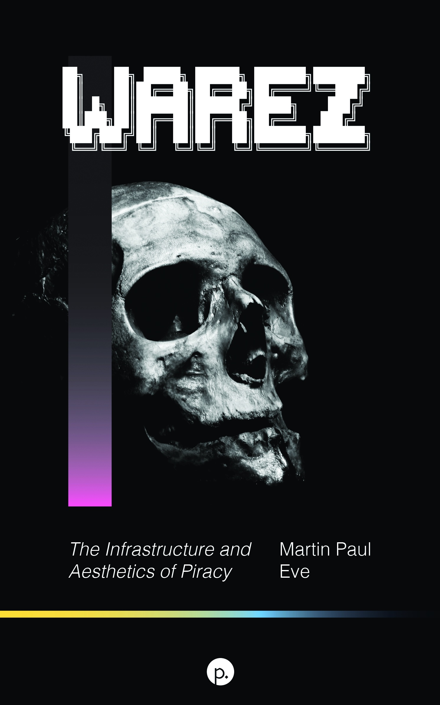

This repo contains a Markdown version of the book *Warez The Infrastructure and Aesthetics of Piracy* by Martin Paul Eve. It was published in 2021 and was released under the Creative Commons BY-NC-SA 4.0 International license, allowing it to be remixed, including into Markdown.

# Warez
## The Infrastructure and Aesthetics of Piracy
## By Martin Paul Eve

* [About this Markdown Edition](Book/about.md)
* [Preface](Book/0-Preface.md)
* [1. Original Pirate Material](Book/1-original-pirate-material.md)
* [2. Setting the Scene](Book/2-setting-the-scene.md)